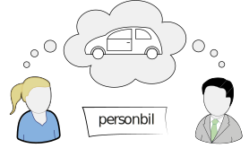
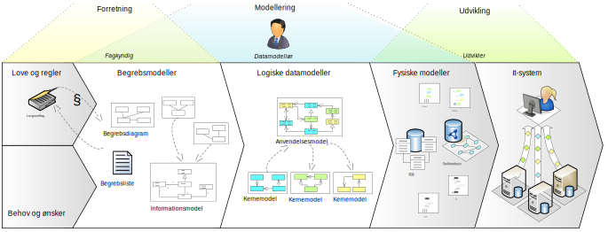
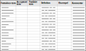
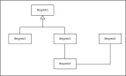
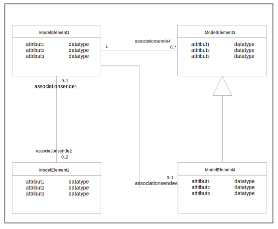
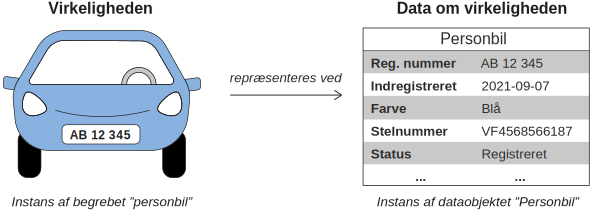
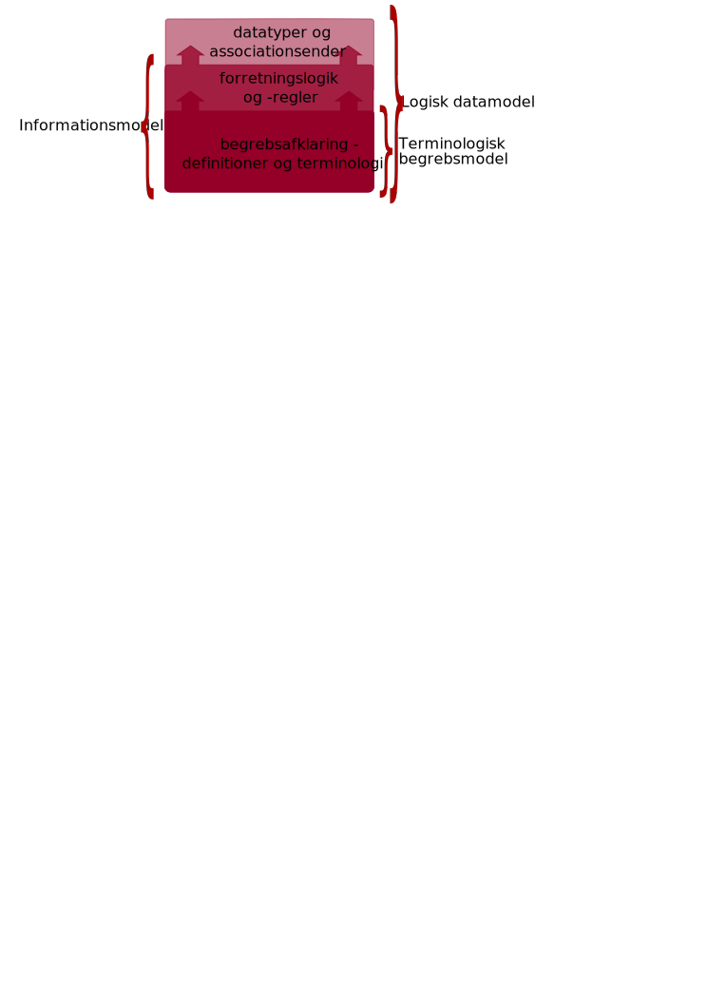
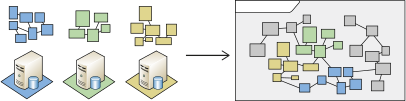

# Indholdsfortegnelse
**[Forord](#forord)**

&nbsp;&nbsp; [Læsevejledning](#læsevejledning)

&nbsp;&nbsp; [Oversigt over regler](#oversigt-over-regler)

**[Kapitel 1: Introduktion](#kapitel-1-introduktion)**

&nbsp;&nbsp; [Formål](#formål)

&nbsp;&nbsp; [Hvorfor anvende de fællesoffentlige regler for begrebs- og datamodellering?](#hvorfor-anvende-de-fællesoffentlige-regler-for-begrebs--og-datamodellering)

&nbsp;&nbsp; [Organisatoriske anbefalinger for modellering](#organisatoriske-anbefalinger-for-modellering)

**[Kapitel 2: Om modeller](#kapitel-2-om-modeller)**

&nbsp;&nbsp; [Hvad er en model?](#hvad-er-en-model)

&nbsp;&nbsp; [Modeltyper](#modeltyper)

&nbsp;&nbsp;&nbsp;&nbsp; [Arbejdet med terminologiske begrebsmodeller](#arbejdet-med-terminologiske-begrebsmodeller)

&nbsp;&nbsp;&nbsp;&nbsp;&nbsp;&nbsp; [Anvendelse af begrebsmodeller](#anvendelse-af-begrebsmodeller)

&nbsp;&nbsp;&nbsp;&nbsp;&nbsp;&nbsp; [Begrebsmodellens indhold og afgrænsning](#begrebsmodellens-indhold-og-afgrænsning)

&nbsp;&nbsp;&nbsp;&nbsp;&nbsp;&nbsp; [Proces for begrebsmodellering](#proces-for-begrebsmodellering)

&nbsp;&nbsp;&nbsp;&nbsp; [Informationsmodeller](#informationsmodeller)

&nbsp;&nbsp;&nbsp;&nbsp;&nbsp;&nbsp; [Proces for informationsmodellering](#proces-for-informationsmodellering)

&nbsp;&nbsp;&nbsp;&nbsp; [Logiske datamodeller](#logiske-datamodeller)

&nbsp;&nbsp;&nbsp;&nbsp;&nbsp;&nbsp; [Anvendelse af logisk datamodellering](#anvendelse-af-logisk-datamodellering)

&nbsp;&nbsp;&nbsp;&nbsp; [Proces for logisk datamodellering](#proces-for-logisk-datamodellering)

&nbsp;&nbsp;&nbsp;&nbsp;&nbsp;&nbsp; [Processen med udgangspunkt i begrebsmodellering](#processen-med-udgangspunkt-i-begrebsmodellering)

&nbsp;&nbsp;&nbsp;&nbsp;&nbsp;&nbsp; [Processen uden forudgående begrebsmodellering](#processen-uden-forudgående-begrebsmodellering)

&nbsp;&nbsp;&nbsp;&nbsp;&nbsp;&nbsp; [Organisering af arbejdet](#organisering-af-arbejdet)

&nbsp;&nbsp;&nbsp;&nbsp; [Klassifikationsmodeller](#klassifikationsmodeller)

&nbsp;&nbsp; [Hvilke modeltyper skal jeg udarbejde?](#hvilke-modeltyper-skal-jeg-udarbejde)

&nbsp;&nbsp; [Modelomfang (kernemodeller vs. anvendelsesmodeller)](#modelomfang-kernemodeller-vs-anvendelsesmodeller)

&nbsp;&nbsp;&nbsp;&nbsp; [Kernemodeller](#kernemodeller)

&nbsp;&nbsp;&nbsp;&nbsp; [Anvendelsesmodeller](#anvendelsesmodeller)

&nbsp;&nbsp; [Genbrug af eksisterende modellering](#genbrug-af-eksisterende-modellering)

&nbsp;&nbsp;&nbsp;&nbsp; [Undgå silomodellering](#undgå-silomodellering)

**[Kapitel 3: Termer og definitioner](#kapitel-3-termer-og-definitioner)**

&nbsp;&nbsp; [Hvad er termer og begreber?](#hvad-er-termer-og-begreber)

&nbsp;&nbsp; [Anvendelse af eksisterende begreber og definitioner](#anvendelse-af-eksisterende-begreber-og-definitioner)

&nbsp;&nbsp;&nbsp;&nbsp; [Direkte genbrug](#direkte-genbrug)

&nbsp;&nbsp;&nbsp;&nbsp;&nbsp;&nbsp; [Hvor finder man genbrugelige definitioner?](#hvor-finder-man-genbrugelige-definitioner)

&nbsp;&nbsp;&nbsp;&nbsp;&nbsp;&nbsp; [Der er en lang række kilder, man kan trække på, når man leder efter genbrugelige definitioner:](#der-er-en-lang-række-kilder,-man-kan-trække-på,-når-man-leder-efter-genbrugelige-definitioner)

&nbsp;&nbsp;&nbsp;&nbsp;&nbsp;&nbsp; [Hvad hvis begrebet er modelleret, men ikke godt nok?](#hvad-hvis-begrebet-er-modelleret-men-ikke-godt-nok)

&nbsp;&nbsp;&nbsp;&nbsp;&nbsp;&nbsp; [Begreber i datamodeller](#begreber-i-datamodeller)

&nbsp;&nbsp;&nbsp;&nbsp;&nbsp;&nbsp; [Hvad hvis begrebet er modelleret flere steder?](#hvad-hvis-begrebet-er-modelleret-flere-steder)

&nbsp;&nbsp;&nbsp;&nbsp; [Afledning](#afledning)

&nbsp;&nbsp;&nbsp;&nbsp; [Specialisering](#specialisering)

&nbsp;&nbsp;&nbsp;&nbsp;&nbsp;&nbsp; [Anvendelse af kilder](#anvendelse-af-kilder)

&nbsp;&nbsp;&nbsp;&nbsp; [Udarbejdelse af nye definitioner](#udarbejdelse-af-nye-definitioner)

&nbsp;&nbsp;&nbsp;&nbsp; [Strukturerede definitioner](#strukturerede-definitioner)

&nbsp;&nbsp;&nbsp;&nbsp; [Oplysende definitioner](#oplysende-definitioner)

&nbsp;&nbsp;&nbsp;&nbsp;&nbsp;&nbsp; [Undgå cirkulære definitioner](#undgå-cirkulære-definitioner)

&nbsp;&nbsp;&nbsp;&nbsp;&nbsp;&nbsp; [Anvend ikke negative definitioner](#anvend-ikke-negative-definitioner)

&nbsp;&nbsp;&nbsp;&nbsp;&nbsp;&nbsp; [Brug ikke opremsninger](#brug-ikke-opremsninger)

&nbsp;&nbsp;&nbsp;&nbsp;&nbsp;&nbsp; [Karakteristika skal altid gælde](#karakteristika-skal-altid-gælde)

&nbsp;&nbsp;&nbsp;&nbsp;&nbsp;&nbsp; [Polyhierarki](#polyhierarki)

&nbsp;&nbsp;&nbsp;&nbsp; [Udarbejd anvendelsesneutrale definitioner](#udarbejd-anvendelsesneutrale-definitioner)

&nbsp;&nbsp;&nbsp;&nbsp; [Tjekliste til udarbejdelse af definitioner](#tjekliste-til-udarbejdelse-af-definitioner)

&nbsp;&nbsp; [Termer](#termer)

**[Kapitel 4: Anvendelse og udformning af HTTP-URIer](#kapitel-4-anvendelse-og-udformning-af-http-urier)**

**[Kapitel 5: Udarbejdelse af modeller](#kapitel-5-udarbejdelse-af-modeller)**

&nbsp;&nbsp;&nbsp;&nbsp; [Begrebslister](#begrebslister)

&nbsp;&nbsp; [UML-modellering](#uml-modellering)

&nbsp;&nbsp;&nbsp;&nbsp; [UML-elementer der anvendes i alle modeltyper](#uml-elementer-der-anvendes-i-alle-modeltyper)

&nbsp;&nbsp;&nbsp;&nbsp; [Yderligere UML-elementer](#yderligere-uml-elementer)

&nbsp;&nbsp;&nbsp;&nbsp; [Pakker](#pakker)

&nbsp;&nbsp;&nbsp;&nbsp; [Stereotyper](#stereotyper)

&nbsp;&nbsp;&nbsp;&nbsp; [Dokumentation af modelelementer](#dokumentation-af-modelelementer)

&nbsp;&nbsp;&nbsp;&nbsp; [Gennemgang af UML-elementer](#gennemgang-af-uml-elementer)

&nbsp;&nbsp;&nbsp;&nbsp;&nbsp;&nbsp; [Klasser](#klasser)

&nbsp;&nbsp;&nbsp;&nbsp;&nbsp;&nbsp; [Generaliseringer](#generaliseringer)

&nbsp;&nbsp;&nbsp;&nbsp;&nbsp;&nbsp; [Generaliseringssæt](#generaliseringssæt)

&nbsp;&nbsp;&nbsp;&nbsp;&nbsp;&nbsp; [Egenskaber](#egenskaber)

&nbsp;&nbsp;&nbsp;&nbsp;&nbsp;&nbsp; [Attributter](#attributter)

&nbsp;&nbsp;&nbsp;&nbsp;&nbsp;&nbsp; [Associationer](#associationer)

&nbsp;&nbsp;&nbsp;&nbsp;&nbsp;&nbsp;&nbsp;&nbsp; [Associationsnavne](#associationsnavne)

&nbsp;&nbsp;&nbsp;&nbsp;&nbsp;&nbsp; [Associationsender](#associationsender)

&nbsp;&nbsp;&nbsp;&nbsp;&nbsp;&nbsp;&nbsp;&nbsp; [Multiplicitet](#multiplicitet)

&nbsp;&nbsp;&nbsp;&nbsp; [Datatyper](#datatyper)

&nbsp;&nbsp;&nbsp;&nbsp;&nbsp;&nbsp; [Strukturerede datatyper](#strukturerede-datatyper)

&nbsp;&nbsp;&nbsp;&nbsp;&nbsp;&nbsp; [Objekter](#objekter)

&nbsp;&nbsp;&nbsp;&nbsp;&nbsp;&nbsp; [Kompositioner](#kompositioner)

&nbsp;&nbsp;&nbsp;&nbsp;&nbsp;&nbsp; [Tilknytningsklasser](#tilknytningsklasser)

&nbsp;&nbsp;&nbsp;&nbsp; [Diagrammer](#diagrammer)

&nbsp;&nbsp;&nbsp;&nbsp;&nbsp;&nbsp; [Diagrammering af store modeller](#diagrammering-af-store-modeller)

&nbsp;&nbsp;&nbsp;&nbsp; [Genbrug af modelelementer](#genbrug-af-modelelementer)

&nbsp;&nbsp;&nbsp;&nbsp;&nbsp;&nbsp; [Genbrug med anvendelsesnote](#genbrug-med-anvendelsesnote)

&nbsp;&nbsp;&nbsp;&nbsp;&nbsp;&nbsp; [Fravær af HTTP-URI](#fravær-af-http-uri)

&nbsp;&nbsp;&nbsp;&nbsp;&nbsp;&nbsp; [Markering af genbrugte elementer](#markering-af-genbrugte-elementer)

&nbsp;&nbsp;&nbsp;&nbsp;&nbsp;&nbsp; [Mangel på genbrugeligt element](#mangel-på-genbrugeligt-element)

&nbsp;&nbsp; [Anvendelsesmodellering](#anvendelsesmodellering)

&nbsp;&nbsp;&nbsp;&nbsp; [Multiplicitet](#multiplicitet)

&nbsp;&nbsp;&nbsp;&nbsp; [Øget specificitet](#øget-specificitet)

&nbsp;&nbsp;&nbsp;&nbsp;&nbsp;&nbsp; [Præcisere anvendelsen](#præcisere-anvendelsen)

&nbsp;&nbsp;&nbsp;&nbsp;&nbsp;&nbsp; [Indsnævre udfaldsrum](#indsnævre-udfaldsrum)

&nbsp;&nbsp;&nbsp;&nbsp;&nbsp;&nbsp; [Indsnævring af multiplicitet](#indsnævring-af-multiplicitet)

&nbsp;&nbsp;&nbsp;&nbsp; [Implicitte kernemodeller](#implicitte-kernemodeller)

&nbsp;&nbsp;&nbsp;&nbsp; [Anvendelsesmodel baseret på en anden anvendelsesmodel](#anvendelsesmodel-baseret-på-en-anden-anvendelsesmodel)

&nbsp;&nbsp; [Klassifikationer og kontrollerede udfaldsrum](#klassifikationer-og-kontrollerede-udfaldsrum)

&nbsp;&nbsp;&nbsp;&nbsp; [Formålet med at lave og bruge klassifikationer](#formålet-med-at-lave-og-bruge-klassifikationer)

&nbsp;&nbsp;&nbsp;&nbsp; [Begrebsafklaring som grundlag for gode klassifikationer](#begrebsafklaring-som-grundlag-for-gode-klassifikationer)

&nbsp;&nbsp;&nbsp;&nbsp; [Modellering af klassifikationer i UML](#modellering-af-klassifikationer-i-uml)

&nbsp;&nbsp;&nbsp;&nbsp;&nbsp;&nbsp; [Valg af enumeration eller klassifikationsklasse og instanser](#valg-af-enumeration-eller-klassifikationsklasse-og-instanser)

&nbsp;&nbsp;&nbsp;&nbsp;&nbsp;&nbsp;&nbsp;&nbsp; [Modellering af klassifikationer med enumerationer](#modellering-af-klassifikationer-med-enumerationer)

&nbsp;&nbsp;&nbsp;&nbsp;&nbsp;&nbsp;&nbsp;&nbsp; [Modellering af klassifikationer med klassifikationsklasser](#modellering-af-klassifikationer-med-klassifikationsklasser)

&nbsp;&nbsp;&nbsp;&nbsp;&nbsp;&nbsp;&nbsp;&nbsp; [Klassifikationer med flere niveauer](#klassifikationer-med-flere-niveauer)

&nbsp;&nbsp;&nbsp;&nbsp;&nbsp;&nbsp;&nbsp;&nbsp; [Anvend generaliseringssæt til at vise inddelingskriterier](#anvend-generaliseringssæt-til-at-vise-inddelingskriterier)

&nbsp;&nbsp;&nbsp;&nbsp;&nbsp;&nbsp; [Store klassifikationer](#store-klassifikationer)

&nbsp;&nbsp;&nbsp;&nbsp;&nbsp;&nbsp; [Anvendelse af klassifikation som udfaldsrum](#anvendelse-af-klassifikation-som-udfaldsrum)

&nbsp;&nbsp;&nbsp;&nbsp;&nbsp;&nbsp;&nbsp;&nbsp; [Brug af eksterne klassifikationer](#brug-af-eksterne-klassifikationer)

**[Kapitel 6: Dokumentation af modellen](#kapitel-6-dokumentation-af-modellen)**

&nbsp;&nbsp; [Modellens indhold og kontekst](#modellens-indhold-og-kontekst)

&nbsp;&nbsp; [Modelstatus og versionering](#modelstatus-og-versionering)

&nbsp;&nbsp; [Forretningsgodkendelse og modelansvar](#forretningsgodkendelse-og-modelansvar)

&nbsp;&nbsp; [Modellens kilder](#modellens-kilder)

&nbsp;&nbsp; [Eksempel på udfyldte metadata](#eksempel-på-udfyldte-metadata)
    
**[Kapitel 7: Det visuelle udtryk](#kapitel-7-det-visuelle-udtryk)**

&nbsp;&nbsp; [Anbefalinger til grafisk opsætning og præsentation](#anbefalinger-til-grafisk-opsætning-og-præsentation)

&nbsp;&nbsp;&nbsp;&nbsp; [Undgå krydsende streger hvor det er muligt](#undgå-krydsende-streger-hvor-det-er-muligt)

&nbsp;&nbsp;&nbsp;&nbsp; [Foretræk vinkelrette knæk fremfor skrå streger](#foretræk-vinkelrette-knæk-fremfor-skrå-streger)

&nbsp;&nbsp;&nbsp;&nbsp; [Ensret klassernes størrelser og justeringer](#ensret-klassernes-størrelser-og-justeringer)

&nbsp;&nbsp;&nbsp;&nbsp; [Sørg for at al tekst er læsbar](#sørg-for-at-al-tekst-er-læsbar)

&nbsp;&nbsp;&nbsp;&nbsp; [Brug anbefalede farver](#brug-anbefalede-farver)

&nbsp;&nbsp;&nbsp;&nbsp; [Placer overordnede klasser over deres specialiseringer](#placer-overordnede-klasser-over-deres-specialiseringer)

&nbsp;&nbsp;&nbsp;&nbsp; [Anvend generaliseringssæt](#anvend-generaliseringssæt)

&nbsp;&nbsp;&nbsp;&nbsp; [Angiv retning på begrebsrelationer](#angiv-retning-på-begrebsrelationer)

&nbsp;&nbsp;&nbsp;&nbsp; [Brug associationer til klasser og attributter til datatyper](#brug-associationer-til-klasser-og-attributter-til-datatyper)

&nbsp;&nbsp; [Eksempel på UML-diagram](#eksempel-på-uml-diagram)

&nbsp;&nbsp; [Anbefalinger til organisering og kommunikation](#anbefalinger-til-organisering-og-kommunikation)

&nbsp;&nbsp;&nbsp;&nbsp; [Skab overblik med opdeling og overordnede diagrammer](#skab-overblik-med-opdeling-og-overordnede-diagrammer)

&nbsp;&nbsp;&nbsp;&nbsp; [Organiser diagrammet ift. rækkefølge hvor relevant](#organiser-diagrammet-ift-rækkefølge-hvor-relevant)

&nbsp;&nbsp;&nbsp;&nbsp; [Lav også alternative visuelle diagrammer til kommunikationsformål](#lav-også-alternative-visuelle-diagrammer-til-kommunikationsformål)

&nbsp;&nbsp; [Yderligere best practices i international modellering](#yderligere-best-practices-i-international-modellering)

&nbsp;&nbsp;&nbsp;&nbsp; [Angivelse af kravniveau med supplerende stereotyper](#angivelse-af-kravniveau-med-supplerende-stereotyper)

&nbsp;&nbsp;&nbsp;&nbsp; [Angiv gerne namespaces og præfikser i logiske datamodeller](#angiv-gerne-namespaces-og-præfikser-i-logiske-datatyper)

**[Kapitel 8: Governance](#kapitel-8-governance)**

&nbsp;&nbsp; [Forretningsgodkendelse](#forretningsgodkendelse)

&nbsp;&nbsp; [Modelteknisk review](#modelteknisk-review)

&nbsp;&nbsp;&nbsp;&nbsp; [Proces for review](#proces-for-review)

&nbsp;&nbsp;&nbsp;&nbsp;&nbsp;&nbsp; [Selve reviewindleveringen](#selve-reviewindleveringen)

&nbsp;&nbsp; [Udstilling](#udstilling)

&nbsp;&nbsp; [Modelkataloget](#modelkataloget)

**[Referencer](#referencer)**

# Forord
Formålet med denne vejledning er at understøtte god modellering og dokumentation af begreber og data, hvilket er en forudsætning for at forvalte data effektivt, og at de anvendes hensigtsmæssigt inden for den enkelte organisation, på tværs af myndigheder samt i samarbejdet med borgere og virksomheder. 
Denne vejledning bygger på De fællesoffentlige regler for begrebs- og datamodellering - i daglig tale modelreglerne, der operationaliserer arkitektur regel 6.2 fra Hvidbog om fællesoffentlig digital arkitektur: Anvend fælles regler for dokumentation af data.
Vejledningen passer til version 2.1.0 af modelreglerne og er udarbejdet i regi af Fællesoffentlig Digital Arkitektur i et samarbejde mellem KL, KOMBIT og Digitaliseringsstyrelsen og følgegruppen for Modelreglerne.
De fællesoffentlige modelregler ejes af Udvalget for arkitektur og standarder, som er en del af den fællesoffentlige governance for samarbejde på digitaliseringsområdet. 

## Læsevejledning 
Vejledningens kapitler har forskellige målgrupper. Her er en oversigt over kapitlernes indhold og deres målgrupper: 

- **Kapitel 1: Introduktion**
  - Giver en introduktion og beskriver formålet med begrebs- og datamodellering, hvorfor man skal følge modelreglerne samt anbefalinger til organisering af arbejdet med modellering.
  -  Henvender sig til alle med en interesse for emnet.
- **Kapitel 2: Om modeller**
  - Beskriver hvilke modeltyper der gives vejledning til, processen ved udarbejdelse af modellerne og hvordan man sikrer sammenhængende modeller ved genbrug.
  - Henvender sig til alle med et kendskab til eller brug for at arbejde med modellering af begreber eller data.
- **Kapitel 3: Termer og definitioner**
  - Giver vejledning til hvordan man genbruger og arbejder videre med allerede definerede begreber samt hvordan man udarbejder nye definitioner, hvor det er hensigtsmæssigt.
  - Henvender sig til alle med kendskab til eller brug for at arbejde med beskrivelse af begreber og/eller data.
- **Kapitel 4: Anvendelse og udformning af HTTP-URIer**
  - Beskriver hvad en HTTP-URI er og giver vejledning til hvordan man opbygger et namespace til en model i henhold til Retningslinjer for stabile HTTP-URIer.
  - Henvender sig til alle med et kendskab til eller behov for at udarbejde modeller.
- **Kapitel 5: Udarbejdelse af modeller**
  - Giver vejledning til hvordan man udarbejder modeller - herunder modelleringsprocessen, begrebslister, anvendelse af UML-klassediagrammer, udarbejdelse af klassifikationer og definition af kontrollerede udfaldsrum iht. Modelreglerne.
  - Henvender sig til alle med kendskab til og praktisk erfaring med modellering af data ved hjælp af UML-klassediagrammer eller har kendskab til og brug for at arbejde med kontrollerede udfaldsrum.
- **Kapitel 6: Dokumentation af modellen**
  - Beskriver hvordan en model dokumenteres ved hjælp af metadata.
  - Henvender sig til alle med et kendskab til eller behov for at udarbejde modeller.
- **Kapitel 7: Det visuelle udtryk**
  - Præsenterer en række anbefalinger til modellernes visuelle udtryk.
  - Henvender sig til alle med kendskab til eller brug for at arbejde med beskrivelse af begreber og/eller data i UML.
- **Kapitel 8: Governance Review, godkendelse og udstilling**
  - Beskriver de processer, modeller gennemgår forud for udstilling, herunder review, godkendelse og udstilling.
  - Henvender sig til alle som udfører en rolle i disse processer.

Kapitel 3-6 indeholder afsnit, som beskriver konkrete trin i modelleringsprocessen. I de kapitler er der referencer til Modelreglerne, der er fremhævet som vist herunder, hvor regelnavnet fungerer som link til webudstillingen af den pågældende regel. Her kan man finde en beskrivelse af reglen, rationalet, implikationer og eksempler. 

§regelnummer - Regelnavn

## Oversigt over regler
Generelt:
01 - Brug UML som det visuelle modelsprog 
02 - Brug kun udvalgte UML-elementer 
03 - Brug UML-stereotyper
04 - Udstil modellen online
05 - Gør modellen tilgængelig i maskinlæsbart format 
Modeller
06 - Angiv meningsfyldte navne og beskrivelser for modeller 
07 - Angiv identifikation af modeller
08 - Angiv den modelansvarlige organisation
09 - Angiv emneområde for modellen
10 - Angiv modellens version
11 - Modellen skal forretningsgodkendes
12 - Angiv modellens modelstatus
13 - Angiv modellens lovgrundlag
14 - Etablér sammenhæng mellem modeller
15 - Modeller klassifikationer til genbrug
Modelelementer
16 - Angiv meningsfyldte UML-navne for modelelementer 
17 - Giv alle modelelementer en identifikator
18 - Angiv termer i et naturligt sprog
19 - Brug standardiserede konventioner for angivelse af navne
20 - Udarbejd definitioner eller beskrivelser af modellens elementer
21 - Udarbejd strukturerede definitioner på en standardiseret måde
22 - Udarbejd anvendelsesneutrale definitioner 
23 - Angiv modelelementers lovgrundlag
24 - Definér kun nye modelelementer når det er nødvendigt
25 - Sammensæt anvendelsesmodeller af elementer fra kernemodeller
26 - Angiv om begrebet tilhører modellens emneområde
27 - Brug standardiserede primitive datatyper
28 - Modellér klassifikationsemner som instanser

# Kapitel 1: Introduktion

## Formål
Det overordnede formål med begrebs- og datamodellering er at skabe et fælles sprog med klarhed og konsensus om betydningen af begreber og de betegnelser, vi bruger om de enkelte begreber, og opnå sammenhæng mellem hvordan begreber anvendes af forretningen og til at beskrive data. Ved at data er velbeskrevne og i overensstemmelse med forretningen dannes grundlag for effektiv udvikling af it-systemer, der understøtter forretningen. Datamodeller dokumenterer desuden den information, der håndteres i forretningen.

Vi har nok alle oplevet situationer, hvor der er opstået forvirring, fordi vi har brugt en betegnelse, der var ukendt for andre, eller endnu værre har brugt en betegnelse, som modtagerne forstod på en anden måde, end vi mente. Det kan blive værre endnu, når man krydser mellem forskellige faglige domæner eller forskellige organisationer. Men selv inden for ét fagdomæne og inden for én organisation kan sprogbrug være forskelligt.

Når man modellerer begreber og data inden for et fagdomæne, kastes der lys over uenigheder, og man skaber grundlaget for en fælles forståelse. Man tilvejebringer et faglig velfunderet begrebsapparat, der er sammenhængende med den faglige praksis på området. Forretningen kan tage et større ejerskab over begreber og dermed over forståelsen af data, så fx it-udviklingen bliver mere forretningsdrevet. En god velbeskrevet datamodel, der er i overensstemmelse med forretningens behov og begrebsanvendelse, er et væsentligt skridt i forhold til at skabe it-understøttelse, der smidigt understøtter forretningsgange og er nemt at anvende.

Samtidig dokumenteres vigtig og måske tavs viden, så den er egnet til deling og videre anvendelse. Det er viden, der kan anvendes i forbindelse med udarbejdelse af lovgivning, regler, strategier mm, og dermed bidrage til at disse bliver fagligt funderede og digitaliseringsklare. Det øgede fokus på databeskyttelse (GDPR) taler også for klarhed over begreber og data.

Entydige begreber og datamodellering kan anvendes til udarbejdelse af krav til it-understøttelse, der reducerer risikoen for bekostelige misforståelser og fejl i løbet af udviklingsprocessen. Ved projekter af tværgående karakter er det særligt vigtigt at indtænke begrebsafklaring for at sikre, at der er enighed mellem de forskellige projektdeltagere ift. hvad projektet indeholder og hvordan leverancerne skal udarbejdes. Det er også et vigtigt element i forhold til at sikre interoperabilitet på tværs af systemer og sektorer.

Modellering er et solidt grundlag for klar kommunikation med borgere, erhvervsdrivende, leverandører, sagsbehandlere og andre, der er involverede i sager med berøring til domænet. Arbejdet med afklaring af robuste, meningsfyldte begreber er en god forberedelse til udvikling og implementering af de brugerrettede dele af et it-system. En fælles forståelse af data hos alle, der føder data ind i systemet og alle, der anvender data, er et vigtigt skridt i forhold til sikring af datakvalitet. Den fælles forståelse af data illustreres af Figur 1, hvor de to personer tænker på et køretøj og er enige om, at det er en personbil.

_Figur 1.1: Samme begreb - samme forståelse_

## Hvorfor anvende de fællesoffentlige regler for begrebs- og datamodellering?
Modelreglerne er en metoderamme, der udstikker fælles retningslinjer for udformning, deling og genbrug af begrebs- og datamodeller i fællesoffentligt regi og bidrager til bedre data, bedre forståelse af data, og øget deling og genbrug af data.

Reglerne er en samling af anerkendte og internationalt forankrede metoder til god begrebs- og datamodellering som understøtter:

* God modellering med forankring i forretningen
* Sammenhæng mellem lovgivning og it-system
* Fælles sprog, kompetenceudvikling og værktøjer på tværs af den offentlige sektor
* Forberedelse til nye, endnu ukendte anvendelser af data
  
Den allervigtigste grund til at anvende en fælles metoderamme er, at man dermed kan sikre interoperabilitet/sammenhæng på tværs af myndigheder og fagdomæner både på forretningsmæssigt plan og mellem forskellige it-systemer. 

Det er afgørende for udviklingen af den digitalt sammenhængende og effektive offentlige sektor, at data kan genbruges, og at digitale processer bygger på sammenhængende begreber og data. Udviklingen understøttes af det fællesoffentlige arkitekturarbejde, og initiativerne under Udvalg for arkitektur og standarder. Der er behov for interoperabilitet på flere niveauer: Juridisk, organisatorisk, semantisk og teknisk. Som Figur 2 viser, adresserer De fællesoffentlige modelregler semantisk interoperabilitet, og koblingerne mellem det semantiske niveau og henholdsvis det juridiske og tekniske niveau og sikrer sammenhæng fra forretning til udvikling.

 
 
_Figur 1.2: Sammenhæng_

Ensartethed, og dermed fælles forståelse, i beskrivelse af begreber og data er en forudsætning for at genbruge både modellering og faktiske data fra eksterne kilder.

Genbrug er med til at minimere det samlede ressource- og tidsforbrug på udvikling og vedligeholdelse af it-løsninger ved at undgå dobbeltarbejde. Desuden sikres høj kvalitet ved genbrug af modelelementer, der er defineret af domæneeksperter.

## Organisatoriske anbefalinger for modellering
For at opnå god begrebs- og datamodellering er det nødvendigt at forankre ansvar, opgaver, kompetencer og ressourcer i organisationen.

Hvis man som organisation ønsker at arbejde med begreber og datamodeller på en ensartet og struktureret måde, anbefales følgende tiltag som en del af den Fællesoffentlige digitale arkitektur (FDA):

1. Betragt begrebs- og datamodeller som forretningskritiske aktiver
2. Placér organisatorisk ansvar for begreber og datamodeller
3. Fastlæg processer, metoder og værktøjer til begrebs- og datamodellering
4. Sikr tilstrækkelige kompetencer og ressourcer til modellering
5. Vedligehold et overblik over organisationens begreber og datamodeller
   
Du kan downloade en [folder med yderligere information](https://arkitektur.digst.dk/sites/default/fileuploads/folder_god-begrebs-og-datamodellering-i-det-offentlige.docx) om disse fem anbefalinger.

# Kapitel 2: Modeltyper og proces

## Hvad er en model?
En model er en repræsentation af virkeligheden, der er egnet til at formidle viden om aspekter af virkeligheden til et bestemt formål. En model er typisk opbygget af elementer, der hver især repræsenterer ‘noget’ i virkeligheden. Modellen beskriver de egenskaber ved elementerne, der er relevante i forhold til modellens formål samt hvordan de relaterer sig til hinanden. Formelt defineres en model i kontekst af modelreglerne som et _“objekt der repræsenterer en entitet ved at besidde en ægte delmængde af dens egenskaber”_.

Der kan være forskellige tilgange til modelleringsarbejdet alt efter om det indgår i arbejdet med lovgivning, afklaring af behov og ønsker eller begrebs- og datamodellering til kørende it-systemer. Modellerne har forskelligt indhold i forhold til den sammenhæng, de indgår i.

De forskellige modeller påvirkes både af arbejdet med andre modeltyper, samt af arbejdet med fx processer, use cases og aktivitetsbeskrivelse, og der kan desuden komme tilbageløb fra videre arbejde med fx kravspecifikation og behovsopgørelse. 

Dette kapitel fortæller om de forskellige modeltyper og den overordnede proces for modeludarbejdelse. Læs mere om hvordan man i praksis udarbejder modellerne i [Kapitel 5: Udarbejdelse af modeller](#kapitel-5-udarbejdelse-af-modeller).

## Modeltyper  
Sprogbrugen om modeltyper og deres anvendelse er forskelligartet og flertydig. I det følgende opridses den forståelse og navngivning, som tilstræbes i denne vejledning. Herefter fortæller vi lidt om arbejdet med de forskellige modeltyper.

**Terminologiske begrebsmodeller** beskriver begreber og deres indbyrdes relationer. En terminologisk begrebsmodel kan udformes som en begrebsliste eller et begrebsdiagram - eller begge dele. Terminologiske begrebsmodeller kaldes i daglig tale ofte blot begrebsmodeller. Der findes også andre modeltyper der kan blive kaldt begrebsmodeller, og ‘terminologisk begrebsmodel’ er det derfor en mere præcis term. ‘Begrebsmodel’ kan dog betragtes som en accepteret alternativ term, og den bruges i vid udstrækning i dette dokument, altid for at referere til terminologiske begrebsmodeller.

* **Begrebslister** er repræsentationer af begrebsmodeller udtrykt på listeform. 
Repræsenteres begrebsmodellen som en begrebsliste, udtrykkes den i tabelformat eller efter ISO 10241 Termposter i standarder.

_Figur 2.1: Eksempel på begrebsliste i tabelformat_

* **Begrebsdiagrammer** er repræsentationer af begrebsmodeller udtrykt visuelt som diagram. 
Der er forskellige måder at udarbejde begrebsdiagrammer. Det er ikke et krav at der udarbejdes et diagram som del af modellen. Dog betyder den systematiske og strukturerede tilgang til arbejdet med begrebsdiagrammer, at inkonsistens, eventuelle uenigheder og manglende begreber i dækning af et emneområde lettere afsløres. I denne vejledning gennemgås én metode, nemlig anvendelse af klasse- og objektdiagrammer lavet i UML (Unified Modelling Language), hvor kasser og pile fortæller om begrebernes indbyrdes sammenhæng. Diagrammer udarbejdet efter denne metode kan gøres til genstand for review i FDA-regi.

_Figur 2.2: Eksempel på begrebsdiagram_

**Informationsmodeller** er modeller som beskriver forretningsviden og som supplerer begreber med forretningsregler. De dokumenterer den information, der håndteres i forretningen, og beskriver den tilstrækkeligt til, at den kan anvendes i nye sammenhænge. Der er taget stilling til om et givent begreb skal repræsenteres som klasse, attribut eller andet, og der er angivet multipliciteter. Dermed ligner diagrammer i informationsmodeller mere datamodeldiagrammer end begrebsdiagrammer, men det semantiske indhold i en informationsmodel er begreber, og derfor kan der også udtrækkes en begrebsliste..

_Figur 2.3: Eksempel på informationsmodel_

**Logiske datamodeller** beskriver dataelementers logiske sammenhænge. De logiske datamodeller udarbejdes som grundlag for dataudveksling eller lagring af data, fx i en teknologisk understøttelse af den løsning de modellerer, dog således at det er de logiske sammenhænge i data og ikke den fysiske struktur der modelleres. Logiske datamodeller kan være fuldstændigt uafhængige af implementeringsmetode, men kan også indeholde konstruktioner der vender sig mod et overordnet realiseringsparadigme, fx relationelle databaser, xml eller graf. Den samme logiske model kan beskrive flere forskellige fysiske implementering med variationer i den fysiske model.

_Figur 2.4: Eksempel på logisk datamodel_

Diagrammer der udarbejdes i forbindelse med informationsmodeller kommer som det ses til at ligne diagrammer udarbejdet i forbindelse med logiske datamodeller, da begge består af klasser, attributter og, hvor relevant, enumerationer. Der er dog et par forskelle idet en logisk datamodel angiver datatyper og navngiver associationsender fremfor associationer. Den største forskel ligger dog i hvad der modelleres. 
Informationsmodeller modellerer virkeligheden som den ser ud fra et specifikt forretningsperspektiv, og derfor er instanser af en klasse i en informationsmodel stadig fænomener i ‘den virkelige verden’ jfr. den blå bil til venstre i Figur 7. Logiske datamodeller modellerer derimod data, (som er en repræsentation af virkeligheden, men ikke selve virkeligheden), og instanser af en klasse i en logisk datamodel er derfor datainstanser jfr. tabellen til højre i Figur 2.5.

_Figur 2.5: Virkeligheden vs. data om virkeligheden_

### Arbejdet med terminologiske begrebsmodeller
En terminologisk begrebsmodel kan repræsenteres på listeform eller som et diagram, hvor begrebernes indbyrdes relationer også tydeliggøres.

Begrebsmodellering er en proces, hvor domænekyndige bliver enige om betydningen af begreber og beskriver det i en definition. Når begrebsarbejdet dokumenteres i en model opnås genbrugelighed, fordi det er tydeligt, hvad der menes med de forskellige begreber. Begrebsmodeller udviklet efter den samme metode kan sammenlignes, udbygges og sættes sammen efter behov.

Arbejdet med begrebsmodeller bør inddrage af centrale fagpersoner for det emne/domæne der modelleres, grundig research og gennemgang af kildemateriale, hvorved relevante begreber i det pågældende emneområde identificeres. Eksisterer der allerede en begrebsmodel for emnet, tages der udgangspunkt i denne, idet de samme begreber ikke skal beskrives igen. Der kan også tages afsæt i eksisterende datamodeller eller kørende digitale løsninger, hvor relevante begreber identificeres, beskrives og modelleres.

I det omfang det er muligt, bør begrebernes relation til gældende lovgrundlag, relevante standarder eller øvrige rammer undersøges. Det er vigtigt, at organisationen prioriterer at domæneeksperter med viden om forretningens lovgivning og formål deltager i begrebsafklaringen, da det netop er af hensyn til forretningen, at modellen og begreberne skal dokumenteres og forankres.

#### Anvendelse af begrebsmodeller
Formålet med begrebsmodellering er som skrevet i indledningen at skabe afklaring og enighed om betydningen af begreber, brugen af termer og begrebernes indbyrdes relationer, og den vigtige viden som domænekyndige bidrager med i processen dokumenteres og fastholdes på en ensartet måde. Det kan være relevant at udarbejde begrebsmodeller i mange forskellige sammenhænge, fx til at:

* skabe fælles sprogbrug i forretningen, så misforståelser undgås
* skabe grundlag for effektiv kommunikation mellem forretning og it ifm. it-udvikling
* skabe grundlag for effektiv kommunikation med brugere  
* bidrage til god datakvalitet via faglig klarhed i it-systemer
* understøtte sporbarhed fra data til de forretningsmæssige begreber
* bidrage til digitaliseringsklar lovgivning 
* understøtte nytænkning af fagområder
* bidrage til introduktion til fagområder ifm. oplæring af nye medarbejdere
   
Kort sagt er begrebsmodeller et middel til at dokumentere viden, skabe interoperabilitet og undgå misforståelser og fejl ved at skabe fælles forståelse. It-løsninger udarbejdet på baggrund af robust begrebsmodellering har et stærkt fundament for fagligt korrekte og relevante data uden gentagelser og støj.

#### Begrebsmodellens indhold og afgrænsning 
Det er vigtigt at undersøge det umiddelbare formål og den direkte anvendelse af begrebsarbejdet, da dette har stor indflydelse på omfanget af begrebsmodellen. Ved en anvendelsesorienteret model, fx til forberedelse af et specifikt it-system eller udvikling af en indberetningsformular, vil det være forretningsbehovene i forbindelse med anvendelsen, der dikterer modellens omfang og indhold. Men også ved emneorienteret modellering er det vigtigt at holde sig formålet for øje. Og hvor et formål som ‘at dokumentere vores faglige viden’ er yderst prisværdigt, så er det også en stor mundfuld, og det kan anbefales at starte med at prioritere et mere specifikt formål, fx ‘at dokumentere de begreber hvor vi har unik viden’, ‘at understøtte dette specifikke samarbejde med ekstern part’ eller ‘at hjælpe de projektledere, jurister mm., vi samarbejder med, til at forstå os’.

En model, der indeholder netop ét emneområdes begreber, er kendetegnet ved at være en samling af begreber, som naturligt hører sammen. Det vil sige, at der er høj begrebsmæssig samhørighed inden for modellen. Emneafgrænsning kan være svært og der er ingen endegyldige svar på hvordan det gøres. En af de komplicerende faktorer er, at afgørelsen af om noget er et eller flere emneområder, kan afhænge af detaljeringsniveauet. 

Man kan fx forestille sig en begrebsmodel på overordnet niveau om emnet transportmidler, hvor begreber der er relevante for transportmidler generelt, fx ‘fører’, ‘passager’, ‘ejer’, ‘førertilladelse’, ‘registrering’, og nogle typer, fx ‘bil’ og nogle af dets centrale undertyper såsom ‘personbil’, ‘lastbil’ og ‘varevogn’ er begreber. Man kan også forestille sig en begrebsmodel over emnet bil, hvor de forskellige undertyper udfoldes og man modellerer begreber, der er relateret til ‘bil’, såsom ‘kørekort’, ‘fremstillingsår, ‘mærke’, ‘model’, ‘parkeringsplads’, ‘nummerplade’, ‘benzin’, ‘syn’ med flere. Eller man kan lave begrebsmodeller der beskriver processen for syn, udstedelse af nummerplader, styringsmekanismers funktion etc., som alle kan være helt rimelige bud på emner afhængigt af modellens formål. 

Det er også vigtigt at pointere at man ikke er forpligtet til at modellere alt, der potentielt kan falde inden for det emneområde man modellerer. Man kan fx sagtens modellere emnet bil fra et lovgivningsperspektiv og kun medtage undertyper og bestanddele i det omfang, det er relevant for (et bestemt stykke) lovgivning. Eller man kan modellere bestanddele uden at gå i detaljer om, hvilke bestanddele en kobling, en gearkasse eller en lygte indeholder. Modellens navn og beskrivelse bør reflektere det perspektiv eller den afgrænsning, man modellerer ud fra.

Det er altså i høj grad pragmatiske vurderinger i forhold til formålet med modelleringsarbejdet der afgør hvad afgrænsningen skal være. Begrebsmodellen vil senere kunne udvides eller relateres med emnemæssigt nærliggende modeller når nye behov opstår, og et væsentligt formål med de fælles modelleringsregler er netop at smidiggøre processen med at udvide/tilføje og skabe relationer.

Som sagt er der ingen faste regler for emneafgrænsning, men et par tommelfingerregler kan dog nævnes:
* Hvis dine begreber fordeler sig i to grupper med mange relationer inden for hver gruppe og ganske få mellem grupperne burde det muligvis være to modeller 

* Hvis din model har mange elementer fra andre emneorienterede modeller sammen med en mængde du selv definerer, er det muligt du er i gang med at lave en blanding af en anvendelsesmodel og en emneorienteret model (se også afsnit om [modelomfang](#modelomfang-kernemodeller-vs-anvendelsesmodeller)).

Hvis der foretages begrebsarbejde med henblik på videre datamodellering, kan det være fordelagtigt at fokusere på de helt centrale begreber samt evt. særlige grupper af begreber hvor der savnes præcision og afklaring i forvaltningen og kommunikationen. Derudover kan det være en god idé, såfremt der er mulighed for det, at lade begrebsarbejdet og datamodelleringsarbejdet forløbe i sideløbende processer, så det er muligt for begrebsmodellører og datamodellører at sparre og tilrette modellerne undervejs.

For at afdække hvilke begreber det er relevant at medtage i begrebsmodellen og hvilke betegnelser der tidligere er blevet brugt for dem, kan man fx konsultere tidligere udarbejdede rapporter, vejledninger - både til fagfolk og borgere, blanketter samt skærmbilleder, dokumentation og dataudtræk fra tidligere systemer. 

#### Proces for begrebsmodellering
Et forløb for begrebsmodellering kunne se således ud:

Figur 2.6: Proces for begrebsmodellering

<ol>
<li> Etablering af arbejdsgruppe </li>
  <ol>
  <li> Arbejdsgruppen bør bestå af både modelleringskyndige og domæneeksperter, der er fagkyndige inden for emneområdet </li>

  <li> Identifikation af relevant forum for forretningsgodkendelse af begrebsmodellen </li>
  </ol>
<li> Valg af en eller flere af følgende arbejdsmetoder: (SDFE 2001): </li>
  <ol>
  <li> afholdelse af workshops, hvor deltagere med relevant viden sættes sammen for at udarbejde modellen i en iterativ proces </li>
  <li> interviews med nøglepersoner, hvor der via en struktureret spørgeramme hentes viden om de faglige aspekter, som interviewpersonen har speciel viden om, og som efterfølgende indarbejdes i modellen </li>
  <li> modelleringskyndige modellerer begreberne ved hjælp af den erfaring og viden der er indsamlet fra domæneeksperterne. </li>
  <li> analyse af kildemateriale hvor relevant fagligt materiale indsamles og analyseres, for at udlede viden, der skal indarbejdes i begrebsmodellen. Denne metode er som regel et nødvendigt supplement til de øvrige metoder </li>
    </ol>
<li> Strukturering af viden </li>
  <ol>
  <li> Udvælgelse og prioritering af relevante termer </li>
  <li> Udarbejdelse af forslag til definitioner, hvis muligt med afsæt i autoritative kilder som lovgivning og standarder (se afsnit om begrebslister og evt. begrebsdiagrammer) </li>
  <li> Angivelse af kommentarer, eksempler mv. </li>
  <li> Etablering af sammenhæng til og mulig genbrug af andre relevante modeller </li>
    </ol>
<li> Review og behandling af reviewkommentarer, jf. Kapitel 5: Review, godkendelse og udstilling </li>
<li> Forretningsgodkendelse, jf. Kapitel 5: Review, godkendelse og udstilling </li>
</ol>

Begrebsdiagrammet kan gøre det nemmere at udarbejde hensigtsmæssige definitioner, idet en god definition bygger på en analyse af det pågældende begrebs placering og relation til andre begreber i begrebsdiagrammet. Erfaring har også vist at der bruges færre ressourcer, hvis man i fællesskab på en workshop drøfter nøglebegreber og tegner de helt overordnede begrebsdiagrammer for emneområdet inden definitionsarbejdet sættes i gang. Derfor kan det være en god ide at udarbejde uformelle diagrammer som en del af Fase 3, selv om man ikke planlægger at publicere formelle diagrammer. Ved modellering af begreber, der repræsenterer fysiske objekter, kan det alternativt eller i tillæg være nyttigt at anvende tegninger af det, man modellerer.

### Informationsmodeller
Informationsmodeller udarbejdes med henblik på analyse og forretningsafklaring. De kan danne det forretningsmæssige grundlag for videre logisk datamodellering. Informationsmodeller er uafhængige af et fremtidigt valg af teknologisk understøttelse af den løsning, de modellerer. Herunder afspejler de heller ikke et specifikt paradigme for implementering, såsom relationel database, noSQL eller triple store. 

I en informationsmodel sættes begreber ind i en afgrænset kontekst og beriges med forretningslogik. I modsætning til begreber kan forretningslogik ændre sig over tid, omend den typisk er stabil over lange perioder. Fx kunne en dansk statsborger indtil 2015 kun have ét statsborgerskab, hvilket kan udtrykkes med multipliciteten 1..1. Nu kan man have to, altså have multipliciteten 1..2. I en anden forretningskontekst kan man have brug for også at repræsentere statsløse i modellen, og derfor angive multipliciteten 0..2. I alle tilfælde er begrebet statsborgerskab det samme, det er blot blevet beriget med informationer om hvordan det anvendes i en forretningsmæssig kontekst.

Ligeledes tager man i forbindelse med udarbejdelsen af en informationsmodel stilling til hvilken informationsstruktur begrebet repræsenteres af i den givne kontekst. Hvis man udarbejder en informationsmodel for at holde styr på organisationens køretøjer (placering, eftersyn, fejlmeldinger m.m.) vil man lade begrebet ‘bil’ repræsentere af en klasse, hvorimod ‘bil’ i en informationsmodel for rejseafregning måske ville være repræsenteret af en værdi i en enumeration. Begrebet ‘bil’ er det samme i begge tilfælde.

Informationsmodeller kan understøtte it-projekters behovsafklaring i forretningsanalysen, fordi modelleringen giver forståelse for og ejerskab til den forretning, der arbejdes med. Desuden er det vigtigt, at de samme metoder anvendes på tværs af forskellige projekter, så det gør det muligt at skabe sammenhæng mellem de forretningsområder, projekterne dækker. 

Et enkelt projekt kan have brug for flere sammenhængende modeller, der komplementerer hinanden, fx for at dokumentere de informationer, man anvender i sine processer, beslutninger, use cases eller services. I forbindelse med udbud kan denne øvelse bruges til at lette arbejdet med at kvalitetssikre kravspecifikationer. Ved at anvende informationsmodeller i kravspecifikationer samt modellere sammenhængen imellem disse, bliver inkonsistens, uklarheder og mangler synliggjort.

#### Proces for informationsmodellering
Informationsmodeller udarbejdes som UML-klassediagrammer.

Ofte vil en informationsmodel blive udarbejdet på baggrund af en begrebsmodel. I så fald består det primære modelleringsarbejde i at tage stilling til hvilken struktur de forskellige begreber skal repræsenteres med, samt at tilføje multipliciteter. Dette arbejde udføres primært af informationsmodellører, men det bør kvalitetssikres af forretningskyndige indenfor modellens emneområde.

Dernæst identificeres tidligere udarbejdede informationsmodeller (nogle gange kaldet byggeblokke), der indeholder relevante begreber, som kan indlånes, og dermed skabe sammenhæng til andre modeller.

Det er også tænkeligt at man identificerer enkelte nye begreber der er relevante for modellen. Hvis samme personkreds som udarbejder informationsmodellen har ansvar for begrebsmodellen kan man evt. tilføje sådanne begreber her. Ellers kan nye begreber defineres i en ny informationsmodel. I begge tilfælde bør forretningskyndige inddrages i termvalg og udarbejdelse af definition.

I tilfælde hvor der ikke er en begrebsmodel som udgangspunkt, må man starte med det begrebsafklarende og -definerende arbejde som beskrevet i kapitel 3. 

### Logiske datamodeller
Hvor begrebs- og informationsmodeller beskriver virkeligheden, beskriver datamodeller [data om virkeligheden](indsæt link til figur 2.5). Logiske datamodeller er datamodeller som beskriver datas logiske sammenhænge uafhængigt af hvilken specifik fysisk struktur og teknisk implementering der anvendes til opbevaring af data. Formålet med logiske datamodeller er at give en forståelse af data, der er gyldig for alle de fysiske formater, data måtte findes i.

En god logisk datamodel kræver forståelse af den forretning og de processer, hvor data skabes og/eller anvendes. Det er derfor vigtigt, at domæneeksperter med indgående viden om forretningen deltager i modelleringsarbejdet, ligesom der bør deltage data- eller informationsarkitekter med viden om logisk datamodellering.

#### Anvendelse af logisk datamodellering:

Logiske datamodeller er velegnede til kommunikation om data, fx mellem en datadistributør og en potentiel anvender. Den logiske datamodel dokumenterer hvilke data distributøren har og hvad de betyder, men dokumenterer ikke hvordan data fysisk opbevares eller leveres, og dataleverancer kan således ske på flere måder og evt. tilpasses anvenders behov, efter at den logiske datamodel har givet anvenderen mulighed for at vurdere hvilke data der er relevante.

Logiske datamodeller danner desuden det semantiske grundlag for fysiske modeller, fx implementering i databaser eller til udvekslingsformater og bidrager dermed til at forretningens forståelse af data og de bagvedliggende begreber afspejles i de data der i praksis gemmes og udveksles.

#### Proces for logisk datamodellering
Hvis der eksisterer en veldokumenteret begrebsmodel, er det oplagt, at den logiske datamodel tager udgangspunkt i den. Hvis ikke kan det give mening at udarbejde en begrebsmodel sideløbende med udarbejdelsen af den logiske model, da det tunge arbejde med vidensindsamling, begrebsafklaring, udarbejdelse af definitioner mv. alligevel skal udføres. Processen for datamodellering varierer alt efter om der er en begrebsmodel, eller om man starter uden forudgående begrebsmodellering. Nedenfor beskrives først processen, hvor der er en begrebsmodel og derefter processen uden.

#### Processen med udgangspunkt i begrebsmodellering
Hvis der er blevet udarbejdet en eller flere begrebs- eller informationsmodeller der helt eller delvist dækker det samme emne, skal den logiske datamodel baseres på disse modeller og sammenhængen skal dokumenteres. Begrebsmodellering, informationsmodellering og logisk datamodellering er tæt forbundet, og der vil typisk være behov for at justere de forskellige modeller undervejs i modelleringsforløbet.

Når der er udarbejdet en begrebsmodel bliver arbejdet med den logiske modellering væsentligt nemmere, idet der allerede er foretaget indsamling af viden og forståelsesmæssig afklaring, samt udarbejdet definitioner og andre metadata som elementerne i den logiske datamodel kan arve. Der skal tages stilling til hvilke begreber der er relevante i den specifikke kontekst den logiske datamodel skal beskrive, og hvilken rolle det enkelte begreb har i den logiske datamodel - om det repræsenteres vha. en klasse, et attribut eller noget tredje - og hvilke associationer mv. der udtrykker datas logiske struktur. 

Afhængigt af detaljeringsniveau og scope af den eksisterende begrebsmodellering kan det desuden være nødvendigt at modellere elementer, ikke mindst attributter og associationsender, der ikke er baseret på et begreb fra en begrebsmodel. I så fald må man som del af den logiske modellering udarbejde definitioner og angive termer og anden metadata. 

Det er vigtigt, at der i denne proces inddrages både forretningsviden og datamodelleringskompentencer, så det sikres at de logiske strukturer er forankret i forretningsviden og at de samtidig er et fornuftigt udgangspunkt for den faktiske implementering.

Der skal etableres sammenhæng mellem den logiske datamodel og den begrebsmodel eller informationsmodel den er baseret på. Det gør man ved at angive hvilket begreb modelelementerne er afledt af. Dette gøres ved at angive begrebets HTTP-URI i tagget ‘wasDerivedFrom’. Desuden skal namespace for begrebsmodellen fremgå i den logiske datamodels metadata - ligeledes i tagget ‘wasDerivedFrom’. Se mere i [Kapitel 6; Dokumentation af modellen](#kapitel-6-dokumentation-af-modellen)(#kapitel-6-dokumentation-af-modellen).

§14 - <ins> Etablér sammenhæng mellem begrebsmodeller og logiske modeller </ins>

##### Processen uden forudgående begrebsmodellering
Ligesom ved begrebsmodellering skal der foretages afklaring af de anvendte begreber og de termer der bruges til at beskrive dem, og der skal udarbejdes definitioner og angives metadata for hvert modelelement. Man kommer derved til at foretage en implicit modellering af begreber, når man udarbejder en logisk datamodel. Information om hvordan man udarbejder gode definitioner og angiver metadata findes i [Kapitel 3: Termer og definitioner](#kapitel-3-termer-og-definitioner) og [Kapitel 5: Udarbejdelse af modeller](#kapitel-5-udarbejdelse-af-modeller). I dette kapitel gennemgås kun det, der gælder særligt for logisk datamodellering.

##### Organisering af arbejdet
Arbejdet med at identificere, indsamle og strukturere den viden, der skal indarbejdes i den logiske model, kan foregå på flere måder. Forskellige medarbejdere involveres med hver deres rolle i projektet. Hvilke roller de kommer til at spille i projektet, afhænger blandt andet af, hvilke forudsætninger de kommer ind i projektet med. 
Her følger en kort beskrivelse af de trin, modelløren typisk gennemgår:

_Fig 2.7: Proces for logisk datamodellering_

<ol>
<li> Klasser tilføjes </li>
<ol>  
<li> Eksisterende klasser genbruges </li>
<li> Nye klasser defineres efter behov </li>
  </ol>
<li> Egenskaber tilføjes </li>
  <ol>
<li> Objektegenskaber tilføjes som associationsender </li>
<li> Datatypeegenskaber tilføjes som attributter </li>
  </ol>
<li> Klassifikationer tilføjes som </li>
  <ol>
<li> Klassifikationsklasser med klassifikationselementer som objekter el. </li>
<li> Klassifikationsklasser med henvisning til eksternt definerede klassifikationer el. </li>
<li> Enumerationer med klassifikationselementer som værdier </li>
    </ol>
<li> Dokumentation </li>
  <ol>
<li> Modellen dokumenteres med forretningsmetadata </li>
<li> Hvert element i modellen dokumenteres med metadata </li>
  </ol>
<li> Review og godkendelse, jf. Kapitel 5: Review, godkendelse og udstilling </li>
</ol>

Modelelementer kan sagtens være relevante for modellen og den senere anvendelse uden at de af den grund hører opgave- eller forretningsmæssigt hjemme i den pågældende organisations emne- eller forretningsområde. Disse modelelementer kan importeres i modellen da de kan være relevante i modellen, fordi de kan være direkte relateret til forretningens egne modelelementer.

### Klassifikationsmodeller
Klassifikationsmodeller kategoriserer og ordner entiteter i emneklasser. Dette kan både bruges til at modellere større hierarkier af entiteter eller til kontrollerede udfaldsrum. Kontrollerede (eller lukkede) udfaldsrum er når man har et sæt af faste værdier som en egenskab kan have, fx sagstyper, fortrolighedsgrad eller ugedage. I det sidste tilfælde vil 'mandag', 'tirsdag', 'onsdag' etc. være entiteter tilhørende emneklassen 'ugedag'.

Klassifikationsmodeller er begrebsmodeller, men kan anvendes i sammenhæng med både begrebs-, informations- og logiske datamodeller. Klassifikationer skal dog laves i separate modeller for at fremme genbrug og dermed fælles forståelse.

## Hvilke modeltyper skal jeg udarbejde?
Det er op til projektet og den modelansvarlige organisation at afklare og afgøre hvilke modeltyper, der er behov for til specifikke formål og målgrupper.

Det er dog et krav, at der etableres sammenhæng mellem modellerne, såfremt der oprettes forskellige modeltyper for det samme emne. 

Læs mere om hvordan man dokumenterer denne sammenhæng i [regel 14]((https://arkitektur.digst.dk/metoder/begrebs-og-datametoder/regler-begrebs-og-datamodellering/de-faellesoffentlige-regler-begrebs#r14).

Det giver i de fleste tilfælde mening at starte med at lave en begrebsmodel, da afklaring og definition af de relevante begreber er nødvendig for semantisk velfunderede modeller og derfor en del af basis for alle modeltyperne. Begrebsmodeller er også den type model, det i de fleste tilfælde er lettest for forretningen at forholde sig til, og derfor er de særligt velegnede til at sikre at modelleringen bliver forankret i forretningen.  

Informationsmodeller og logiske datamodeller skal i henhold til modelreglerne baseres på velafklarede begreber. Man kan undlade at lave en eksplicit begrebsmodel, men selve den begrebsafklaring der ligger i at lave definitioner og blive enige om termer kan man ikke springe over. Ligeledes kan man undlade at lave informationsmodel, men den forretningsafklaring der ligger i en informationsmodel, får man brug for når man skal lave en logisk datamodel.

_Figur 2.8: Illustration af hvad der skal afklares for at lave de forskellige modeltyper_

Skal der ikke udarbejdes et konkret it-system, udvekslingsformat eller lignende, men fastlægges et fælles sprogbrug om et emne, vil det ofte være tilstrækkeligt at udarbejde en begrebsmodel. Dette gælder for eksempel referencearkitekturer, vejledningsmateriale og kommunikative indsatser, samt i situationer hvor det primære formål med modelleringen er at kunne tale om et emne uden at misforstå hinanden.

Informationsmodeller og logiske datamodeller, der er udarbejdet på basis af afklarede begrebsmodeller, bliver dermed også semantisk forankrede i forretningen. Det er ikke et krav, eller nødvendigvis hensigtsmæssigt, at begrebsmodelleringen er fuldt afsluttet inden arbejdet med de andre modeltyper påbegyndes. Det videre arbejde kan sagtens afdække spørgsmål og scenarier, der påvirker begrebsafklaringen og dermed føre til ændringer i begrebsmodellen.

Informationsmodeller tilføjer yderligere forretningsmæssig information om struktur og afhængigheder, ofte kaldet forretningsregler. Informationsmodeller er fx en god måde at formidle de forretningsregler, der gælder for data, når eksterne skal udarbejde en datamodel, og der er derfor også gode bilag til kravspecifikationer.

Logiske datamodeller bør udarbejdes i projekter der beskæftiger sig med udveksling af data mellem forskellige systemer, og kan være nyttige i andre projekter der beskæftiger sig med data, herunder systemudvikling og dataanalyse. 

## Modelomfang (kernemodeller vs. anvendelsesmodeller)
Modelreglerne er baseret på en række principper om gode modeller og på en modelleringsmetode, som fremmer genbrugelighed og sammenhængende begreber og data. En del af metoden går ud på at skelne mellem modeller, der beskriver et bestemt emneområde (benævnt **kernemodeller**), og modeller, der beskriver en bestemt anvendelseskontekst (benævnt **anvendelsesmodeller**). Dette gælder for alle modeltyper. Nedenfor beskrives de to typer modeller mere indgående.

På denne måde vil selvstændige emneområder blive beskrevet selvstændigt, og de kan godkendes af et forum, der er relevant for emneområdet. Til en bestemt anvendelse kan elementer fra forskellige emneområder så sammensættes i en model der netop understøtter det konkrete formål. Det kan fx være i forbindelse med en implementering af et specifikt it-system, database, udvekslingsformat eller lignende.

Denne vigtige skelnen mellem kernemodeller og anvendelsesmodeller gør det muligt at genbruge fremmede modeller i egen modellering, og den støtter dialogen om, hvordan modelleringen bedst koordineres, og hvordan ejerskabet og ansvaret for modellen placeres.

§06 - <ins>  Angiv meningsfyldte navne og beskrivelser for modeller  </ins>

### Kernemodeller
En kernemodel er en genbrugelig model over et afgrænset emneområde, som ikke definerer modelelementer, der er defineret i andre emneorienterede modeller. 

Modellen har typisk et centralt forretningsobjekt i fokus. En model, der netop indeholder ét emneområdes begreber, er kendetegnet ved at være en samling af begreber, der hører naturligt sammen gennem høj samhørighed i modellen. Modellerne bliver mere generelt anvendelige ved at afgrænse kernemodellerne til (mindre) emneområder uden at knytte dem til specifikke anvendelser. Kernemodellerne kan ses som byggeblokke, der gør det muligt at genbruge de modelelementer, der allerede er defineret og beskrevet inden for et relevant emne. Da kernemodeller ikke overlapper, men relaterer sig til hinanden, vil de med tiden danne et komplet modelnetværk, som beskriver hele den offentlige forretning.

_Figur 2.9: Eksempel på kernemodeller, der danner modelnetværk_

En kernemodel kan indeholde modelelementer der ikke tilhører emneområdet, men som er nødvendige for at give kontekst til eller definere relationer fra/til de modelelementer der tilhører emneområdet. Disse modelelementer skal ideelt set være defineret i andre kernemodeller af personer, der er eksperter inden for det pågældende emneområde. Som udgangspunkt vil man kun importere elementer fra andre modeller  hvortil der oprettes en direkte relation til et af forretningens egne modelelementer. Det vil i praksis sige at man i diagrammet kun medtager ’nærmeste’ element fra den anden model - nedenfor markeret med blå.

_Figur 2.10: Genbrug af klasse fra et andet emneområde i egen model_

I realiteten er det ikke altid muligt at finde alle de elementer man har brug for, og man kan derfor være nødt til selv, forhåbentligt midlertidigt, at definere disse modelelementer. I begge tilfælde angives det, at modelelementet ikke tilhører emneområdet. Implikationen af denne angivelse er også, at man ikke tager samme grad af ansvar for modelelementets faglige indhold, og at man planlægger at følge opdateringer af den model, der har defineret elementet, eller at erstatte sit midlertidige modelelement når en passende erstatning modelleres.

### Anvendelsesmodeller

En anvendelsesmodel er en model, som er rettet mod en specifik anvendelse i en afgrænset kontekst. 

Dette kunne være et system, et register eller lignende, der skal understøtte et forretningsområde. Anvendelsesmodeller afspejler og afgrænses af behovet for information i en bestemt anvendelsessituation og sammensættes af elementer fra en eller flere kernemodeller. Anvendelsesmodeller kan forstås som sammensætningen af forskellige byggeblokke til en bestemt anvendelse.

Modelelementer der indgår i en anvendelsesmodel skal således være defineret i kernemodeller. Der kan dog være projekter, hvor man ikke har tid/ressourcer til eksplicit at udarbejde kernemodellerne, hvorfor modelreglerne åbner mulighed for, at en eller flere kernemodeller kan modelleres som en del af en anvendelsesmodel ved anvendelse af forskellige namespaces i modelelementerens HTTP-URIer. Se mere [Kapitel 4: Anvendelse og udformning af HTTP-URIer](#kapitel-4-anvendelse-og-udformning-af-http-urier).

 

<table border="0">
 <tr>
    <td>_Figur 2.11: Et antal kernemodeller: en kernemodel kan forstås som en byggeblok for et bestemt emne- eller forretningsområde_</td>
    <td>_Figur 2.12: Anvendelsesmodel sammensat af kernemodelelementer: en anvendelsesmodel kan forstås som sammensætningen af elementer fra byggeblokke til en bestemt anvendelsessituation_</td>
 </tr>
</table>
                
§25 - <ins> Sammensæt anvendelsesmodeller af elementer fra kernemodeller </ins>

## Genbrug af eksisterende modellering
Genbrug af eksisterende modellering fremmer sammenhængende begreber og data, fordi genbrug af modeller og modelelementer automatisk skaber interoperabilitet mellem modeller.

Kernemodeller bør ikke overlappe andre kernemodeller, og der bør kun findes én modellering af et givet emneområde og dets modelelementer. Hvis man har behov for at anvende eksterne modelelementer til at beskrive ‘sin egen’ model, kan man repræsentere dem som indlånte i modellen. En model kan fremme genbrug ved at være grundlæggende beskrevet, udstillet via internettet og orienteret mod fællesoffentlig interoperabilitet. Det er derfor helt centralt, at sammenhængen med andre modeller og modelelementer er dokumenteret. Det vil sige, at man i henhold til modelreglerne er forpligtet til at undersøge, om de relevante begreber og modelelementer allerede er beskrevet på en fyldestgørende måde. 

Det skal være nemt at _finde_ eksisterende modeller, og derfor er der blevet oprettet et [fællesoffentligt katalog over begrebs- og datamodeller](https://data.gov.dk/catalogue/models/), også kaldet Modelkataloget. Modelkataloget indeholder en oversigt over begrebs- og datamodeller, der er udarbejdet i offentligt regi, og som er registreret med henblik på videndeling og genbrug. Nye fællesoffentlige modeller optages løbende, og der kan også optages modeller under udarbejdelse således, at andre kan se, at der er noget under udarbejdelse, og der kan etableres kommunikation om fælles modelleringsbehov. Derudover indeholder dette katalog også oplysninger om en række anerkendte internationale modeller, som kan have en bred anvendelse i dansk administrativ og fællesoffentlig kontekst.

§24 - <ins> Definér kun nye modelelementer når det er nødvendigt </ins>

### Undgå silomodellering
Der er i det offentlige en lang tradition for at arbejde i projekter, som har et iboende “snævert syn” på den problemstilling, som projektet arbejder med, og det kan derfor være svært at undgå silomodellering. Det er oftest meget lettere kun at tænke på projektets egne behov og ikke blive forstyrret med noget andre har beskrevet i forvejen. Hvad nu hvis det, de andre har beskrevet, ikke lige præcis er det, vi mener? Så hellere definere det selv. Det kender de fleste sikkert.

Et andet problem er, at det kan være svært for det enkelte projekt at retfærdiggøre investeringen i gode, brede og genanvendelige modeller, da det ofte vil være nogle andre end projektet selv, der får gavn af den store modelleringsindsats. Ydermere kommer gevinsten ikke lige med det samme, men måske først på længere sigt.

Der kan ikke være tvivl om, at alle vil have stor gavn og spare mange ressourcer på lang sigt, hvis vi har veldokumenterede kernemodeller på de forskellige domæner, som pr. automatik danner grundlag for anvendelse i mange forskellige projekter. Tænk bare hvor meget projekter på f.eks. skoleområdet kan spare, hvis alle begreber, termer, klassifikationer osv. ligger færdige i aftalte modeller med den rigtige governance. De forskellige leverandører på området skal ikke til at opfinde egne begreber, klassifikationer osv. men blot tage det, vi allerede har på hylden. Det vil også gøre det meget nemmere at sammenligne den ene skole med den anden eller udarbejde god ledelsesinformation, når “tingene” er sammenlignelige og tager samme udgangspunkt.

Målet er, skridt for skridt, at få etableret et sammenhængende netværk af gode kernemodeller med indbygget governance, som vi alle kan stole på og derfor også anvende som grundlag for fremtidige projekter og udvekslingsstrukturer på tværs af fagområder.

_Figur 2.13: Illustration af overgangen fra silomodellering til et sammenhængende netværk af kernemodeller_

# Kapitel 3: Termer og definitioner
Elementer i datamodeller skal være baseret på afklarede begreber med definitioner og vedtagne termer. Derfor gælder alt i dette kapitel om termer og definitioner også for elementer i datamodeller.

## Hvad er termer og begreber?
Et **begreb** er groft sagt det mentale billede vi har af en given type af ting, oftest associeret med et bestemt ord eller udtryk. I faglig kommunikation anvendes en **term** til at udtrykke et specifikt begreb med en afgrænset betydning. Termer kaldes ofte også _fagudtryk_. De faktiske ting (konkrete eller abstrakte) som “hører ind under” begrebet kaldes **instanser**. Instanser kan være forskellige på en række punkter (fx farve, alder, mærke, størrelse), men deler en eller flere egenskaber (fx funktion, opbygning) der gør at man kan sige at de er af samme slags. Disse delte egenskaber danner grundlag for begrebets **definition**. Nedenfor ses definitioner af de centrale elementer i begrebsmodellering, samt en illustration af deres indbyrdes forhold.

* Et **begreb** er en mental forestilling om et bestemt fænomen. 
* En **term** er et sprogligt udtryk, som udtrykker et specifikt begreb.
* En **instans** er et abstrakt eller konkret fænomen i den virkelige verden, som en term refererer til.
* En **definition** er en beskrivelse af betydningen af et begreb.

_Figur 13: Centrale elementer i begrebsmodellering_

Der vil være en mængde af fænomener i den virkelige verden der falder ind under et givet begreb, og mængden af disse fra ‘den virkelige verden’ kaldes for begrebets **instanser**. Instanser kaldes ofte _referenter_ i terminologilitteratur.

Ved definering af et begreb beskrives betydningen af begrebet, og det bliver muligt at finde ud af om en given instans opfylder de betingelser som blev nævnt i definitionen.

Findes der flere synonyme termer, vil én typisk foretrækkes og prioriteres, hvor andre vil være accepterede men ikke foretrukne. Der kan også være termer som aktuelt anvendes for et begreb, som frarådes, fordi de er uønskede, forældede eller direkte forkerte. En foretrukken term er en term, som vurderes at være den bedste af flere synonyme udtryk for et givet begreb. En accepteret term er en term, hvis anvendelse godtages, men ikke foretrækkes. En frarådet term er en term, som ikke bør anvendes, fordi den er uønsket, forældet eller forkert. Begrebet kan også udtrykkes med termer på flere sprog. 

## Anvendelse af eksisterende begreber og definitioner
En vigtig målsætning med fælles modelregler er øget genbrug af begreber og definitioner på tværs af den offentlige sektor for at opnå en entydig forståelse og anvendelse af begreberne i fx lovgivning, it-systemer og sagsbehandling. Derfor er det helt centralt, at man altid genbruger allerede eksisterende begreber i egen organisation samt genbruger fra andre organisationer, hvor det er muligt.

Der er overordnet fire måder at genbruge eksisterende begreber og definitioner og dermed skabe sammenhæng: 

* Direkte genbrug fra en anden model 
* Afledning fra en anden type af element
* Specialisering af et begreb fra en anden model
* Anvendelse af kilder.
  
### Direkte genbrug
Når det begreb man har brug for i sin model allerede er modelleret i en anden model med en passende definition og identifikation i form af en HTTP-URI, bør man genbruge dette.  
Eksempelmodellen ‘Cykel’ genbruger fx begrebet ‘cykelhandler’ fra kernemodellen ‘Detailhandel’.
Ved genbrug overtager man definition, termer, identifikator og andre informationer og man bør ikke ændre definitionen ud over at definitioner på et andet sprog end dansk oversættes til dansk. Det er tilladt at tilføje yderligere informationer, fx alternative termer eller kommentarer, der præciserer hvordan begrebet bruges i netop denne model, samt selvfølgelig dansk oversættelse når man genbruger international modellering. De tilføjede informationer må selvfølgelig ikke være i modstrid med allerede eksisterende informationer. 

Ved denne form for genbrug er man ikke ansvarlig for definitionens udformning. Kvaliteten af definitioner fundet andre steder kan være varierende. For at opnå sammenhæng kan det være fordelagtigt at genbruge en definition selvom man ikke er imponeret over kvaliteten, især hvis denne kommer fra en autoritativ kilde eller allerede er bredt anvendt.

I begrebsmodeller og informationsmodeller kan man genbruge direkte fra andre begrebsmodeller. I logiske datamodeller kan man genbruge direkte fra andre datamodeller. Man kan også genbruge definitioner på tværs af modeltyper, men så er der tale om en afledning (se nedenfor), ikke direkte genbrug. 

#### Hvor finder man genbrugelige definitioner?
Der er en lang række kilder, man kan trække på, når man leder efter genbrugelige definitioner, fx:

* Lovgivning
* I egen organisation
* [I det fællesoffentlige modelkatalog](https://data.gov.dk/catalogue/models/)
* Ved at spørge i faglige netværk og lignende
* Fra EU:
  * [ISA2 Core Vocabularies på JoinUp](https://joinup.ec.europa.eu/collection/joinup) 
  * [Øvrige kernemodeller fra EU på JoinUp](https://joinup.ec.europa.eu/search?keys=vocabulary)
  * [Øvrige anvendelsesprofiler fra EU på JoinUp](https://joinup.ec.europa.eu/search?keys=application+profile)
  * [EU vokabularer](https://op.europa.eu/en/web/eu-vocabularies/)
  * [IATE (EU termbank)9](https://iate.europa.eu/home)
  * [SPECIAL](https://www.specialprivacy.eu/platform/ontologies-and-vocabularies)-projektet
  * [INSPIRE datamodeller](https://github.com/INSPIRE-MIF/application-schemas)
  * INSPIRE [glossary](http://inspire.ec.europa.eu/glossary)
  * [INSPIRE kodelister](https://inspire.ec.europa.eu/codelist)
* [KLs Modelkatalog](https://rammearkitektur.kl.dk/byggeblokke/modelkatalog/)
* [Ontoportal & Bioportal](https://ontoportal.org/)
* [schema.org](https://schema.org/)
* Standardiseringorganisationers terminologidatabaser:
  * [ISO Online Browsing Platform](https://www.iso.org/obp) (vælg Terms & Definitions)
  * [ISO/TC 211 Geolexica](https://isotc211.geolexica.org/)
  * [Electropedia](https://www.electropedia.org/) (International Electrotechnical Commission)
  * [ITU Terms and Definitions](https://www.itu.int/br_tsb_terms/#/) (International Telecommunications Union)
* [Basel Register of Thesauri, Ontologies & Classifications](https://bartoc.org/)
* [EIRA as controlled vocabulary in SKOS format](https://joinup.ec.europa.eu/collection/european-interoperability-reference-architecture-eira/solution/eira/release/v400)
* [Linked Open Vocabularies](https://lov.linkeddata.es/dataset/lov/) - linked data søgemaskine
* [Awesome Semantic Web](https://github.com/semantalytics/awesome-semantic-web#ontologies) - GitHub repo med linked data ressourcer
* Standarder og specifikationer, fx fra [W3C](https://www.w3.org/standards/)

Der er selvfølgelig også andre kilder, der kan have beskrevet eller defineret de pågældende begreber. 

På nuværende tidspunkt er omfanget af eksisterende fællesoffentlig modellering, der kan genbruges direkte desværre begrænset. Efterhånden som flere begrebsmodeller bliver udarbejdet i henhold til de fællesoffentlige modelregler og publiceret i det fællesoffentlige modelkatalog, forventes omfanget at stige.

Det fællesoffentlige modelkatalog henviser også til internationale modeller, der beskriver forholdsvis overordnede begreber, og som formodes at være relevante for mange modeller. Modelsekretariatet kan ofte ikke vurdere kvaliteten af mere fagligt orienterede modeller, så dem er der ikke nødvendigvis henvist til. De kan dog inkluderes, hvis kilden er tilstrækkelig pålidelig, eller hvis domæneksperter siger god for dem.

#### Hvad hvis begrebet er modelleret, men ikke godt nok?
Man kan komme i en situation, hvor det begreb man har brug for er modelleret i en anden begrebsmodel, men definitionen er ikke tilstrækkelig anvendelsesneutral til, at man umiddelbart kan bruge begrebet i sin model, eller definitionen er lidt uklar, så man bliver i tvivl om det rent faktisk er det begreb man skal bruge. 

I den situation bør man, om muligt, det vil i praksis nok primært være når der er tale om en anden dansk myndighed, kontakte den modelansvarlige organisation og få præciseret begrebets betydning, så det bliver klart om man kan genbruge det. Samtidigt vil dette give feedback til den modelansvarlige om at begrebet ikke er tydeligt, og det kan aftales at der tilføjes forklaring til begrebet, eller man kan evt. blive enige om at erstatte begrebet med et nyt fælles begreb. Er det ikke muligt, må man oprette sit eget begreb. Man opretter ligeledes sit eget begreb i situationer hvor et begreb i en anden model hedder det samme som det begreb man har brug for, men definitionen gør det klart, at der er tale om et andet begreb. 

#### Begreber i datamodeller
Datamodeller indeholder implicit information om begreber, idet elementerne i modellen er et udtryk for anvendte begreber. Gode datamodeller indeholder definitioner af elementerne. Disse definitioner kan være af svingende kvalitet, og det er op til den enkelte modellør, at vurdere om kvaliteten er tilstrækkelig til at definitionen kan genbruges. 

For datamodeller udarbejdet i henhold til modelreglerne gælder dog de samme krav til definitionerne som gælder for begrebsdefinitioner, så her kan definitioner umiddelbart genbruges. 

#### Hvad hvis begrebet er modelleret flere steder?
Man kan også komme ud for at der findes flere modelleringer af samme begreb. For at opnå sammenhæng i den offentlige administration bør man, hvis en sådan findes, vælge modellering, der er anvendt og godkendt i det fællesoffentlige samarbejde eller i andet offentligt samarbejde, fx den fælleskommunale rammearkitektur. 

I tilfælde hvor man har flere definitioner fra andre kilder at vælge mellem, er det op til projektet at vælge hvilken modellering der anvendes. I forbindelse med valget kan man overveje om en af definitionerne stammer fra en kilde man gerne vil være interoperabel med eller som har en særligt autoritet, som det er sandsynligt, at andre derfor også vil bruge, fx EU eller ISO/W3C-standarder med bred anvendelse. Og så kan man selvfølgelig tage hensyn til hvilken definition der er mest gennemarbejdet og bedst passer til ens behov.

§24 - <ins> Definér kun nye modelelementer når det er nødvendigt </ins>

### Afledning
Som nævnt ovenfor kan man ikke genbruge direkte på tværs af skellet mellem begreber og datamodelelementer. Det er fordi begrebsmodeller (og informationsmodeller) modellerer virkeligheden, mens datamodeller modellerer data. Bemærk også, at internationale modeller med navne som ‘ontology’ og ‘vocabulary’, fx [The Organization Ontology](https://www.w3.org/TR/vocab-org/) eller [EUs Core Location Vocabulary](https://joinup.ec.europa.eu/collection/semic-support-centre/solution/core-location-vocabulary), ofte modellerer data og derfor være at betragte som datamodeller i regi af modelreglerne. SKOS-modeller (Concept Schemes) er derimod begrebsmodeller.

For at beholde sammenhængen mellem virkelighed og data er det dog en rigtig god ide at genbruge definitioner og termer. Hvis man udarbejder flere modeltyper for samme område er det et krav at man gør dette, og det er også en god måde at genbruge fra andre modeller på. I begge tilfælde anvendes feltet ‘afledt af’ til at angive det begreb eller dataelement der er kilden til definitionen.

### Specialisering
Hvis begrebet kan fortolkes som en specialisering af et eksisterende begreb, skal der oprettes et nyt begreb med en specialiseringsrelation til det eksisterende overbegreb. Dette skaber sammenhæng på tværs af modeller, selvom der ikke direkte genbruges begreber. Det kan fx være internationale modelelementer der specialiseres til en dansk kontekst.

Ved specialisering kan man indsnævre overbegrebets definition, men det er ikke tilladt at udvide eller på anden vis være i modstrid med den eksisterende definition.

Som ved direkte genbrug, kan der være overvejelser ift. eksisterende definitioners egnethed til genbrug, og anbefalingerne gælder også her.

#### Anvendelse af kilder
Kilder til definitioner bør udvælges i følgende prioriterede rækkefølge:

1. Love og bekendtgørelser, se [retsinformationen](https://www.retsinformation.dk/) og [EUR-Lex](https://eur-lex.europa.eu/homepage.html)
2. Nationale og internationale modeller/standarder, fx fra [ISO](https://www.iso.org/standards-catalogue/browse-by-ics.html) eller [INSPIRE](https://inspire.ec.europa.eu/)
3. Øvrige kilder, fx og faglitteratur
4. Egne definitioner

Der henvises til juridiske kilder med et link, nærmere bestemt en ELI [(European Legislation Identifier)](https://eur-lex.europa.eu/eli-register/about.html). ELIen er også webadresse på loven/bekendtgørelsen. På EUR-Lex skal man dog være opmærksom på, at det ikke er adressen på den danske oversættelse, men på lovens hovedside.

_Figur 14: ELI på retsinformationen_

_Figur 15: ELI på EUR-Lex_

Hvis lovgivningen giver en definition af et givent begreb, bør denne ideelt set anvendes, også selvom den ikke opfylder modelreglernes krav til udarbejdelse af definitioner. Det kan dog forekomme, at lovgivningens definition af et begreb vurderes at være decideret uanvendelig. I så fald kan definitionen fravælges, men medtages i en kommentar med en forklaring på, hvorfor den ikke kan anvendes. Ligeledes bør lovgivningens terminologi medtages men ikke nødvendigvis foretrækkes.

Også i tilfælde hvor lovgivning, der vedrører begrebet, ikke (eksplicit) definerer begrebet, kan det være relevant at henvise til denne for at øge sammenhængen mellem lovgivning og anvendelse.

Kilder kan både være steder, hvor man har fundet den præcise ordrette definition, og steder hvor man har hentet begrebets betydning fra, men selv har formuleret definitionen.

Både i forbindelse med afledning og anvendelse af kilder kan det være sammenhængsskabende at genbruge definitioner selvom de ikke til fulde overholder modelreglernes krav til definitioner. Der bør dog være tale om definitioner, der er utvetydige, forståelige og egnede til at afgrænse begrebet fra andre begreber. Jo mere udbredt og veletableret en definition er, i jo højere grad kan det give mening at gå på kompromis med de formelle krav til udformningen af definitioner.

Man kan i nogle tilfælde finde inspiration til sine egne definitioner i [Den Danske Ordbog](https://ordnet.dk/ddo), [Den Store Danske](https://denstoredanske.lex.dk/) eller i Wikipedia. Her skal man selv sørge for at formulere definitionen, så den dels har tilstrækkelig faglighed, og følger de principper for udarbejdelse af definitioner, der gennemgås nedenfor. 

§23 - <ins> Angiv modelelementers lovgrundlag </ins>

## Udarbejdelse af nye definitioner
Gode definitioner er en essentielle del af en god begrebsmodel. Det er her, den fælles forståelse, man er nået frem til, nedfældes, formaliseres og bliver delbar og genbrugelig. Derfor er det vigtigt, at definitionerne er entydige, forståelige og egnede til brug i andre kontekster. Regel 20-22 beskæftiger sig derfor med udarbejdelsen af definitioner.

Først og fremmest skal alle begreber forsynes med en definition, der entydigt og fyldestgørende forklarer begrebets betydning, således at det kan forstås uanset, om man har været involveret i begrebsarbejdet eller ej.

Definitionerne skal være skrevet på korrekt dansk, der er så let forståeligt som muligt.

Når man selv udarbejder definitioner, er der yderligere regler man skal overholde, som beskrives her.

§20 - <ins> Udarbejd definitioner eller beskrivelser af modellens elementer <ins>

### Strukturerede definitioner
Man bør udarbejde definitioner der er **koncise**, **dækkende** og **oplysende**. 
Med koncise menes at definitionerne skal være korte og præcise. De skal være så korte som muligt og så komplekse som nødvendigt. Al ekstra information skal tilføjes i en bemærkning. Definitionen beskriver kun ét begreb, dvs. ikke andre begreber, der indgår i definitionen eller over- eller underordnede begreber. 

Med dækkende menes at definitionerne skal inkludere præcis de samme instanser som begrebet dækker, og de må altså ikke blive for snævre (inkludere for få instanser) eller for brede (inkludere for mange instanser). 

**Ikke dækkende** definition af cykel: “ikke-motoriseret køretøj med to hjul” (inkluderer løbehjul og håndtrukne rickshaws, hvilket gør den for bred, men fx ikke elcykler eller trehjulede cykler, så den er også for smal).

**Dækkende**: “køretøj der drives frem ved pedalkraft” (inkluderer elcykler, ladcykler, et- og trehjulede cykler, tandemcykler mm.)

Med oplysende menes at definitionen rent faktisk skal indeholde oplysninger om, hvad begrebet _er_. En person, der ikke på forhånd kender begrebet, skal blive klogere af at læse definitionen, og en person der mener at kende begrebet skal kunne afgøre om det er præcis det begreb, vedkommende formoder, at det er. Dette udelukker fx at man bruger et synonym som definition, at man blot omskriver termen, eller at man blot tilføjer en generisk frase så som ‘henvisning til’ eller ‘angivelse af’ til termen.

**Ikke oplysende** definitioner af fremstillingsår: 
* år for fremstilling 
* produktionsår
* reference til fremstillingsår
* en værdi mellem 1900 og 2020

**Oplysende definition:**
* årstal hvor produktionen af enheden blev færdiggjort
  
Definitionerne bør derfor udarbejdes som **indholdsdefinitioner**. Dette er en metode, der understøtter, at definitionerne bliver koncise, dækkende og oplysende (omend den ikke i sig selv garanterer det). Desuden er indholdsdefinitioner egnet til sammenligning, hvilket gør det lettere at afgøre ligheder og forskelle mellem to begreber, der er defineret forskellige steder.

Metoden indebærer, at man definerer et begreb ved at angive nærmeste overbegreb samt adskillende træk - også kaldet karakteristiske træk. Man bør altså anføre, hvad begrebet er for “en slags”, og hvilke karakteristika adskiller netop denne slags fra andre begreber med samme direkte overbegreb. 

Nedenstående er et eksempel på en indholdsdefinition:

**cykel**: _<ins>køretøj</ins> der <ins>drives frem ved pedalkraft</ins>_
I dette eksempel er overbegrebet et _<ins>“køretøj”</ins>_, og det, der adskiller en cykel fra andre køretøjer er, at det _<ins>“drives frem ved pedalkraft</ins>_”.

Det er væsentligt at vælge det nærmeste overbegreb, fordi man derved implicit medtager det nærmeste overbegrebs adskillende træk i definitionen. Hvis man fx skal lave en definition af ‘tandemcykel’ og bruger ’køretøj’ som overbegreb skulle man med de adskillende træk adskille ‘tandemcykel’ fra alle andre køretøjer, hvilket man kunne komme til at gøre på en måde der er inkonsistent med definitionen af ‘cykel’. Ved at bruge ‘cykel’ som overbegreb er det allerede givet at en tandemcykel er et _køretøj der drives frem ved pedalkraft_, og man kan nøjes med at tilføje _hvor to eller flere pedalerende personer sidder bag ved hinanden_. Ved altid at vælge det nærmeste overbegreb sikrer man konsistens i sin begrebsmodel.

Som det ses bør definitionen ikke have stort begyndelsesbogstav, indeholde termen eller indledes med ‘det betyder at’, ‘defineres som’ eller lignende, og definitionen bør ikke afsluttes med punktum. Supplerende oplysninger skal anføres som kommentarer og må ikke indgå i definitionen. Definitionen er således en frase, som kan erstatte termen i en given tekst (ISO 2016).

### Oplysende definitioner
For at sikre sig, at de karakteristika, man bruger i definitionen, er tilstrækkeligt oplysende og rent faktisk egnede til at adskille begrebet fra andre af samme type, er der visse anvisninger, man skal følge:

#### Undgå cirkulære definitioner

Definitioner må **ikke være cirkulære**, hverken inden for definitionen selv eller inden for begrebsmodellen. Dvs. at de ikke må indeholde henvisninger til sig selv, samt at to (eller flere) begreber ikke må henvise til hinanden på en måde så ingen af dem reelt defineres.

Cirkulær definition (i model hvor **stel** er: bærende konstruktion som noget er bygget omkring):
**cykelstel**: stel som er en bærende konstruktion 
To definitioner, der henviser til hinanden på cirkulær vis:
**herrecykel**: drengecykel til voksne
**drengecykel**: herrecykel til børn

#### Anvend ikke negative definitioner
Definitioner må **ikke være negative**, dvs. de skal præcisere, hvad noget er, ikke hvad det ikke er. Dog kan udelukkelsen af noget være centralt for en definition.
Negativ (dårlig) definition: 
**børnecykel**: cykel der ikke er beregnet til voksne. 
Definition med udelukkelse: 
**passager**: person der er med i/på et transportmiddel uden at føre dette 

#### Brug ikke opremsninger
Definitioner bør ikke bestå af opremsninger som fx en liste af underbegreber eller af de bestanddele, sådan en ting består af. Dette er ikke god måde at udarbejde definitioner, dels fordi det ikke siger meget om, hvad begrebet er, dels fordi det er svært at være sikker på, at alle underbegreber/bestanddele er med. Desuden kan nye underbegreber opstå og bestanddele kan ændre sig over tid.

Opremsende (dårlige) definitioner:
**børnecykel**: pige- eller drengecykel (hvad hvis man begynder at markedsføre kønsneutrale børnecykler)
**cykelhjul**: nav, eger og ring (hvad er/gør de ting? Og så blev den forældet da man også begyndte at bruge                pladehjul)

#### Karakteristika skal altid gælde
De karakteristika, der bruges i definitioner, og som adskiller begrebet fra sideordnede begreber, skal beskrive noget som ALTID gælder. Ord som typisk, ofte, som regel, gerne, normalt bør derfor undgås i en definition, da de antyder at man ikke har fat i det, der reelt er det adskillende karakteristika. Fx vil en tandemcykel typisk have to ryttere, men en cykel til to ryttere der sidder ved siden af hinanden er ikke en tandemcykel, da en tandemcykel bliver defineret som en cykel, hvor to eller flere ryttere sidder på række bag ved hinanden og træder i pedaler. Derfor er ‘typisk to’ ikke egnet som adskillende træk.

        **tandemcykel**: cykel hvor to eller flere pedalerende personer sidder bag ved hinanden

#### Polyhierarki 
I visse tilfælde kan et begreb arve karakteristika fra to forskellige overbegreber. Et sådant begreb vil ofte være defineret ved at være kombinationen af adskillende træk fra de to overbegreber uden at have yderligere adskillende træk. For eksempel er en ‘pigecykel’ defineret ved at være en kombination af de adskillende træk fra ‘børnecykel’ og ‘damecykel’. Man kan fx lave en definition der består af det ene overbegreb samt de adskillende træk fra det andet.
**pigecykel**: damecykel der er lavet i mindre størrelse og som er tiltænkt børn

               _overbegreb_
                                _adskillende træk fra definition af ‘børnecykel’_

§21 - <ins> Udarbejd strukturerede definitioner på en standardiseret måde </ins>

### Udarbejd anvendelsesneutrale definitioner

For at opnå det største potentiale for genbrug og sammenhæng bør definitionen være så anvendelsesneutral som muligt. Dette vil samtidig være med til at gøre definitionen robust over for nogle ændringer i verden omkring os.

Anvendelsesneutral vil sige, at definitionen ikke må indeholde elementer, som udtrykker en uhensigtsmæssig indsnævring af begrebet ved for eksempel at beskrive tekniske, organisatoriske eller politiske afhængigheder. Supplerende, kontekstafhængige kommentarer eller eksempler skal ikke indgå i definitionen, da disse oplysninger ikke er relevante for definitionen og kan være begrænsende for bred anvendelse af begrebet. 

I forbindelse med sikring af anvendelsesneutrale definitioner bør man som _tommelfingerregel_ være kritisk over for definitioner med nedenstående kendetegn:

* **Teknisk format** - eksempel: _fremstillingsdato: dato hvor produktionen af enheden blev færdiggjort udtrykt som YYYY-MM-DD_ (ved at indsnævre det tekniske format reduceres genbrugsmulighederne)
* **Egennavn** - eksempel: _udstedelsesdato: dato hvor tilladelsen er udstedt af <ins>Trafikstyrelsen</ins>_ (ved at indsnævre til en bestemt organisatorisk enhed reduceres genbrugsmulighederne).
* **For snævert overbegreb** - eksempel: _cykel: ikke-motoriseret køretøj der drives frem ved pedalkraft_ (her udelukkes elcykler der drives frem ved pedalkraft assisteret af en motor).

Anvendelsesneutralitet betyder også, at man skal tænke over at undgå ord, der indskrænker definitionen unødvendigt, hvilket gør den sværere at genbruge. Er man fx ved at lave en begrebsmodel for cykler og i den forbindelse definerer begrebet ‘stelnummer’ bør man huske at andre typer af køretøjer også har stelnumre. Desuden kan det være nærliggende at inkludere det, at stelnumre bliver indgraveret i stellet som del af definitionen, men det bør overvejes om den konkrete teknik til markering er et nødvendigt karakteristikum, for at noget er et stelnummer.

Ikke anvendelsesneutral definition:
**stelnummer**: unik kombination af tal og bogstaver der indgraveres på stellet af en cykel for entydigt at kunne           identificere denne
Anvendelsesneutral definition:
**stelnummer**: unik kombination af tal og bogstaver der markeres permanent på stellet af et køretøj for entydigt at kunne            identificere dette

Dette skal ikke forstås således at den definition man udarbejder nødvendigvis skal dække alle anvendelser af det ord eller udtryk, der er den foretrukne term. Ordet kan, især hvis det også anvendes almensprogligt, have andre eller bredere betydninger, og man skal definere den betydning, det har inden for det faglige emneområde, man er i gang med at modellere.

En definition af ‘stel’ til brug for modellering af køretøjer skal således absolut ikke inkludere kaffe- eller middagsstel. og skal heller ikke nødvendigvis inkludere alle stel, der har det tilfælles med stel til køretøjer, at de er bærende konstruktioner som noget bygges op omkring, fx møbel- eller brillestel, hvis dette ville nødvendiggøre, at man undlader noget, der er centralt for definitionen af et stel til køretøj.

§22 - <ins> Udarbejd anvendelsesneutrale definitioner </ins>

### Tjekliste til udarbejdelse af definitioner
* Kan definitionen umiddelbart erstatte termen uden tab af mening?
    * Husk lille begyndelsesbogstav og ikke at afslutte med punktum
* Er det **nærmeste** overbegreb anvendt?
* Er adskillende karakteristika angivet og ikke:
    * opremsninger
    * negative
    * cirkulære
* Er definitionen fri for:
    * den foretrukne term
    * synonymer
    * typisk/ofte/som regel/normalt el.lign.
    * tekniske formater
    * egennavne

## Termer
Begreber skal forsynes med termer som afspejler forretningens sprogbrug samtidigt med at de skrives i et naturligt sprog med standardiserede konventioner og almindelig god praksis.

Ved at forsyne modelelementer med termer i et naturligt sprog afspejles terminologien i emneområdet, og dermed understøttes fremsøgning og genbrug af modelelementer. Med naturligt sprog skal forstås skriftsprog der følger det pågældende sprogs retskrivning og ikke programmeringskonventioner såsom CamelCase og sammensætningen af ord med understregning eller bindestreg. Termerne skal altså ikke yderligere behandles for at kunne indgå og forstås som termer i en traditionel ordliste.

Som minimum registreres den foretrukne term, men såfremt et begreb kan udtrykkes ved flere synonyme accepterede eller frarådede termer, så anbefales det at disse også registreres, selvom det ikke er et krav. Termer registreres ved hjælp af elementegenskaberne ‘foretrukken term’, ‘accepteret term’ og ‘frarådet term’. Jo flere alternative termer der angives, både accepterede og frarådede, jo nemmere bliver det for andre at finde og genkende begrebet, og dermed øger du potentialet for genbrug og sammenhæng til mulige relaterede begrebsmodeller.

* Anvend substantiver i ubestemt entalsform for begreber/klasser 
* Termer og associationsnavne angives med lille begyndelsesbogstav 
* Termer og associationsnavne angives efter gældende retstavning
* Anvend mellemrum til adskillelse af ord
* Navngiv klasser og associationer i et naturligt sprog (kun begrebsdiagrammer)
* Anvend verbalfraser i nutidsform for associationer i begrebsmodeller 
* Anvend et almindeligt udbredt tegnsæt (Unicode)

I forbindelse med begrebsafklaringen anbefales det, at de termer, der skal indgå i begrebsmodellen, kvalificeres efter nedenstående principper. Jf. Madsen (2007) og Socialstyrelsen (2010) 

1. Termer bør være **passende**, dvs. termer skal være gængse og overholde etablerede og kendte konventioner for termdannelse inden for emneområdet.
2. Termer bør være **selvforklarende**, dvs. termer skal afspejle adskillende karakteristiske træk, således at man får et helt eller delvist indtryk af definitionen alene ud fra termen.
3. Termer bør være **systemrigtige**, dvs. termer skal være afstemt og koordineret inden for det pågældende emneområde og skal i det omfang, det er muligt, være udformet i overensstemmelse med begrebsmodellen.
4. Termer bør være **korte**, men præcise.
5. Termer bør være **grammatisk korrekte**.
   
I nogle tilfælde kan principperne trække i forskellige retninger. Her må begrebsmodelløren og den domænekyndige sammen vurdere, hvad der giver bedst mening i det konkrete tilfælde.

§18 - <ins> Angiv termer i et naturligt sprog </ins>
§19- <ins> Brug standardiserede konventioner for angivelse af navne </ins>

# Kapitel 4: Anvendelse og udformning af HTTP-URIer
En URI er en entydig persistent identifikator, der bl.a. er med til at facilitere genbrug, fordi det altid bliver helt entydigt om to modeller anvender det samme element eller blot to elementer med det samme navn men potentielt forskellig semantik.
En HTTP-URI følger den syntaks vi alle kender fra almindelige internetadresser - også kaldet URLs. Hvor URL står for Universal Ressource Locator, står URI for Universal Resource Identifier. En URI adskiller sig fra URLer ved at den først og fremmest har funktion som entydig identifikator. Derudover kan den også anvendes som entydig adresse (som en URL) på en webside, hvor man kan finde yderligere information om det den identificerer - i denne sammenhæng om modellen eller modelelementet, hvilket selvfølgelig er det ideelle at gøre.
Den HTTP-URI en model forsynes med kaldes også dens namespace, hvilket vil sige at det grupperer en række relaterede elementer, som skal have navne, der er unikke inden for namespacet.
Et namespace opbygges i henhold til Retningslinjer for stabile HTTP-URIer af: 
“https://” + domæne + “/” + type + “/” + emne  + “/” + reference 
Eksempel på namespace for en model i form at en URI: https://data.gov.dk/concept/core/TransportationMeans
For en detaljeret gennemgang af de forskellige delelementer henvises til retningslinjerne. Nedenfor angives, hvordan de skal anvendes til at lave namespaces for modeller udarbejdet i henhold til modelreglerne. Her gælder det at:
domæne = ‘data.gov.dk’
type = ‘concept’ for begrebsmodeller og informationsmodeller og ‘model’ for logiske datamodeller
emne = ‘core’ for kernemodeller og ‘profile’ for anvendelsesmodeller
reference identificerer den enkelte model
Modelelementer, inkl. begreber, forsynes med en URI bestående af modellens namespace samt et entydigt fragment der identificerer elementet inden for modellen. Husk at modelelementer defineres i kernemodeller (se mere i afsnittet [Anvendelsesmodellering](#anvendelsesmodellering)). Namespace og fragmentnavn bør adskilles enten med “/”, fx https://data.gov.dk/concept/core/TransportationMeans/bicycle. Det er også muligt at anvende “#” som fragmentskilletegn, https://data.gov.dk/concept/core/TransportationMeans#bicycle. Dette afspejler dog ikke den aktuelle konsensus om bedste praksis, hvorfor det anbefales at anvende “/”. Især i ældre modeller kan man dog  møde “#”.
Fragmentet bør afspejle modelelementets navn, og vil ofte være identisk med dette. Dog kan fragmenter ikke indeholde mellemrum, så begrebsnavne der består af flere ord omskrives til CamelCase, fx https://data.gov.dk/concept/core/transportationMeans/tandemBicycle
Desuden kan det være en god ide at angive fragmentet på engelsk, selvom elementnavnet er på dansk. Ved at vælge engelsk gør man det muligt at modellen og dens elementer kan genbruges internationalt og dermed øge sammenhæng ikke kun i Danmark, men også på tværs af grænserne. Det bliver også muligt at bringe sin model i spil i forhold til internationalt standardiseringsarbejde og dermed reducere risikoen for at skulle ændre sin modellering som følge af international standardisering. International brug kræver engelske definitioner og termer, som kan tilføjes senere, hvorimod URIen ikke kan ændres efter at modellen er erklæret stabil i version 1.0.0.
Hvis modellen er udfærdiget på dansk og man ikke ønsker at den skal genbruges internationalt, kan man vælge at lave fragmentet på dansk, for at opnå den tættest muligt afspejling af modellen.

En URI er ikke beydningsbærende og kan derfor i princippet bestå af en række tilfældige tegn, og i nogle situationer giver det endda rigtig god mening, især hvis det kun er maskiner der skal læse URIerne. Når man skal genbruge modelelementer og dermed deres URIer letter det dog processen og reducerer risikoen for fejl hvis URIerne er forståelige for mennesker. Ligeledes er det rart at kunne aflæse af URIen hvor et modelelement kommer fra når det genbruges i andre modeller eller henvises til som fx overbegreb for, kilde til eller ækvivalent med et andet modelelement. Derfor anbefales det at udarbejde menneskelæselige URIer.

Figur X: Eksempler på HTTP-URIer

§07 Angiv identifikation af modeller
§17 Giv alle modelelementer en identifikator

# Kapitel 5: Udarbejdelse af modeller
### Begrebslister
En begrebsmodel kan udtrykkes som en begrebsliste. Begrebslisten skal udtrykkes i det tabelformat, der er specificeret i modelreglerne, eller efter ISO 10241. Her vejledes om anvendelse af tabelformatet. Ønsker man at anvende ISO 10241-formatet henvises til denne standard for vejledning. 
Begrebsoplysningerne opsættes som en tabel, således at hver række beskriver ét begreb. Tabellen opsættes med kolonneoverskrifter, som det er specificeret i Modelreglerne, Jf. Bilag D og E: 

Foretrukken dansk term: dansk term som foretrækkes anvendt for et givet begreb
Accepteret dansk term: dansk term som accepteres anvendt for et givet begreb
Frarådet dansk term: dansk term som ikke bør anvendes for et givet begreb
Definition: dansk beskrivelse af betydningen af et begreb
Eksempel: typisk tilfælde der beskrives for at forklare eller anskueliggøre
Kommentar: supplerende bemærkning eller oplysning vedrørende begrebet
Anvendelsesnote: note der beskriver hvordan et begreb anvendes i en bestemt anvendelseskontekst
Juridisk kilde: reference til lovgrundlag (hjemmel)
Kilde: reference til ressource hvorfra begrebet er afledt
Tilhører emneområde: angivelse af om begrebet hører til modellens emneområde
Identifikator: entydig reference til begrebet i form af en HTTP-URI
Afledt af: reference til element som begrebet er afledt af
Felterne 'Foretrukken dansk term', 'Definition' og 'Tilhører emneområde' skal altid udfyldes. Resten af felterne udfyldes, hvis det er relevant. 
‘Tilhører emneområde’ kan udfyldes med en præcis reference til den model hvor begrebet er defineret, hvilket for kernemodeller kan være modellen selv. For kernemodeller kan man også nøjes med at angive om begrebet tilhører modellens emneområde med Ja/Nej. Man bør kunne se hvor begrebet stammer fra enten i feltet ‘Tilhører emneområde’ eller i et af kildefelterne.
§26 Angiv om begrebet tilhører modellens emneområde
§25 Sammensæt anvendelsesmodeller af elementer fra kernemodeller
Hvis man har en illustration, der kan bidrage yderligere til forståelsen af begrebet, kan denne publiceres på nettet (på en stabil adresse) og et link til illustrationen kan tilføjes i kommentarfeltet. 
Den enkelte myndighed eller det enkelte projekt kan desuden tilføje yderligere kolonner, hvis der er yderligere information om begreberne, man ønsker at definere.
Man kan på Modelreglernes websted på FDA hjemmesiden downloade et regneark, der indeholder en skabelon til begrebslister i tabelformat, og som følger specifikationerne. Nedenfor ses et eksempel på en begrebsliste.

Foretrukken term
Accepteret term
Frarådet term
Definition
Eksempel
Kommentar
Anvendelsesnote
cykel

jernhest
køretøj der drives frem ved pedalkraft

cykelstel

stel som en cykel er bygget omkring

er normalt lavet af metal

stelnummer
stelnr.

unik kombination af tal og bogstaver der markeres på stellet af en køretøj for entydigt at kunne identificere
WDA1234Z

et stelnummer på en cykel består af fabrikantmærke (1-4 bogstaver), serienummer (bestående af tal) og årstalsmærke (et enkelt bogstav)

Foretrukken term
Juridisk kilde
Kilde
Tilhører emneområde
Identifikator
Afledt af
cykel
https://www.retsinformation.dk/eli/lta/2016/976

Ja
https://data.gov.dk/concept/core/transportationMeans/bicycle

cykelstel

Tværoffentlig referencegruppe for køretøjer
Ja
https://data.gov.dk/concept/core/transportationMeans/bicycleFrame

stelnummer
https://www.retsinformation.dk/eli/lta/2009/4

Ja
https://data.gov.dk/concept/core/transportationMeans/SerialNumber

Figur 16: Eksempel på udfyldt begrebslisteskabelon. Åbn billedet i en ny fane for at zoome ind.

Se også Kapitel 6: Dokumentation af modellen for information om, hvilke oplysninger selve modellen bør forsynes med.

## UML-modellering

UML står for Unified Modelling Language og er en udbredt standard til informations- og datamodellering. Modelreglerne er mere restriktive end UML-specifikationen både med hensyn til hvilke elementer man har til rådighed og med hensyn til fortolkningen af visse af disse. Dette er for at sikre, at modeller udarbejdet i henhold til reglerne er utvetydige og lette at forstå, og dermed kan deles og genbruges uden, at der kan opstå betydningen af begretvivlsspørgsmål om den rette fortolkning. Nedenfor gives en oversigt over de tilladte elementer og derefter gennemgås hvordan de hver især bruges i henhold til modelreglerne. Det er dog uden for scope af denne vejledning at give en grundig indføring i UML-modellering.
UML kan også anvendes til visualisering af begrebsmodeller med diagrammer. I modelreglerne og derfor denne vejledning er det begrænset hvilke elementer der er tilladt for at det stemmer overens med de ting man bør udtrykke i en begrebsmodel. Begrebsdiagrammer, der følger modelreglerne kan gøres til genstand for review og optages i modelkataloget. Derudover opnås et ensartet, genkendeligt og derfor let forståeligt udtryk på tværs af organisationer og domæner.

### UML-elementer der anvendes i alle modeltyper

Nedenfor ses en oversigt over de UML-elementer, der kan anvendes i alle modeltyper med definitioner, kommentarer, information om hvordan navne skrives og billedeksempler.

klasse
(begreb/forretningsobjekt)
repræsentation af et begreb eller et sæt objekter der deler egenskaber og semantik

Klasser der repræsenterer begreber eller forretningsobjekter som tilhører et andet emneområde markeres med blåt

Begrebsmodeller: Navngives i naturligt sprog
Andre modeller: Navngives med UpperCamelCase

generalisering
(specialisering)
relation mellem en superklasse (overbegreb) og en subklasse (underbegreb), hvor subklassen er en type af superklassen
Superklasser beskriver egenskaber, som er fælles for alle subklasser. Superklassen er en generalisering af subklasserne og hver subklasse er en specialisering af superklassen. 
Navngivning ikke nødvendig
         
association

 
relation mellem to klasser eller begreber der beskriver at disse (og dermed deres instanser) står i relation til hinanden
Associationer kan være med eller uden navigabilitet
I logiske datamodeller efter de fællesoffentlige regler har dette element udelukkende betydning som den struktur, som bærer associationsenden – det er associationsenden, som beskriver klassernes indbyrdes relation.

associationsnavn
navn der beskriver hvordan to  klasser eller begreber (og deres instanser) står i relation til hinanden

Et associationsnavn kan angives med eller uden læseretning
Begrebsmodeller: navngives i almindeligt sprog 
Andre modeller: navngives med lowerCamelCase

Tabel X: UML-elementer der anvendes i alle modeltyper

Ovennævnte elementer er de eneste der anvendes i begrebsdiagrammer. Nedenfor ses et eksempel på et begrebsdiagram.

Figur ?: Eksempel på begrebsdiagram

### Yderligere UML-elementer 
Nedenfor vises en oversigt over de yderligere UML-elementer, der kan anvendes i informationsmodeller og logiske datamodeller.

attribut
(datatypeegenskab)
egenskab som et forretningsobjekt har og som udtrykkes ved en simpel værdi af en bestemt datatype

Navngives med lowerCamelCase

associationsende
(objektegenskab)
egenskab som et forretningsobjekt har og hvor udfaldsrummet er et andet forretningsobjekt, altså en klasse
Defineres typisk uden multiplicitet i kernemodeller og altid med multiplicitet i anvendelsesmodeller (I kernemodeller kan man tilføje multiplicitet for at håndhæve lovmæssige konstruktioner.)
Navngives med lowerCamelCase

primitiv datatype
datatype, som beskriver et udfaldsrum bestående af en enkelt værdi 

Typisk udfaldsrum for et attribut.

struktureret datatype
UML-element som beskriver et udfaldsrum som en sammenstilling af attributter med datatyper 

En struktureret datatype adskiller sig fra en klasse ved kun at være identificeret ved sin værdi. Det anbefales, men er ikke et krav, at strukturede datatyper farves gule.

Navngives med UpperCamelCase

enumeration
datatype som specificerer en række (tekst)værdier som gyldigt udfaldsrum for et attribut eller associationsende

Det anbefales, men er ikke et krav, at enumerationer farves grønne.

Enumerationen navngives med UpperCamelCase, værdierne med lowerCamelCase

multiplicitet

objekt
(instans/individ)
element som anvendes til at beskrive en konkret forekomst af et forretningsobjekt
Bruges i klassifikationer til at repræsentere klassifikationens medlemmer
Navngives med UpperCamelCase

komposition

association som anvendes til at beskrive en relation mellem to klasser, hvor hver forekomst af den ene klasse er en del af / tilhører en forekomst af den anden klasse og ikke kan eksistere uden denne.
Konstruktionen kan udelukkende anvendes i anvendelsesmodeller. Bemærk at relationen er transitiv og ikke symmetrisk. 
Navngivning ikke nødvendig

tilknytningsklasse 

(associationsklasse)
UML-element som beskriver egenskaber ved en association
Ofte anvendt til at angive klassifikation eller temporalitet for en association.
Denne konstruktion kan betragtes som en ’visuel forkortelse’ for det forhold, at der findes en klasse, som er knyttet til de to associerede klasser, som udfyldes med konkrete forhold vedrørende en instantieret anvendelse af de to klasser.
Navngives som andre klasser med UpperCamelCase

Tabel X: UML-elementer der udelukkende anvendes i informations- og logiske datamodeller
Udover de ovenstående elementer anvendes der i alle modeltyper pakker og stereotyper 

### Pakker 
En pakke i UML er et element som kan indeholde andre UML-elementer, og som karakteriserer disse i sammenhæng. Pakker anvendes til at organisere elementerne. Der skal være en pakke der indeholder hele modellen. Denne kan desuden have underpakker, hvis man ønsker at gruppere modelelementer. Dette kan for eksempel anvendes i en anvendelsesmodel til at gruppere elementer baseret på hvilken kernemodel de kommer fra. Modellens pakke bærer desuden dennes metadata.
I anvendelsesmodeller kan man med fordel organiserer elementer fra forskellige kernemodeller i forskellige underpakker i modellen. Dette gælder især hvis man laver kernemodeller i forbindelse med en anvendelsesmodel uden at kernemodellerne publiceres separat. 

### Stereotyper
Stereotyper er en måde at specialisere UML-elementer til en bestemt kontekst. Navne på stereotyper vises mellem en type anførselstegn (guillemets) der ligner dobbelte spidse parenteser: <<stereotypenavn>>. Derudover fungerer de som ‘beholder’ for såkaldte tagged values. I modelreglerne anvendes tagged values til at dokumentere (angive metadata for) både modelelementer og pakker. Derfor er det i henhold til modelreglerne obligatorisk at anvende stereotyper for både modelelementer og modelpakker. 
Til modelelementer anvendes:
<<Concept>> i begrebsmodeller og informationsmodeller
<<ModelElement>> i logiske datamodeller 
Elementer der ikke tildeles stereotyper, fordi de ikke skal dokumenteres med metadata: generaliseringer, associationer i begrebsmodeller og (unavngivne) associationer i logiske datamodeller.
Til modelpakker anvendes afhængigt af modeltype:
<<ConceptModel>>
<<InformationModel>>
<<LogicalDatamodel>>
<<ClassificationModel>>

Det er ikke et krav at angive stereotyper på underpakker, men det er selvfølgelig tilladt hvor det giver mening.
Det er tilladt at anvende stereotyper udover de ovenfor nævnte. Fx er det udbredt at anvende stereotyperne <<mandatory>>, <<recommended>>  og <<optional>> til at angive kravniveauer. Det er tilladt at definere egne stereotyper. Her bør man dog være meget opmærksom på om stereotypenavnene er selvforklarende og dermed tilføjer information eller blot bliver støj for udenforstående der ikke forstår dem. Ligeledes bør man være opmærksom på flere stereotyper per element kan gøre diagrammer sværere at læse.
UML keywords vises på samme måde som stereotyper. Almindelige keywords er <<enumeration>> og <<dataType>>, men disse er altså ikke stereotyper.

### Dokumentation af modelelementer
Modeller skal - uanset om de er begrebsmodeller eller af en anden type - være baseret på afklarede og dokumenterede begreber. Derfor skal elementer i UML-modeller dokumenteres med stort set de samme begrebsoplysninger som findes i en begrebsliste. For forklaring af disse oplysningstyper se afsnittet om [Begrebslister](#begrebslister) i starten af dette kapitel.
Dette gøres i praksis, som nævnt ovenfor, ved hjælp af tagged values, hvor de angives som metadata til hvert modelelement. Hver tagged value består af et tag-navn, der svarer til navnet på en kolonne i begrebslisten, og værdi for tagget det er individuelt for hvert element/begreb.

Foretrukken term
Accepteret term
Frarådet term
Definition
Eksempel
Kommentar
Anvendelsesnote
stelnummer
stelnr.

unik kombination af tal og bogstaver der markeres på stellet af en køretøj for entydigt at kunne identificere
WDA1234Z

et stelnummer på en cykel består af fabrikantmærke (1-4 bogstaver), serienummer (bestående af tal) og årstalsmærke (et enkelt bogstav)

Foretrukken term
Juridisk kilde
Kilde
Tilhører emneområde
Identifikator
Afledt af
stelnummer
https://www.retsinformation.dk/eli/lta/2009/4

Ja
https://data.gov.dk/concept/core/transportationMeans/SerialNumber

Figur 18: Begrebet ‘stelnummer’ beskrevet i listeformat. Åbn billedet i en ny fane for at zoome ind.

Tag
Værdi
preflabel (da)
stelnummer
altLabel (da)
stelnr.
deprecatedLabel (da)

definition (da)
unik kombination af tal og bogstaver der markeres på stellet af et køretøj for entydigt at kunne identificere dette
example (da) 
WDA1234Z
comment (da)

applicationNote (da)
et stelnummer på en cykel består af fabrikantmærke (1-4 bogstaver), serienummer (bestående af tal) og årstalsmærke (et enkelt bogstav)
legalSource
https://www.retsinformation.dk/eli/lta/2009/4
source

isDefinedBy 
https://data.gov.dk/concept/core/TransportationMeans
URI
https://data.gov.dk/concept/core/TransportationMeans/VIN-number
wasDerivedFrom

				 Tabel X ‘stelnummer’ beskrevet med tagged values

Der er to forskelle mellem en UML-model og en begrebsliste, som man skal være opmærksom på. Den ene forskel er, at oplysningen om den entydige identifikator i form af en HTTP-URI bliver obligatorisk. Den anden er, at oplysningen om hvorvidt begrebet eller klassen tilhører modellens emne skal angives på en anden måde, nemlig i tagget ‘isDefinedBy’, hvor den model, hvor begrebet defineres, identificeres ved hjælp af en HTTP-URI. 
Tilhører begrebet emnet, man modellerer, angives URIen for denne model. For begreber der ikke tilhører emnet, vil det ikke altid være muligt at angive en URI, fx hvis man har genbrugt et begreb fra en kilde der ikke anvender URIer. Det kan stadig give mening at genbruge et begreb for derved at få en fagligt valideret definition og/eller en definition, der i forvejen er bredt anerkendt. Her må man lade tagget være uudfyldt, men selvfølgelig angive, hvor begrebet stammer fra som kilde. 

### Gennemgang af UML-elementer
Klasser 
Anvendes i alle modeltyper
En UML-klasse er en repræsentation af et sæt af objekter, der deler semantik og egenskaber. At de deler semantik vil sige, at der findes en definition, der dækker præcis de objekter, der er medlem af klassen, hvormed klassen også svarer til et begreb. Man kan også sige, at en klasse beskriver en kategori/type af instanser. 

Figur x: Klasser der repræsenterer ting af typen cykel.

Alle modeltyper anvender klasser. Der er dog den forskel, at begreber i terminologiske begrebsmodeller navngives med naturligt sprog også når begrebsmodellen visualiseres med UML, hvorimod klasser i informations- og logiske datamodeller navngives med UpperCamelCase, således at begrebet ‘ethjulet cykel’ fx bliver til klassen ‘EthjuletCykel’. Som ved begreber, er det god skik at anvende entalsformen af substantiver (navneord) til navngivelse af klasser, hvilket afspejler, at klassen typificerer et sæt af objekter.
I forbindelse med forretnings- og løsningsarkitektur snakkes ofte om forretningsobjekter, og man kan se en UML-klasse som en repræsentation af et forretningsobjekt. Logiske modeller indeholder flere detaljer end et diagram over forretningsarkitektur normalt vil gøre, så hvis man tager udgangspunkt i sådan et, vil man, udover at lave en klasse for hvert forretningsobjekt, ofte skulle tilføje yderligere klasser, der repræsenterer forretningsobjekter, der ikke er  medtaget i forretningsarkitekturdiagrammet, og/eller opdele en overordnet klasse i flere mere specialiserede underklasser. Derudover tilføjes information om semantik, egenskaber og relationer
Når man går fra forretningsmodellering til UML-modellering skal man passe på sprogforbistring i forbindelse med ‘objekt’. Hvor ordet forretningsobjekt ofte bruges om en type af objekter, repræsenterer et UML-objekt altid et enkelt konkret objekt, og typer repræsenteres af klasser. 

#### Generaliseringer

_Anvendes i alle modeltyper_

En særlig form for association, med indbygget semantik, er generalisering, også kaldet specialisering. Hvilken betegnelse, der anvendes, afhænger af perspektivet. Associationen forbinder to klasser, hvoraf den ene, superklassen, er overordnet og mere generel i forhold til subklassen, der til gengæld er en specialisering af superklassen. Sammenholdt med en begrebsmodel repræsenterer superklassen overbegrebet og subklassen et underbegreb. I et UML-begrebsdiagram vil dette forhold ligeledes være repræsenteret af en generalisering.
For eksempel er ‘Cykel’ og ‘Hestevogn’ specialiseringer - mere specifikke typer - af et ‘Ikke-motoriseretKøretøj’. Som subklasser arver ‘Cykel’ og ‘Hestevogn’ alle egenskaber (både attributter og associationer) fra superklassen ‘Ikke-motoriseretKøretøj’. Derudover kan der modelleres yderligere egenskaber for den enkelte subklasse, som ikke gælder for superklassen. I eksemplet arver ‘Cykel’ og ‘Hestevogn’ attributterne ‘antalHjul’, ‘farve’ og ‘maxPassagerer’ fra ‘Ikke-motoriseretKøretøj’ samtidig med, at de hver især har attributter, der gælder kun for dem. 

Figur xx: Eksempel på generalisering/specialisering
Den indbyggede semantik i generaliseringsassociationen gør, at der her ikke tilføjes metadata, associationsende, stereotype eller multiplicitet.

#### Generaliseringssæt
Anvendes i alle modeltyper
Et generaliseringssæt samler to eller flere specialiserede klasser i et sæt. Ved at samle klasser i et generaliseringssæt indikerer man at de er specialiserede efter samme inddelingskriterie. Fx er ‘personbil’, ‘varevogn’ og ‘lastbil’ specialiseringer af ‘bil’, der er inddelt i forhold til funktion, hvorimod ‘lejebil’ er en specialisering af ‘bil’ i forhold til hvordan man får retten til at bruge den. Derfor er ‘personbil’, ‘varevogn’ og ‘lastbil’ del af samme generaliseringssæt, mens ‘lejebil’ ikke er. 

Figur xx: Eksempel på generaliseringssæt

#### Egenskaber
En egenskab modelleres i UML som en Property og kan være enten en associationsende eller et attribut. Der skelnes mellem to overordnede typer af egenskaber: 
Datatypeegenskab: 
egenskab hvor udfaldsrummet er en mængde af dataværdier
En dataegenskabs ’værdi’ er altså altid en dataværdi af en bestemt datatype.
Datatypeegenskaber repræsenteres bedst som attributter. 

Objektegenskab: 
egenskab hvor udfaldsrummet er en mængde af objekter 
En objektegenskabs ’værdi’ er altså altid et objekt - repræsenteret ved en UML-klasse. 
Objektegenskaber repræsenteres bedst som associationsender. 
I UML kan en relation til enten et objekt eller en dataværdi i begge tilfælde udtrykkes både som en association og som et attribut. For at få et standardiseret udtryk – og dermed et lettere aflæseligt udtryk – anbefales modellører at repræsentere objektegenskaber som associationsender og datatypeegenskaber som attributter. 

#### Attributter
_Anvendes i informations- og logiske datamodeller_

Attributter er de egenskaber en klasse har hvis værdi udtrykkes som en bogstavelig værdi (literal). Ofte antal, tekststrenge eller sandt/falsk markeringer. Objekter der er instanser af klassen vil have egenskaben med en specifik værdi. Værdier kan være unikke for et enkelt objekt eller der kan være sammenfald for mange objekter. Fx vil attributtet ‘stelnummer’ på klassen ‘Cykel’ være unikt for hver enkelt instans af klassen, da hvert stelnummer identificerer en unik cykel. For atributtet ‘farve’ må man derimod forvente mange gentagelser af fx ‘sort’, hvis der findes tilstrækkeligt mange instanser af klassen selvom værdien er specifik for hver instans. 

figur x: Klassen Cykel med attributterne stelnummer, farve og størrelse
Attributter navngives med lowerCamelCase, fx ‘stelnummer’, ‘maxPassagerer’ eller ‘antalHjul’. Navnet på klassen bør ikke medtages i attributnavnet. Dels bliver det sværere at genbruge egenskabernes semantik (‘stelnummer’ kan genbruges for fx motorcykler, men ‘cykelStelnummer’ kan ikke - selve UML-attributtet kan ikke genbruges, men egenskaben semantik (navn, definition og anden beskrivelse) kan og bør), dels bliver attributnavnene unødigt lange og svære at læse. Og informationen om at der her er tale om et stelnummer på en cykel er til stede fordi attributtet netop er placeret på klassen ‘Cykel’. 

#### Associationer 
_Anvendes i alle modeltyper_

Associationer anvendes til at forbinde begreber/klasser. Ligesom en klasse er en generalisering over en gruppe af objekter så er associationen teknisk set en generalisering over hvordan objekter, der er instanser af de to klasser, kan være forbundet. En generisk association udtrykkes med fuldt optrukken streg. Den siger ikke i sig selv noget om hvordan klasserne er forbundet, blot at de er.

Associationer kan angives med navigabilitet, der vises som en pil i enden af associationer. Dette omtales ofte mindre præcist som retning. Modelreglerne tillader angivelse af navigabilitet, men kræver det ikke.

##### Associationsnavne
_Anvendes i begrebs- og informationsmodeller_
En association kan gives et navn der beskriver hvordan de begreber/klasser den forbinder er relateret til hinanden, altså en betegnelse for associationens semantik. Associationsnavne bør anvendes i begrebs- og informationsmodeller, undtagen for generaliseringer og kompositioner. I begrebsmodeller angives de i naturligt sprog, men i informationsmodeller, som lowerCamelCase.

Figur XX: Associationsnavn i begrebsmodel
Associationsnavnet kan forsynes med angivelse af læseretning i form af et udfyldt pilehoved der fortæller hvordan navnet skal læses, fx ‘Cykelhandler’ harPåLager ‘Cykel’, frem for ‘Cykel’ harPåLager ‘Cykelhandler’.

Figur XX: Associationsnavn med læseretning i informationsmodel

#### Associationsender
_Anvendes i logiske datamodeller_

Associationsender udtrykker objektegenskaber, dvs egenskaber en klasse har hvor udfaldsrummet er en anden klasse (eller strengt taget de objekter der er instanser af den anden klasse). I praksis vil der ofte være en sammenhæng mellem et associationsnavn i en begrebs- eller informationsmodel og en associationsende i en logisk datamodel, selvom de udtrykkes på forskellig vis.
Associationsenden bæres af associationen, og i logiske datamodeller er netop det at bære associationsender associationens vigtigste funktion. Associationsenden placeres i den ende af associationen der “længst væk” fra den klasse den er egenskab for, og dermed “tættest på “ den klasse der repræsenterer udfaldsrummet. I eksemplet nedenfor har ‘Cykelhandler’ egenskaben ‘påLager’ og udfaldsrummet for denne egenskab er ‘Cykel’, som er det der kan være på lager. Navne på associationsender angives i lowerCamelCase.

##### Multiplicitet
_Anvendes i informations- og logiske datamodeller der er anvendelsesorienterede_

Multiplicitet angiver hvor mange (forskellige) værdier en egenskab kan eller skal have. Angives for attributter og associationsender i anvendelsesmodeller. Kan evt. angives i kernemodeller hvis multipliciteten har særlig betydning for forståelsen og man er helt sikker på at multipliciteten dækker alle potentielle anvendelsessituationer og ikke kan ændres over tid (fx ved lovændring, som da det i 2015 blev muligt for en dansker at have dobbelt statsborgerskab).
Multiplicitet angives med en nedre og øvre grænse:
x..y: Mindst x, højst y værdier skal angives for eksempel:
x..x: Netop x værdier skal angives - kan forkortes x
0..1: Værdien kan være fraværende, højst en værdi kan angives
0..*: Værdien kan være fraværende, antallet af samtidige værdier er ubegrænset - kan forkortes *
1..1: Netop én værdi skal angives - kan forkortes 1
1..*: Mindst én værdi skal angives, antallet af samtidige værdier er ubegrænset.

Det første eksempel viser multiplicitet i forbindelse med attributter. Standard-UML-læsning medfører, at fravær af angivelse af multiplicitet betyder at multipliciteten er 1..1 (værdien krævet). Dette ses ofte ved attributter. 
Eksemplet nedenfor viser en anvendelsessituation, hvor man altid vil have information om hvor mange passagerpladser cykeltaxaen har og hvorvidt den er overdækket, men kun i nogle tilfælde vil have oplysninger om cykeltaxaens vægt og model.

Figur xx: Multiplicitet vist på attributter
Det følgende eksempel viser multiplicitet i forbindelse med associationsender. En cykelhandler kan have fra 0 til et ubegrænset antal cykler på lager. En specifik cykel kan være på lager hos højst en cykelhandler, men behøver ikke være på lager hos nogen. En cykel har som del netop to bremsesystemer, men et bremsesystem kan være installeret på højst en cykel.

Figur xx: Multiplicitet vist på associationsender
Det kan måske være fristende at læse multipliciteten efter mønsteret ‘klasse - nærmeste multiplicitet - klasse i den anden ende’, altså fx cykelhandler har 0 til 1 cykel, men dette er forkert, da multipliciteten hører til associationsenden som angives nærmest den klasse, den har som udfaldsrum. Dette betyder, at multipliciteten skal læse efter mønsteret ‘klasse - multiplicitet angivet i modsatte ende - klasse i modsatte ende’, altså fx cykelhandler har (på lager) 0 til ubegrænset antal cykler.
Bemærk desuden at multiplicitet i logiske modeller skal modelleres som et snit i tid. Det vil sige at en egenskab som eksempelvis har netop én gyldig værdi ad gangen, men som godt over tid kan have forskellige værdier skal modelleres med multipliciteten 1..1 og ikke 1..*.
I nogle sammenhænge bruges termen ’kardinalitet’ synonymt med multiplicitet. Ifølge UML-specifikationen betegner kardinalitet dog det konkrete antallet af instanser, der indgår i en samling i en specifik situation, hvorimod ’multiplicitet’ betegner rammerne for, hvor mange elementer, der potentielt kan indgå. Det anbefales derfor at undgå at bruge de to termer synonymt.
Ved genbrug af egenskaber gælder det, at man kan gøre multipliciteten mere specifik, men ikke angive en multiplicitet, der ikke er tilladt ifølge den model, man genbruger fra. Hvis der eksempelvis er angivet 0..1 som multiplicitet, kan man godt specificere 1..1. men ikke 0..*, og 1..* kan specificeres til 1..10, men ikke 0..10.

### Datatyper
Anvendes altid i logiske datamodeller. Anvendes normalt ikke i informationsmodeller, men det kan evt. være relevant at modellere forretningsspecifikke datatyper som strukturerede datatyper (se nedenfor)  fordi det kan være en del af forretningsforståelsen.
Datatyper angives for attributter og er en specifikation af hvordan de data, der kan optræde som værdi for det givne attribut, kan se ud og opføre sig, fx om det er et tal som der kan laves matematiske operationer på eller en streng af karaktere. ‘111’ vil derfor være et eksempel på forskellige datatyper afhængigt af om det er antallet af biler en organisation ejer, og derfor et tal der kan stige eller falde, eller et id-nummer for en af bilerne, der i princippet lige så godt kunne være ‘xyz’ og skal behandles som en tekststreng.
Databasesystemer og andre fysiske dataformater har typisk deres egne datatyper. Da logiske datamodeller jo er uafhængige af specifikke fysiske implementeringer, skal der i disse anvendes en af nedenstående samlinger af datatyper. Disse er standardiserede og det er veldokumenteret hvordan de skal forstås og anvendes. De er også velegnede som udgangspunkt for systemspecifikke datatyper. Man bør ikke blande de to forskellige slags datatyper i samme model.

XSD/RDFS Datatypes
Datatyperne kan tilgås fra W3Cs specifikationerne XML Schema 1.1 Part 2: Datatypes og RDF 1.1 Concepts and Abstract Syntax 
ISO/TC 211 Harmonized Model 
ISO/TC 211 Datatyperne kan tilgås fra ISO/TC211 Harmonized Model Management Group GitHub-repositorium (HMMG)
XSD/RDFS datatyperne er udviklet og vedligeholdes af W3C (organisation for internetstandardisering) og anvendes bredt på nettet, herunder som standard for det semantiske web (Linked Data). IISO/TC 211 datatyperne er en UML-repræsentation af udvalgte såkaldte ”language-independent data types” beskrevet i ISO/IEC 11404. De anvendes blandt andet af INSPIRE og i modelleringen af Grunddata, hvor de også skal anvendes fremadrettet. Der er udarbejdet mapning mellem de to standarder som del af Guidelines for the RDF encoding of spatial data. Selvom disse ikke er formelt vedtaget, kan mapningerne regnes for gældende i regi af FDA.
Nogle af de mest almindelig datatyper ses nedenfor:

XSD/RDFS
ISO/TC 211
Forklaring
xsd:string
CharacterString
Tekststreng eller anden sekvens af tegn
xsd:integer
Integer
Heltal
xsd:decimal
Decimal
Tal med decimaler
xsd:date
Date
Dato 
xsd:dateTime
DateTime
Dato samt tidspunkt 
xsd:boolean
Boolean
Angivelse af om noget er sandt eller falsk
xsd:anyURI
URL
Absolut eller relativ URI eller IRI. 

Figur X: Attributter med angivelse af datatyper i hhv. XSD/RDFS og ISO/TC 211

De ovennævnte datatyper er primitive datatyper. Det vil sige, at de ikke har intern struktur eller underdele. Der findes to andre slags datatyper: Strukturerede datatyper og enumerationer. En enumeration er en lukket liste over værdier der er tilladte som udfaldsrum for et attribut, fx ugens dage.

Figur xx: Eksempel på enumeration over ugedage

Enumerationer beskrives yderligere i afsnittet [Klassifikationer og kontrollerede udfaldsrum](#klassifikationer-og-kontrollerede-udfaldsrum), strukturerede datatyper beskrives nedenfor.

#### Strukturerede datatyper
I de tilfælde, hvor der ikke findes en egnet primitiv datatype, bliver man nødt til selv at definere en datatype. Det gøres ved hjælp af en struktureret datatype. Disse anvendes oftest fordi data består af flere dele som kan beskrives individuelt. Disse forskellige dele angives som attributter på datatypen. Fx består stelnumre af et fabrikantmærke (1-4 bogstaver), et serienummer og et årstalsmærke i form af et bogstav. 

Figur xx: Struktureret datatype der modellerer opbygningen af et stelnummer på en cykel

Man kan dog også definere en struktureret datatype med kun et enkelt attribut, hvis der ikke er individuelle dele, men man ønsker at definere en datatype, der er mere specifik end de primitive datatyper giver mulighed for. Man kunne fx forestille sig at definere CPR-nummer som en datatype. I sådanne tilfælde skal man overveje om det giver en reel værdi eller om de yderligere restriktioner er noget det er så implemteringsnært og måske endda systemspecifikt at det hører til i en fysisk model.
Strukturerede datatyper og deres attributter skal dokumenteres på samme måde som alle andre modelelementer, altså med definitioner mm.
Strukturerede datatyper er ikke klasser, selvom der er visse ligheder. Forskellen er at klasser har instanser der har selvstændig identitet, hvorimod datatyper udelukkende identificeres ved værdien. To personer ved navn ‘Hans Hansen’ er forskellige individer, selvom vi ikke ved andet om nogen af dem end deres navn, hvilket indikerer at de er instanser af en klasse. Navnet ‘Hans Hansen’ er til gengæld præcist det samme i begge tilfælde, og man kan modelleres som en struktureret datatype med attributterne ‘fornavn’ og ‘efternavn’. 
Dette er dog ikke den eneste valgmulighed. Man kan sagtens vælge at modellere et enkelt attribut ‘navn’ med datatypen ‘xsd:string’ på klassen ‘Person’ eller at modellere attributterne ‘fornavn’ og 'efternavn' direkte på klassen. Det vil oftest være tilfældet, at man har sådanne valgmuligheder. Det giver mening at anvende en struktureret datatype når den interne struktur eller dokumentation er væsentlig forretningsmæssigt eller formodes at være væsentlig ved implementering.
Navnet på strukturerede datatyper angives ved det attribut den er datatype for ligesom primitive datatyper. Derudover kan man synliggøre relationen mellem attributtet og datatypen ved hjælp af den relationstype der hedder ‘dependency’. Brugen af dependency gør det typisk nemmere at læse diagrammet, men er ikke strengt nødvendig.

#### Objekter
_Anvendes i logiske datamodeller_

Et UML-objekt repræsenterer en konkret instans af en klasse, eller sagt på en anden måde, et af de objekter, der er medlem af klassen. Det kan også kaldes en forekomst eller et individ (individ behøver i denne sammenhæng ikke at være et menneske, men er en hvilket som helst individuel ting). Fx er objektet ‘CykelAK951847M’ den specifikke cykel, der har stelnummeret AK951847M, og er medlem af klassen ‘Cykel’.
I logiske modeller er man oftest på et abstraktionsniveau, der gør, at man ikke har brug for eller ønsker at modellere konkrete objekter, men det er tilladt, hvis man har behov for det. Desuden anbefales det at modellere emnerne i en klassifikation som instanser af den pågældende klassifikationsklasse - se mere i afsnittet [Klassifikationer og kontrollerede udfaldsrum](#klassifikationer-og-kontrollerede-udfaldsrum). Man kan i en logisk datamodel have brug for at referere til et enkelt klassifikationsemne, fx for at illustrere, at den person der udfører et bilsyn skal være klassificeret som ‘autoriseret mekaniker’. I så fald anvendes et UML-objekt.
Objekter adskiller sig visuelt fra klasser ved at navnet er understreget. For at tydeliggøre forskellen kan man desuden med fordel anvende en lysegrå farve. Det er muligt at medtage navnet på den klasse objektet er en instans af. Dette gøres i så fald efter objektets navn, adskilt med kolon. Dette kan anbefales i tilfælde hvor klassen ikke ellers er medtaget i diagrammer. Hvis der hører attributter til klassen, kan disse vises på objektet instantieret med de værdier der gælder for den specifikke instans.

Figur xx: Eksempler på objekt, objekt vist med klassenavn og objekt med attributværdier

#### Kompositioner
_Anvendes i informations- og logiske datamodeller_

En anden association med indbygget semantik er komposition. Den betyder, at instanser af den ene af de forbundne klasser er en del af/tilhører instanser af den anden forbundne klasse. Implikationen af dette er, at instanser af den “afhængige” klasse ikke kan oprettes i et datasæt uden at være forbundet til en instans af den “uafhængige” klasse, samt at når en instans af den “uafhængige” klasse slettes, slettes også forbundne instanser af den “afhængige” klasse.
En komposition angives med en association, der har en udfyldt rombe i den ende, der peger på den uafhængige klasse.

Figur xx: Eksempel på komposition
I eksemplet er modelleret, at en pladsreservation ikke kan eksistere uden at være knyttet til en bestemt planlagt togafgang. Skulle togafgange blive aflyst forsvinder pladsreservationerne også, hvorimod de passagerer, der har pladsreservationen eksisterer uafhængigt, både i virkeligheden og - efter al sandsynlighed - i systemet, så de kan blive notificeret/ombooket.
Note om multiplicitet: Instanser af afhængige klasser kan altid kun indgå i en instans af den uafhængige klasse, men associationen i sig selv siger intet om hvor mange instanser af den afhængige klasse der kan eksistere per instans af den uafhængige klasse, derfor skal der angives multiplicitet i den ende af kompositionen.

#### Tilknytningsklasser
_Anvendes i informations- og logiske datamodeller_

En tilknytningsklasse er tilknyttet en association og giver mulighed for at tilføje information til associationen i form af tilknytningsklassens attributter. Dette illustreres med en stiplet linje mellem association og tilknytningsklasse. Nedenfor ses en tilknytningsklasse med attributtet ‘modtagetDato’ som beskriver hvornår associationen mellem cykelhandleren og den enkelte cykel er opstået, altså hvornår den er kommet ‘påLager’.

Figur xx: Eksempel på tilknytningsklasse

### Diagrammer
_Diagrammering af store modeller_

Hvis den model man udarbejder indeholder mange begreber/klasser, er det ikke nødvendigvis hensigtsmæssigt at inkludere dem alle på samme diagram. Der er ingen regler for, hvordan eller hvornår man bør opdele sin model i flere diagrammer. Det kan dog anbefales at lave en slags oversigts- eller indflyvningsdiagram, der indeholder de mest centrale begreber/klasse og sammenhænge, og som kan fungere som en introduktion til modellen. Et givent modelelement kan optræde på flere diagrammer, men oprettes kun en gang..

## Genbrug af modelelementer
Genbrug forstås i modelreglerne som genbrug af et modelelements semantik, dvs. at man genbruger den forståelse der er knyttet til elementet og dermed dets definition og anden metadata. Det genbrugte element identificeres ved dets HTTP-URI. Dette skal ses i modsætning til genbrug af UML-elementer, hvor nogle værktøjer giver mulighed for at genbruge visse UML-elementer, fx klasser, i flere modeller. Egenskaber er i UML derimod defineret ift. den klasse de hører til og UML-elementet kan ikke umiddelbart genbruges. Men egenskabens semantik kan genbruges, og der findes egenskaber som det giver mening at anvende i forbindelse med mange forskellige klasser, fx startDato (http://www.w3.org/ns/dcat#startDate) eller beskrivelse (http://purl.org/dc/terms/description).
Modelreglerne foreskriver genbrug af (semantikken fra) både klasser og egenskaber, hvis der findes eksisterende modellering, der opfylder relevante behov. For klasser kan genbrugen eventuelt i praksis ske ved genbrug af et UML-element, hvor semantikken allerede er dokumenteret, men for egenskaber - samt klasser der ikke tidligere er oprettet i systemet - sker genbrugen ved at anføre HTTP-URI (identifikator) for det genbrugte element, samt at kopiere definition mm.

Figur X: Genbrug af egenskaben ‘description’ fra vokabularet DCMI Metadata Terms (dct) som attribut på klassen ‘Cykel’
Når det genbrugte element stammer fra en international model, vil der ofte mangle danske termer og dansk definition. For generelt anvendelige elementer kan det tænkes, at der er oprettet oversættelse i andre fællesoffentlige modeller, og nogle internationale modeller har danske oversættelser eller profiler, fx DCAT-AP-DK. I så fald er det en god ide at genbruge disse oversættelser. Ellers må man selv oversætte.
Ved genbrug fra internationale modeller er det ikke sikkert at definitionen explicit er markeret som definition. 
Ved genbrug respekteres de definitioner samt egenskaber, den fremmede klasse har, dog kan egenskaber der ikke er relevante udelades. Termer medtages ligeledes. Man kan tilføje yderligere accepterede og frarådede termer, og hvis der er tungtvejende grunde kan man vælge en anden foretrukken term. 
Yderligere metadata kan medtages i det omfang det er relevant, og vil under alle omstændigheder være gældende. I eksemplet ovenfor vil kommentaren om at en beskrivelse kan inkludere abstrakt, indholdsfortegnelse, grafik eller fritekst stadig være gældende for egenskaben som sådan, og den vil altid skulle bruges netop som egenskab og ikke som entitet/klasse. Det er dog ikke nødvendigt at medtage i en model, hvor egenskaben bruges på en mere specifik måde, og dens status som attribut netop er i overensstemmelse med at det er en egenskab.
### Genbrug med anvendelsesnote
Når man genbruger et modelelement kan man i nogle tilfælde ønske at beskrive at anvendelsen i en bestemt model er  mere specifik end det genbrugte element giver mulighed for. Det kan fx være ved genbrug af meget generelle egenskaber, som fx ‘beskrivelse’ ovenfor. Denne mere specifikke brug beskrives i en anvendelsesnote. Anvendelsesnoten ændrer ikke på elementets definition, men kan være en hjælp til hvordan det bruges i en given model. Man kan altså ikke bruge anvendelsesnoten til at beskrive en brug der på nogen måde falder uden for elementets oprindelige semantik. 
Det er en god ide at indlede anvendelsesnoten med angivelse af hvilken model eller anvendelse den gælder, fx I datamodellen for transportmidler anvendes Registrering til angivelse af registrering i motorregisteret. Hvis man direkte genbruger et UML-element, hvis metadata derfor også vises i en eller flere andre modeller, er det en nødvendighed for at kunne se hvilken model noten gælder, og også i andre tilfælde gør det genbrug lettere.

### Fravær af HTTP-URI
Direkte genbrug kræver en identifikator i form af en HTTP-URI, da identifikatoren viser at der er tale om samme element. Men ikke alle modeller har disse identifikatorer, og der kan sagtens være værdi i at genbruge definition og anden metadata alligevel, enten fordi det er fagligt solidt, allerede er bredt anvendt eller stammer fra dokumentationen af et system man ved man skal integrere med. 
Har man kontakt til ejeren af modellen fra hvilken man vil bruge elementer, kan det være en god ide at høre om den pågældende organisation vil tilføje HTTP-URIer til modellen for at facilitere genbrug. Hvis dette ikke er muligt, må man bruge den pågældende model som kilde. Det vil sige at man bruger definition mm., angiver modellen som kilde (source), og selv tildeler en HTTP-URI. 

### Markering af genbrugte elementer
Ved genbrugte elementer tager den modelansvarlige ikke det samme ansvar for definition og anden metadata som ved elementer, man selv definerer. Fx kan der, for at opnå sammenhæng,være mening i at genbruge definitioner der ikke opfylder modelreglernes principper for udarbejdelse af definitioner. Ligeledes kan man have brug for at genbruge modelelementer fra områder hvor man ikke selv er fagekspert, men stoler på at de domæneeksperter, der har defineret dem, har gjort det rigtigt. 
Derfor er det vigtigt at man gør det tydeligt hvilke elementer der er genbrugt. Dette gøres I UML først og fremmest ved at udfylde tagget ‘isDefinedBy’ (tilhører emneområde) med HTTP-URI for den model, som modelelementet kommer fra. Derudover er det god praksis at give genbrugte klasser en visuel markering i form af blå farve. I begrebslister skives HTTP-URIen i kolonnen ‘Tilhører emneområde’. Desuden kan man give den foretrukne term en blå farve.

### Mangel på genbrugeligt element
Da mange emneområder endnu ikke er dækket af en genbrugelig kernemodel, er det muligt at stå i en situation hvor man mangler et genbrugeligt element. Et element man har brug for at relatere til, men som ligger uden for ens eget ekspertiseområde og som burde være defineret i forbindelse med en anden kernemodel, men ikke er det. 
Her er man nødt til selv at definere elementet. Ved at give det en blå markering - eller i en begrebsliste skrive ‘Nej’ i kolonnen ‘Tilhører emneområde’ - kan man dog signalere at dette element burde have været defineret andetsteds. Dermed siger man også at man ikke tager den samme grad af ansvar for elementet og dets generelle anvendelighed som man gør for de elementer der falder inden for modellens emneområde. Dette flager over for andre modellører at de skal være varsomme med at genbruge elementet. Et sådant element må gerne genbruges, men det er så at sige ‘på eget ansvar’. 
En sådan markering bør samtidigt være en indikation af at man vil opdatere sin model når et passende element bliver defineret i en kernemodel af nogen med den rette ekspertise. 

## Anvendelsesmodellering
En anvendelsesmodel er en model, som er rettet mod en specifik anvendelse i en afgrænset kontekst. 
Dette kunne være et it-system, et register eller lignende, der skal understøtte et forretningsområde. Anvendelsesmodeller afspejler og afgrænses af behovet for information i en bestemt anvendelsessituation og sammensættes af elementer fra en eller flere kernemodeller. Anvendelsesmodeller kan forstås som sammensætningen af forskellige byggeblokke til en bestemt anvendelse. 
Nedenfor ses en (forsimplet) anvendelsesmodel for et it-system til understøttelse af cykeludlejning. Den er sammensat af elementer fra kernemodeller for cykel, kunde og kalender

I anvendelsesmodeller giver det - i modsætning til kernemodeller - ikke mening at markere genbrugte elementer visuelt, da alle elementer nødvendigvis skal være genbrugte. 
Derudover genbruges modelelementer på samme måde som beskrevet ovenfor med den metadata, herunder identifikator, definition og termer, som de er definerede, med i kernemodeller. 

### Multiplicitet
Det er normalt god praksis ikke at angive multiplicitet i kernemodellering, og i anvendelsesorienterede begrebsmodeller anvendes der heller ikke multiplicitet. I informationsmodeller der er anvendelsesmodeller skal der derimod angives multiplicitet for alle attributter, og i logiske datamodeller der er anvendelsesmodeller skal der angives multiplicitet for alle egenskaber, dvs. både attributter og associationsender. Når multipliciteten ikke er eksplicit angivet er antagelsen i UML at den er netop ‘1’. Nogle værktøjer viser derfor ikke multipliciteten når den er ‘1’, men det er en god ide at angive den eksplicit hvis man kan.

### Øget specificitet
I en anvendelsesmodel kan man gøre modelleringen mere specifik og målrettet i den konkrete anvendelsessituation ved at
præcisere anvendelsen af et modelelement
indsnævre udfaldsrum, fx til en bestemt klassifikation
indsnævre multiplicitet 
Dette gælder både ved direkte brug af elementer fra kernemodeller samt når man baserer en anvendelsesmodel på en eksisterende anvendelsesmodel.

#### Præcisere anvendelsen
Når et element har en lidt bredere definition end man kunne ønske sig og man gerne vil specificere hvordan det præcis skal forstås inden for et forretningsdomæne eller system kan man tilføje en anvendelsesnote til elementet.
Eksempel 
Term: stelnummer
Definition: unik kombination af tal og bogstaver der markeres på stellet af et køretøj for entydigt at kunne identificere dette
Anvendelsesnote: På en cykel sidder stelnummeret enten under kranken eller på sadelrøret og består af fabrikantmærke, serienummer og årstalsmærke.

#### Indsnævre udfaldsrum
Man kan i en anvendelsesmodel blive mere specifik omkring hvilke data der kan forekomme som værdier for et givent attribut og dermed indsnævre udfaldsrummet for attributtet. Det kunne fx være ved at indsnævre ’xsd:dateTime’ til ’xsd:dateTimeStamp’ eller bruge ’xsd:positiveInteger’ i stedet for ’xsd:integer’. https://arkitektur.digst.dk/node/1091#bilag-b-datatyper-fra-xsdrdfs 
En anden måde at indsnævre et udfaldsrum er ved at udpege en relevant klassifikation/enumeration for en given attribut eller ved at begrænse hvilke værdier i en klassifikation/enumeration, som allerede er en del af modellen, der kan anvendes. Da de enkelte værdier i en klassifikation/enumeration er tekststrenge, vil disse kunne anvendes alle steder hvor datatypen er/kan være en tekststreng.
Eksempel på tilføjelse af enumeration
Attributtet ‘farve’ på klassen ‘Cykel’ er defineret med datatypen xsd:string i kernemodellen, men hvis man ved at der i den konkrete anvendelse vil være tale om, at cykler kan have seks specifikke farver, kan man tilføje en enumeration for farve. 

Eksempel på begrænsning af mulige værdier
Hvis der i en kernemodel findes en enumeration over cykeltyper med fire forskellige typer, og man ved at der i den konkrete anvendelse kun er to der er relevante kunne man begrænse enumerationen som vist nedenfor.

Man kan også tilføje en struktureret datatype til erstatning for en simpel datatype, når de værdier beskrevet af den strukturerede datatype stadig vil kunne beskrives af den simple datatype, fx for at specificere at en tekststreng skal have en bestemt struktur. Fx kan man i en anvendelsesmodel der beskriver cykler specificere at attributtet ‘stelnummer’ i stedet for ‘xsd:string’ skal have den strukturerede datatype ‘StelnummerCykel’ som udfaldsrum.

#### Indsnævring af multiplicitet 
Hvis kernemodellen har angivet multiplicitet (eller man baserer sin anvendelsesmodel på en anden anvendelsesmodel), kan man gøre multipliciteten mere, men ikke mindre, specifik. Det vil sige at man ikke kan angive en multiplicitet der ikke er tilladt ifølge den model, man genbruger fra. Hvis der eksempelvis er angivet 0..1 som multiplicitet, kan man godt specificere 1..1. men ikke 0..*, og 1..* kan specificeres til 1..10, men ikke 0..10.
I praksis betyder dette at man kan gøre valgfrie elementer (med en multiplicitet der inkluderer 0) obligatoriske, man kan vælge at de aldrig anvendes eller man kan bibeholde dem som valgfrie med samme multiplicitet.

### Implicitte kernemodeller
Det er muligt at få brug for elementer i sin anvendelsesmodel som endnu ikke er defineret i nogen kernemodel. I den ideelle verden ville man udarbejde den relevante kernemodel. I praksis er dette ikke altid muligt inden for rammerne af et givet projekt. Modelreglerne åbner mulighed for, at en eller flere kernemodeller kan modelleres som en del af en anvendelsesmodel ved anvendelse af namespaces der afspejler emneorienterede modellering i modelelementerens HTTP-URIer. Se mere [Kapitel 4: Anvendelse og udformning af HTTP-URIer](#kapitel-4-anvendelse-og-udformning-af-http-urier).
Man slipper ikke udenom at definere de elementer man skal bruge i henhold til reglerne for hvordan elementer defineres i kernemodeller, hvilket vil sige at de skal dokumenteres med definitioner, termer og anden metadata. Man kan dog undlade at tage stilling til hvilke andre elementer der burde være en del af en given kernemodel, modelleringen af disse, samt den fysiske oprettelse af kernemodellen.
Essentielt skal modelelementerne stadig have en identifikator i form af en HTTP-URI, og denne skal afspejle den kernemodel, elementet kommer fra. Det vil sige at modelelementer aldrig defineres i (dvs. ikke har HTTP-URIer der starter med) anvendelsesmodellens namespace. En anvendelsesmodel for et system til registrering af transportmidler ejet af en given styrelse kunne fx have identifikatoren: https://data.gov.dk/model/profile/styrelseXTransportmidler, men elementer defineret i forbindelse hermed ville have identifikatorer der afspejler de emne de tilhører, fx https://data.gov.dk/model/core/bygning/garage eller https://data.gov.dk/model/core/bilsyn/sidst-synet. 
Hvor det normalt ikke giver mening at markere genbrugte elementer visuelt i en anvendelsesmodel, er det ved implicit kernemodellering en god måde at adskille den implicitte kernemodel fra elementer genbrugt andre steder fra.

### Anvendelsesmodel baseret på en anden anvendelsesmodel
Udover at sammensætte sin anvendelsesmodel direkte på kernemodellering, kan der være situationer hvor det giver mening at basere sin anvendelsesmodel på en allerede eksisterende anvendelsesmodel. Dette vil være hvis der findes en model rettet mod en anvendelsessituation der er mere generel end, men fuldt inkluderer, den man har brug for at modellere. Eksempler inkluderer tilpasning af en international model til nationale forhold, som i eksemplet nedenfor, eller oprettelse af en anvendelsesmodel for en sektor eller et specifikt system baseret på en fællesoffentlig model.
International kernemodel: DCAT (Data Catalog Vocabulary)
Fælleseuropæisk anvendelsesmodel: DCAT-AP (Application Profile for Data Portals in Europe)
Dansk anvendelsesmodel: DCAT-DK-AP (Dansk anvendelsesprofil til beskrivelse af datasæt og datakataloger)
Der vil normalt være tale om mindre ændringer. Man kan øge specificiteten som beskrevet ovenfor, og derudover kan man tilføje elementer. Her skal man være opmærksom på at de tilføjede elementer skal være defineret i en kernemodel. Og selvfølgelig kan de ikke udveksles med systemer eller anvendere der bruger den mere generelle model man baserer sig på. 
 

## Klassifikationer og kontrollerede udfaldsrum

I mange sammenhænge støder man på klassifikationer - også under navne som emnesystematikker, journalplaner, kontoplaner, opgavekataloger, taksonomier, kodelister, enumerationer, mv. - som kontrollerer udfaldsrum på en systematisk måde. Klassifikationer kan være alt fra små simple lister over fx statusser eller fortrolighedsgrader til store niveauopdelte systematikker over fx diagnoser eller myndighedsopgaver.
I praksis kan det være svært at skelne fuldstændigt mellem ovennævnte eksempler, hvorfor klassifikation i denne sammenhæng rummer alle førnævnte typer og skal forstås bredt som et vidensorganiserende system der kategoriserer og ordner forekomster i klasser - ofte med henblik på søgning, genfinding, navigering eller opmærkning. 
Ved at anvende klassifikationer til opmærkning af data opnås større konsistens end ved fritekstbeskrivelser. 
Der er stor værdi i at kunne genbruge disse essentielle vidensstrukturer, som grundlæggende systematiserer og styrer forretningens data, både for at undgå at bruge ressourcer på dobbeltarbejde og for at opnå øget interoperabilitet. Klassifikationer har ofte et væsentligt for at blive genbrugt af andre, og anvendelse af samme klassifikationer øger datas interoperabilitet.
Klassifikationer skal derfor dokumenteres på lige fod med andre modeller. Dog med den undtagelse at det for meget store klassifikationer ikke nødvendigvis giver mening at udarbejde en UML-model, da en sådan kan blive ganske uoverskuelig. I så fald kan det aftales med modelsekretariatet at dokumentationen udarbejdes og udstilles på anden vis, fx placeret på en klassifikationstjeneste eller som et regneark.
Se også Anvendelsesprofil for klassifikation.

### Formålet med at lave og bruge klassifikationer
Faste udfaldsrum i form af klassifikationer, hvad enten der er tale om ganske små eller meget store klassifikationer, flade lister eller hierarkiske strukturer, giver en række fordele frem for fritekstfelter i it-systemer. 
Det er oftest hurtigere at vælge en værdi på en liste end at skrive selv, og risikoen for fejl ved datainput reduceres. Samtidigt sikres konsistens, således at information der funktionelt betyder det samme også repræsenteres ens i data. Et menneske forstår fx umiddelbart at det betyder det samme uanset om der i et felt står ‘borgeren har rygproblemer’ eller bare ‘rygproblemer’, men værktøjer til databehandling og -analyse gør ofte ikke, og det vil være en fordel at have et fast sæt af værdier at vælge mellem. 
Desuden kan konsistens også lette den menneskelige forståelse, da det kan reducere det antal termer en potentiel (videre)anvender af data eller dataanalytiker skal sætte sig ind i. Klassifikationer er dermed et middel til at sikre datakvalitet og dataforståelse.
Forskellige datakilder kan nemmere sammenstilles hvis de bruger samme klassifikationer. Hvis forskellige datakilder bruger forskellige klassifikationer, kan klassifikationerne stadig hjælpe til at forstå forskelle og ligheder i data og afgøre hvilke sammenstillinger af data, der kan eller ikke kan give mening. 
For at opnå disse fordele kræver det først og fremmest, at klassifikationen er en god og dækkende repræsentation af det emneområde den beskriver. Hvis anvenderne af klassifikationen ikke har de valgmuligheder de har brug for, bliver datakvaliteten, i form af sammenhængen med virkeligheden (datas korrekthed), reelt dårligere. Dernæst er det selvfølgelig vigtigt at have en fælles forståelse af, hvad de enkelte forekomster i klassifikationen betyder.
Begreberne bag forekomsterne i en klassifikation - også benævnt emnerne -  i klassifikationen skal derfor dokumenteres på lige fod med øvrige begreber, så betydningen er velbeskrevet. Dette giver mulighed for genbrug og for at klassifikationen kan anvendes som et fælles så sprog. 
§28 - Modellér klassifikationsemner som instanser 

### Begrebsafklaring som grundlag for gode klassifikationer
Ved struktureret begrebsarbejde analyseres og defineres begreber ved at angive nærmeste overbegreb samt adskillende træk i forhold til et givet inddelingskriterium (se kapitlet Termer og definitioner for yderligere information). Man anfører, hvad begrebet er for “en slags”, og hvilke karakteristika netop denne slags har i forhold til andre begreber med samme direkte overbegreb (under samme inddelingskriterium). 
Et inddelingskriterium angiver et særligt perspektiv, som begreberne inden for en gruppe bliver betragtet ud fra, og hvorved de adskiller sig fra hinanden. Fx i forhold til egenskaber, tilstand, formål, indhold, udformning, anvendelse m.v. Transportmidler kan fx inddeles efter tiltænkt anvendelse (godstransport, persontransport, fritids/sportsbrug), fremdriftsmiddel (benzin, diesel, el, hybrid), ejerforhold (eje, leje, leasing, dele) mm.  
Netop denne analyse og arbejdet med inddelingskriterier og adskillende træk giver et godt udgangspunkt for gode og robuste klassifikationer. Den strukturerede tilgang kan ofte også afsløre eventuelle ‘huller’ i en klassifikation og eventuelt også give anledning til opdeling af en klassifikation, hvis en række underbegreber til ét begreb kan grupperes under forskellige inddelingskriterier. En sådan opdeling kan enten realiseres ved opdelingen i separate klassifikationer eller i underinddelinger - også kaldet facetter - den samme klassifikation. Separate klassifikationer er især relevante når klassifikationen skal udtrykkes som en flad liste.
Eksempelvis er ‘racercykel’, ‘bycykel’, ‘damecykel’ og ‘herrecykel’ alle underbegreber til cykel, men ‘racercykel’ og ‘bycykel’ er inddelt efter hvad cyklen anvendes til, mens ‘damecykel’ og ‘herrecykel’ er inddelt efter hvem cyklen er beregnet til. Den samme cykel kan sagtens være både en racercykel og en dame- eller herrecykel på samme tid.
Det er ofte sådan at det samme individ/genstand i den virkelig verden passer ind under forskellige inddelingskriterier, og i praktisk anvendelse vil der også tit være en sammenhæng mellem den eller de egenskab(er) klassifikationen er udfaldsrum for og de anvendte inddelingskriterier. Derfor giver det mening at adskille grupper af begreber, hvor der er anvendt forskellige inddelingskriterier enten i forskellige klassifikationer eller i forskellige dele af en mere kompleks klassifikation (se mere nedenfor). 
Gode definitioner baseret på adskillende træk gør det også nemmere at anvende klassifikationsemnerne til opmærkning. I praksis skal klassifikationer anvendes af personer der ikke har har været med til at udarbejde dem. Det kan være slutbrugere af det system klassifikationen er udarbejdet til eller andre modellører der genbruger klassifikationen. Det  er det vigtigt at de bruger klassifikationen som beregnet, hvilket gode definitioner letter væsentligt. Ellers går man i realiteten glip af de standardiseringsfordele man formodentligt netop gerne ville opnå ved at bruge en klassifikation.

### Modellering af klassifikationer i UML
For mindre klassifikationer kan det være meningsfuldt at repræsentere og visualisere disse med UML. I UML kan klassifikationer modelleres på to måder. Enten med enumerationer eller med klassifikationsklasser, men for begge gælder at de skal placeres i en selvstændig pakke med stereotypen <<ClassificationModel>> og dokumenteres med metadata. Dette for at facilitere at klassifikationerne kan genbruges i så mange sammenhænge som muligt, samt gøre det muligt at lave ændringsstyring på klassifikationer uafhængigt af de modeller der benytter dem. 

#### Valg af enumeration eller klassifikationsklasse og instanser
En enumeration, hvor klassifikationsemnerne repræsenteres af enumerationsværdier, eller en klassifikationsklasse, hvor emnerne repræsenteres af instanser, kan i mange situationer repræsentere den samme information, som i eksemplet nedenfor.

Så hvilken modelleringsmetode skal man vælge? Enumerationer er primært egnede til små simple klassifikationer, der kan forventes at være stabile over længere tid. Det kunne fx være klassifikationer med ugedage, godkendelsesstatus eller filtilladelser.
Kvalifikationsklasser og instanser er bedre egnet til store og/eller dynamiske klassifikationer. Desuden giver denne metode mulighed for at lave klassifikationer med hierarkier samt at berige dem med attributter. Det er ikke altid hensigtsmæssigt at modellere store klassifikationer visuelt, dvs. med UML. Vi vender tilbage til dette længere nede.

#### Modellering af klassifikationer med enumerationer
En enumeration specificerer en række værdier i form af tekststrenge som gyldigt udfaldsrum for et attribut. Anvendes en enumeration, vil klassifikationsemnerne være værdierne i denne enumeration.
Sådan oprettes en klassifikationsmodel som en enumeration i UML:
Opret en UML-pakke til klassifikationsmodellen
Opret en UML-Enumeration, som skal indeholde en mængde af klassifikationsemner
Opret de relevante klassifikationsemner som værdier i enumerationen
Dokumentér både selve enumerationen, samt de individuelle værdier med metadata ligesom alle andre modelelementer, dvs. som minimum med URI, definition og foretrukken term. 
Anvend enumerationen som udfaldsrum for den relevante egenskab
(se mere nedenfor)

Figur xx: Klassifikationsmodel med enumeration

En enumeration er en flad liste uden struktur. Derfor bør alle værdierne i en enumeration være på samme niveau, dvs. at ingen af værdierne er over- eller underordnet andre værdier i enumerationen. Fx kunne en enumeration med værdierne ‘enpersonscykel’, ‘flerpersonscykel’  og ‘tandemcykel’ skabe det indtryk at tandemcykel er til præcis to personer, mens flerpersonscykel er til flere end to. Definitionerne ville afsløre at en tandemcykel er karakteriseret ved at rytterne (som der kan være mere end to af) sidder bag ved hinanden og at flerpersons blot betyder mere end en rytter, hvilket betyder at at tandemcykler er en specifik (underordnet) type af flerpersonscykel. Hvis ‘tandemcykel’ og ‘flerpersonscykel’ bliver præsenteret som sideordnede, vil modellens kommunikative værdi være reduceret, og der vil nemt kunne opstå tvivl om, hvordan enumerationen skal anvendes.
Ligeledes bør man undgå at beskrive mere end et inddelingskriterie i en enkelt enumeration. Cykler kan fx opdeles både efter tiltænkt anvendelse og efter tiltænkte anvendere. Både ‘racercykel’ og ‘damecykel’ er direkte underbegreber til ‘cykel’ og dermed på samme niveau, men fordi de er opdelt efter forskellige inddelingskriterier specificerer de cykler ud fra forskellige dimensioner, og samme cykel kan fx være både en racercykel og en damecykel. 
Man kunne måske forestille sig at lave en enumeration over kombinationerne, såsom ‘herre racercykel’, ‘dame racercykel’, ‘børne racercykel’, ‘herre bycykel’, ‘dame bycykel’ etc., men det giver større overskuelighed. Samtidig er det nemmere at vedligeholde og genbruge, hvis enummerationerne deles op i to.

#### Modellering af klassifikationer med klassifikationsklasser 
Anvendes en klassifikationsklasse, vil klassifikationsemnerne være instanser af denne klasse. 
Sådan oprettes en klassifikationsmodel ved brug af en klassifikationsklasse:
Opret en UML-pakke til klassifikationsmodellen
Opret en UML-klasse, som repræsenterer klassen som alle klassifikationsemnerne falder ind under
Opret de relevante klassifikationsemner som instanser (UML-objekter) af denne klasse.
Dokumentér både klassifikationsklassen samt instanser med metadata ligesom alle andre modelelementer, dvs. som minimum med URI, definition og foretrukken term. 
Anvend klassifikationsklassen som udfaldsrum for den relevante egenskab 
(se mere nedenfor)

Figur xx: Klassifikationsmodel med klassifikationsklasse (associationer er valgfrie)

#### Klassifikationer med flere niveauer
En klassifikation kan indeholde mange niveauer af klassifikationsemner, der er specialiseringer af hinanden. 
Figur x: Dele af en større klassifikation

Egentlig burde alle klassifikationsemner illustreres med et objekt i UML, da alle er instanser af den klassifikationsklasse der beskriver hele klassifikationen. Dette er dog ikke muligt da UML ikke tillader relationer mellem objekter. Derfor må alle niveauer undtagen det allermest detaljerede vises med klasser. Et objekt arver alle egenskaber fra den klasse det er et objekt af, og giver mulighed for evt. at instantiere en eller flere egenskaber med den specifikke værdi der gælder for objektet.

Figur x: Objekter med nogle egenskaber instantieret

#### Anvend generaliseringssæt til at vise inddelingskriterier
Et generaliseringssæt er et element der gør det muligt at gruppere specialiseringer iht. et relevant inddelingskriterium. Et generaliseringssæt kan visuelt siges at dele en generaliseringsassociation således at der er én pil der peger på overbegrebet med flere ender der forbinder specialiseringerne. Man kan nøjes med at bruge den visuelle indikation, men det er også muligt at tilføje yderligere information til generaliseringssættet.
Dels kan man give generaliseringssættet et navn. Navnet bør beskrive det inddelingskriterie der er anvendt for sættet, fx er ‘primært formål’ et passende navn når man opdeler køretøjer efter hvad de først og fremmest er tiltænkt at transportere. Derudover kan et generaliseringssæt beskrives med egenskaberne isCovering og isDisjoint. 
Egenskaben isCovering har udfaldsrummet ‘complete’ (komplet) / ‘incomplete’ (ufuldstændig) og  angiver om alle specialiseringer er angivet. Hvis generaliseringssættet er komplet indeholder det alle tænkelige specialiseringer og der kan ikke tilføjes yderligere specialiseringer. Hvis sættet er ufuldstændigt betyder det, at kan tilføjes yderligere specialiseringer, som man måske, måske ikke er bekendt med på modelleringstidspunktet. Hvis intet er angivet er default-læsning i henhold til UML-standarden ‘ufuldstændig’. 
Egenskaben isDisjoint har udfaldsrummet ‘udelukkende’ (disjoint) / ‘overlappende’ (overlapping) og angiver om klassifikationsemnerne er gensidigt udelukkende eller ikke. Hvis de er gensidigt udelukkende kan intet høre til / være instans af mere end et klassifikationsemne. Hvis klassifikationsemnerne derimod er overlappende, kan en enkelt instans potentielt beskrives af mere end ét klassifikationsemne. Hvis intet er angivet er default-læsning i henhold til version 2.5 af UML-standarden ‘overlappende’. Default-læsninger har dog tidligere været ‘udelukkende’ og for nogle typer af klassifikationer, herunder enumerationer, er det desuden god praksis at klassifikationsemner under samme inddelingskriterium udelukker hinanden. Dermed kan man formode at der kan opstå tvivl om default-læsningen, og det giver derfor god mening at angive eksplicit om generaliseringssæt er udelukkende eller ej.

Figur xx: Eksempel som viser anvendelse af generaliseringssæt

### Store klassifikationer
Nogle klassifikationer indeholder hundreder af klassifikationsemner, som kan være fordelt på flere niveauer. Selvom det teknisk kan lade sig gøre at modellere disse i UML, bliver diagrammet meget svært, for ikke at sige umuligt, at udarbejde og præsentere på en overskuelig og anvendelig måde. Her kan en anden præsentationsform, såsom en klassifikationsservice, et regneark eller en html-præsentation være mere velegnet. 
For at følge modelreglerne skal klassifikationsemnerne stadig dokumenteres med, som minimum, identifikator, definition og foretrukken term. Dette for at understøtte forståelse og genbrug af klassifikationen. Desuden er det god skik at anvende notation til at vise hvor i klassifikationen de enkelte klassifikationsemner hører til, hvilket fx kan gøres ved notation.
Notation er en alternativ måde at give den information som man i et diagram får ved hjælp af specialiseringsrelationer. Nedenfor vises hvad der kunne være et udpluk at klassifikationsemner i en klassifikation af køretøjer. Emner på øverste niveau tildeles et ciffer, dets specialisering tildeles samme ciffer + et punktum + et individuelt ciffer. For hvert niveau i klassifikation tildeles et ekstra punktum og ciffer, således at alle klassifikationsemner får en notation der består af notationen for det nærmeste overordnede emne samt et ciffer der adskiller det fra andre sideordnede emner.

1 køretøj
1.1 ikke-motoriseret køretøj
1.2 motoriseret køretøj
[…]
1.1.1 cykel
1.1.2 hestevogn
[…]
1.2.1 bil
1.2.2 scooter
[...]
1.1.1.1 racercykel
1.1.1.2 bycykel
1.1.1.3 mountainbike
1.1.1.4 tandemcykel
[...]
1.2.1.1 personbil
1.2.1.2 lastbil
[...]
1.2.1.2.1 kølebil
1.2.1.2.2 skraldevogn

### Anvendelse af klassifikation som udfaldsrum
Henviser man til en klassifikation fra et attribut vælges enumerationen eller klassifikationsklassen som attributtets udfaldsrum/datatype som det ses i illustration til venstre herunder. 
                                 
Figur xx: henvisning via attribut		   Figur xx: tydeligere henvisning til enumeration via attribut
Til venstre er der skabt sammenhæng mellem attributtet og klassifikationen, men det er også muligt at vise relationen mellem en enumeration og en attribut mere tydeligt i UML-diagrammet med en dependency-relation som det ses i illustrationen til højre.
Henviser man fra en klasse til en klassifikationsklasse ved hjælp af en association gives associationsenden en passende betegnelse samt relevante metadata.

Figur xx: Henvisning til klassifikationsklasse via associationsende

#### Brug af eksterne klassifikationer
Når man vil genbruge en eksisterende klassifikation der er udstillet eksternt skal man oprette en klassifikationsklasse som ovenfor, men i stedet for at oprette de tilhørende klassifikationsemner som UML-objekter indsættes i stedet en entydig reference til definitionen af klassifikationens udfaldsrum i tagget ‘rdfs:isDefinedBy’ (er defineret af). Referencen skal være en resolverbar og persistent HTTP-URI, hvor anvendere kan slå klassifikationen og dens indhold op.

Figur XX: Henvisning til ekstern klassifikation 

Det kan være relevant at genbruge en specifik del af en (ekstern) klassifikation frem for den hele. I så fald må man modellere en anvendelsesmodel på baggrund af den genbrugte klassifikation, der viser hvilke dele man anvender. 

Figur XX: Eksempel på anvendelse af del af ekstern klassifikation

# Kapitel 6: Dokumentation af modellen
Modelreglerne 6-13 omhandler dokumentation af modellen, der bidrager til den overordnede forståelse af modellen og dens kontekst. Det er en forudsætning for at modellerne kan genbruges og gør det lettere at finde begrebs- og datamodeller og vurdere deres egnethed til genbrug, når de beskrives på en struktureret og standardiseret måde. Samtidig forpligter det dem, der skaber modellen, til at tage ejerskab over modellens indhold. 
Dokumentation består af metadata, der svarer på spørgsmål om modellen, fx. Hvad hedder den? Hvad handler den om? Hvem er ansvarlig for dens indhold? Hvornår blev den senest opdateret? Hvad er dens status?

Felt
Definition
Namespace 
(namespace)*
logisk område, indenfor hvilket elementer navngives unikt, og som tjener som overordnet reference til de navngivne elementer
Modelnavn 
(label)*
det eller de ord der betegner en model
Beskrivelse 
(comment)*
supplerende bemærkning eller oplysning vedrørende elementet
Modelsprog 
(language) *
angivelse af modellens primære sprog, som UML-repræsentationen fremhæver
Modelomfang 
(modelScope) *
angivelse af en models omfang og orientering mod enten et bestemt emne eller en bestemt anvendelse
Emne 
(theme) *
oplysning som klassificerer en ressource i en tematisk kategori
Godkendelsesstatus 
(approvalStatus) *
status som angiver hvorvidt en model er accepteret og erklæret som gældende i et - for emneområdet - relevant forum
Godkendt af 
(isApprovedBy)
angivelse af det emnespecifikke forum som har accepteret og erklæret modellen som gældende.
Modelansvarlig 
(responsibleEntity) *
organisation der står inde for modellens indhold og struktur på udgivelsestidspunktet
Modelstatus 
(modelStatus) *
status som angiver modellens gyldighed, her forstået som hvor komplet og færdig og dermed anvendelig modellen er
Versionnummer 
(versionInfo) *
unik identifikation af en specifik version
Seneste opdateringsdato 
(dateModified) *
den dato hvor der senest blev foretaget ændringer
Ændringshistorik
(versionNotes)
beskrivelse af forskellene mellem den aktuelle version og den forrige version af modellen.
Juridisk kilde 
(hasLegalResource)
reference til lovgrundlag som danner grundlag for modellen
Kilde 
(source)
reference til ressource hvorfra modellen er afledt
Afledt af
(wasDerivedFrom)
angivelse af model eller det modelelement, som den aktuelle ressource er afledt af

Tabel 5: Modelmetadatasektionen fra begrebslisteskabelonen
Ovenfor ses modelmetadatasektionen fra begrebslisteskabelonen. Det er de samme metadata alle modeller skal have, selvom metoden til angivelse varierer lidt afhængigt af om det er en UML-model eller en begrebsmodel i listeformat.
Namespace udfyldes med den HTTP-URI der bruges til entydig identifikation af modellen. Se [Kapitel 4: Anvendelse og udformning af HTTP-URIer](#kapitel-4-anvendelse-og-udformning-af-http-urier) for information om hvordan den udformes.
§07 - Angiv identifikation af modeller 

## Modellens indhold og kontekst
En del af modellens metadata skal beskrive modellens indhold. Det primære formål med dette er at bidrage til den overordnede forståelse af modellen og dens kontekst. Dermed får andre modellører mulighed for at fremsøge modeller, der kan være relevante for dem, og vurdere modellernes indholdsmæssige relevans for genbrug.
Modelnavn er en meningsfyldt betegnelse for modellen, der afspejler, hvad man kan forvente at finde modelleret. For emneorienterede modeller bør modelnavnet referere til det specifikke emneområde og/eller modellens centrale forretningsbegreb. Ofte vil det være hensigtsmæssigt at tage udgangspunkt i navnet på det mest centrale element i modellen, som modellens andre elementer på en eller anden måde relaterer sig til. Det bør ikke referere til planlagte anvendelser eller eventuelle systemer, der skal anvende begreberne. 
For anvendelsesorienterede modeller vil modelnavnet derimod tage udgangspunkt i den specifikke anvendelse, modelleringen er rettet imod. 
Desuden kan det lette andres umiddelbare forståelse af modellen at inkludere modeltypen i navnet, fx Begrebsmodel for … eller Informationsmodel for … .
Derudover forsynes modellen med en kort fritekst beskrivelse af modellens indhold og formål. Her kan man også kort beskrive valg, der er foretaget i forbindelse med emneafgrænsning. Hvis typen af model ikke fremgår af titlen, bør den fremgå af beskrivelsen. 
Modellens primære sprog - det sprog der er anvendt til navngivning af modellen og dens elementer - angives i modelsprog. Sproget angives med en kode der følger RFC5646, fx ‘da’ for dansk eller ‘en’ for engelsk. RFC5646 indeholder bl.a. alle ISO 639-1 sprogkoder, og giver desuden mulighed for at tilføje regionskoder, fx ‘en-UK’ eller ‘en-US’, hvis man har behov for dette. 
Modelomfang er en angivelse af, om modellen er en kernemodel, dvs. orienteret omkring et specifikt emne, eller en anvendelsesmodel, dvs. orienteret mod en bestemt anvendelse. Se Kapitel 2: Om modeller for mere information om de forskellige modeltyper.
Med angivelse af emne klassificeres modellen i forhold til en etableret emnesystematik. I det offentlige er de mest relevante emnesystematikker FORM og KLE. Det er dog tilladt at anvende andre systematikker, hvis de to nævnte ikke er passende for modellen.
§03 - Brug UML-stereotyper 
§06 - Angiv meningsfyldte navne og beskrivelser for modeller 
§09 - Angiv emneområde for modellen 

## Modelstatus og versionering
Modelstatus er en angivelse af, hvor modellen er i sin livscyklus, og er en indikation af, hvor pålidelig den er. Der er fire valgmuligheder:
Under udvikling (development), der anvendes mens modellen har en foreløbig og ukomplet udformning
Endelig (completed), der anvendes når modellen er færdigudviklet og stabil
Forældet (deprecated), der anvendes når modellen tidligere har været gældende, men at den sidenhen er blevet erstattet af en anden model eller overflødiggjort
Trukket tilbage (withdrawn), der anvendes når modellen tidligere har været gældende, men at den ikke vurderes at være anvendelig længere da den er fejlbehæftet eller mangelfuld
De sidste to anvendes for modeller, der har været gyldige, men ikke længere er det. Forskellen er, at forældede modeller er blevet erstattet af nyere modeller eller ikke længere fundet relevante, men stadig anses for at have været korrekte. Derimod er modeller, der er trukket tilbage, decideret fejlbehæftede. Modellens status giver vigtig information til parter, der har genbrugt modellen, om hvor kritisk det er, at de opdaterer deres egne modeller.
Versionsnummer angiver modellens version. Der skal bruges semantisk versionering, hvilket vil sige at versionsnummeret består af tre tal adskilt af punktummer efter mønstret MAJOR.MINOR.PATCH. Den første færdige version af en model tildeles versionsnummeret 1.0.0. Det sidste af  tallene, PATCH, stiger hvis den nye version blot indeholder fejlrettelser og er fuldt bagudkompatibel. Det midterste tal, MINOR, stiger ved mindre bagudkompatible ændringer. En ny version er bagudkompatibel, når andre der har genbrugt elementer fra modellen stadig kan genbruge elementerne uden problemer. I praksis er tilføjelser typisk bagudkompatible, mens sletninger og ændringer i definitioner ikke er det. Det første tal, MAJOR,. stiger ved ikke bagudkompatible ændringer. I udviklingsfasen kan versionsnumre, der starter med 0 anvendes, fx 0.3.12.
Seneste opdateringsdato er den dato, hvor man sidst har lavet ændringer i modellen. Denne oplysning hjælper andre anvendere med at vurdere, om indholdet stadig kan betragtes som gyldigt. Dato skal angives efter formatet YYYY-MM-DD. fx 2019-09-30. 
Desuden er det god praksis, omend ikke regelsat, kort at beskrive de ændringer der er sket siden sidste version, når man laver en ny version af en eksisterende model (altså for modeller med et versionsnummer højere end 1.0.0). Dette kan gøres i feltet Ændringshistorik. 
Der er en vis sammenhæng mellem modelstatus og versionering, sådan at en model med et versionsnummer der er mindre en 1.0.0. - altså starter med 0, altid vil have status ‘Under udvikling’, og får status ‘Endelig’ samtidig med at versionsnummeret opdateres til 1.0.0. Deraf kan man dog ikke udlede, at modeller med et versionsnummer over 1.0.0 ikke kan være under udvikling. I forbindelse med modellering af en ny version af en model, vil der typisk være en fase, hvor den nye version er under udvikling. Hvis man ønsker at udtrykke, at modelversionen er under udvikling, kan man tilføje -alpha eller -beta til versionsnummeret. Dette er dog ikke nødvendigt for at overholde modelreglerne, blot man angiver modelstatus til ‘Under udvikling’.
§10 - Angiv modellens version 
§12 - Angiv modellens modelstatus

## Forretningsgodkendelse og modelansvar
Godkendelsesstatus, Godkendt af
For at sikre faglig validitet samt forankring i forretningen skal begrebs- og datamodeller godkendes af et fagligt relevant forum. Det er relevant for potentielle anvendere at vide hvilket forum, der har godkendt modellen, hvorfor dette skal angives i feltet Godkendt af. Dette felt bør også udfyldes selvom godkendelsen reelt ikke er sket endnu, blot forum for godkendelsen er identificeret. Hvor modellen aktuelt befinder sig i godkendelsesflowet indikeres med Godkendelsesstatus, som har udfaldsrummet:
Afventer godkendelse/awaiting approval
Godkendt/Approved
Godkendt med bemærkninger/Approved with remarks
Ikke relevant/Not relevant
Hvis modellen er ‘godkendt med bemærkninger’ bør disse bemærkninger være tilgængelige, fx ved at de inkluderes i feltet Beskrivelse. Forretningsgodkendelse er nærmere beskrevet nedenfor. Der kan være enkelte modeller, hvor der ikke kan identificeres et relevant fagligt forum. I så fald kan statussen ‘Ikke relevant’ anvendes.
Modelansvarlig er navnet på den organisation, der har ansvaret for modellen og står inde for det faglige indhold i og strukturen af modellen på udgivelsestidspunktet. Det vil være den organisation der har taget initiativ til udarbejdelsen af modellen, uanset om organisationen selv har udarbejdet modellen eller har hyret andre til at gøre det. Det er også den organisation der har ansvaret for at modellens faglige indhold er godkendt af personer med tilstrækkelige faglige kompetencer til at kunne vurdere kvaliteten. Organisationen påtager sig ikke et ansvar for at opdatere eller ændre modellen, hvis der sker ændringer i forretningsområdet, ud over det ansvar den evt. allerede måtte have som en del af dens myndighedsudøvelse. I og med at organisationen ikke påtager sig et fremtidigt ansvar, er det muligt at angive en midlertidig organisation,som fx en projektgruppe, der går på tværs af flere myndigheder.
§08 - Angiv den modelansvarlige organisation 
§11 - Modellen skal forretningsgodkendes 

## Modellens kilder
Når man udarbejder en model baserer man sig på eksisterende viden og det øger sammenhæng, at anvendere ved hvilke kilder man har hentet viden fra. Især er det vigtigt at afsøge modellens lovgrundlag, dvs. de love, forordninger, bekendtgørelser mm., der enten danner grundlag for udarbejdelsen af modellen eller omhandler begreber/elementer der indgår i modellen. Dette lovgrundlag angives som Juridisk kilde. En model kan sagtens have flere juridiske kilder, og i så fald gentages oplysningstypen (med flere rækker i tabelformat eller flere tagged values af samme type i en UML-model). 
En juridisk kilde skal angives ved hjælp af en ELI. ELIer fungerer både som entydige identifikatorer og som webadresse på loven/bekendtgørelsen på enten retsinformationen erl EUR-Lex. På EUR-Lex skal man dog være opmærksom på, at det ikke er adressen på den danske oversættelse, men på lovens hovedside.

Figur xx: ELI på retsinformation

Figur xx: ELI på EUR-Lex
Nationale og internationale standarder er også ofte relevante kilder for modeller. Disse angives i Kilde, og her kan også angives andre typer af kilder, der måtte være relevante. Som ved juridisk kilde kan der være flere per model og i så fald gentages feltet/tagget. Da langt fra alle kilder har en identifier i stil med ELI, er der større frihed for hvordan kilden angives, selvom en HTTP-URI stadig er ideel. Er kilden online kan man angive et link til den, ellers må man angive titel, forfatter m.m., så andre kan identificere kilden.
Endelig kan andre modeller være en væsentligt kilde til den model man har udarbejdet. Det gælder især, når man udarbejder en informationsmodel eller en datamodel på baggrund af en begrebsmodel eller eventuelt en begrebsmodel med udgangspunkt i en datamodel. Her anvendes Afledt af, hvor den HTTP-URI der er identifikator for ophavsmodellen angives. Juridiske og andre kilder skal stadig angives, selvom modellen er afledt af en anden.
§13 - Angiv modellens lovgrundlag 
§14 - Etablér sammenhæng mellem modeller 

## Eksempel på udfyldte metadata
Nedenfor ses et fiktivt eksempel på hvordan metadata om en model kunne se ud.

Felt
Definition
Namespace 
(namespace)*
https://data.gov.dk/concept/core/transportationMeans/
Modelnavn 
(label)*
Begrebsmodel for transportmidler
Beskrivelse 
(comment)*
Begrebsmodel over transportmidler udarbejdet som eksempelmodel i forbindelse modelleringsvejledningen til de fællesoffentlige regler for begrebs- og datamodellering. Modelleringen er derfor ikke fyldestgørende eller fagligt valideret, og modellens metadata er eksempler uden reel gyldighed.
Modelsprog 
(language) *
da
Modelomfang 
(modelScope) *
kernemodel
Emne 
(theme) *
59.02.05 Overordnede opgaver vedrørende trafik og transport
Godkendelsesstatus 
(approvalStatus) *
Afventer godkendelse
Godkendt af 
(isApprovedBy)
Rådet for Sikker Trafik
Modelansvarlig 
(responsibleEntity) *
Trafik-, Bygge- og Boligstyrelsen
Modelstatus 
(modelStatus) *
Under udvikling
Versionnummer 
(versionInfo) *
0.1.0
Seneste opdateringsdato 
(dateModified) *
2020-11-06
Ændringshistorik
(versionNotes)
Dette er første udgave af modellen
Juridisk kilde 
(hasLegalResource)
https://www.retsinformation.dk/eli/lta/2016/976
Juridisk kilde 
(hasLegalResource)
http://data.europa.eu/eli/reg/2013/168/oj
Kilde 
(source)
ISO 4210 Cycles — Safety requirements for bicycles (https://www.iso.org/standard/78075.html)
Afledt af
(wasDerivedFrom)
https://data.gov.dk/model/core/transportationMeans/

Tabel 6: Fiktivt eksempel på metadata om en model

# Kapitel 7: Det visuelle udtryk
Af hensyn til brugbarheden bør man gøre modellerne så læsevenlige som kompleksiteten i modellen tillader det, og helt overordnet anbefales det at det visuelle udtryk i UML-modellerne ensrettes så meget som muligt. 

Det visuelle udtryk af modellen understøtter kommunikation mellem forskellige interessenter såsom arkitekter, udviklere og forretningseksperter, samt på tværs af organisationer med forskellig dokumentationspraksis. Det visuelle udtryk kan dermed betragtes som UMLs største fordel, og denne udnyttes bedst, hvis diagrammerne er nemme at afkode og behagelige at kigge på. Derfor giver det mening at følge fælles principper for udarbejdelsen af diagrammer, for at opnå et genkendeligt visuelt udtryk. Dette gælder uanset om der er tale om begrebsdiagrammer, diagrammer for informationsmodeller eller logiske datamodeller.

De generelle anbefalinger nedenfor betyder ikke at selve indholdet af UML-modellen bliver bedre, men at det bliver nemmere at kommunikere modellen til interessenter. 

## Anbefalinger til grafisk opsætning og præsentation

### Undgå krydsende streger hvor det er muligt
Gør dit UML-diagram lettere at læse og forstå ved at undgå at stregerne krydser hinanden. Ligeledes bør streger ikke krydse klasser, enumerationer eller strukturerede datatyper.

Hvis dit UML-diagram er så omfattende at det kan være svært at undgå dette, så kan dette være et tegn på, at modellen med fordel kan opdeles i deldiagrammer.

### Foretræk vinkelrette knæk fremfor skrå streger
Det kan give et mere ordnet og roligt udtryk hvis modellens streger ikke tegnes skråt fra element til element, men at de derimod knækkes vinkelret.

### Ensret klassernes størrelser og justeringer
Ensret UML-klassernes størrelser og justeringer i det omfang det er muligt.
I begrebsdiagrammer: lav de klasser der repræsenterer begreberne lige høje og hvor muligt lige brede
I informationsmodeller og logiske datamodeller: lad gerne klasser være lige brede, eller brug evt. 2 faste bredder.

Man kan evt. vælge at lade diagrammets mest centrale klasse/begreb være større end resten, dels for at give en visuel indikation af at det er centralt, dels for at give bedre plads til mange associationer. At lade et mindre centralt element være større vil derimod virke forvirrende.
Det giver et mere roligt udtryk hvis klassernes kanter, hvor muligt er justeret, så kanterne flugter med hinanden.

### Sørg for at al tekst er læsbar
Navne på associationer og associationsender skal være fri af andre elementer så hele navnet er synligt og altså ikke ligge oven på hinanden.

Tag også hensyn til at indholdet af klasser (klassenavn, attributter og datatyper) bedst kan læses hvis der er plads mellem tekst og kanten af klassen. Dette kan gøre det nødvendigt at bryde ovenstående princip om ensretning af klassernes størrelse.

Desuden kan det være en god ide at øge tekststørrelsen eller gøre skrift fed for at øge læsbarheden. 

### Brug anbefalede farver
Farver skal anvendes til at fremhæve information, der allerede er tilstede i modellen. Når der anvendes farver bør man bruge dem, der anbefales i modelreglerne og dem der typisk anvendes til specifikke modelelementtyper. 

Modelreglerne fastlægger for eksempel at genbrugte/indlånte elementer fremhæves i kernemodeller med en visuel markering. Her anbefales farven blå. Informationen om at et givet modelelement er genbrugt og defineret i en anden model vil allerede være til stede i form af elementets URI og evt. kvalificerede elementnavne, men fremhæves yderligere med den visuelle markering. 

Grunddatamodellering har en praksis vedr. enumerationer og datatyper som også anbefales anvendt bredt, selvom farveanbefalingerne her ikke indgår i Modelreglerne.

Der anbefales følgende farver til modelelementer:

* Sandfarve/beige til egendefinerede klasser
* Blå til genbrugt/fremmede/indlånte klasser/begreber fra andre kernemodeller
* Grøn til klassifikationer i form af enumerationer og klassifikationsklasser
* Gul til strukturerede datatyper
* Lysegrå til objekter

De valgte farver skal egne sig til både skærm og print, og tekst placeret på disse farver skal være let læselig.

Til orientering anvendes der i grunddatamodellering disse specifikke farver:

* Klasser: Sandfarvet (RGB: 254,250,247, HEX: #FEFAF7)
  
  
  
* Indlånte klasser: Blå (RGB: 135,205,235, HEX: #87CDEB)

  
  
* Strukturerede datatyper: Gul (RGB: 251,249,198, HEX: #FBF9C6)

  

* Enumerationer: Grøn (RGB: 232,253,227, HEX: #E8FDE3)

  

Man kan eventuelt anvende yderligere visuelle markeringer, der fremhæver aspekter af modelleringen. I så fald bør disse markeringer:
* udelukkende fremhæve - ikke tilføje - information
* supplere - ikke erstatte - de fælles anbefalede farver
* anvendes konsistent
* forklares på diagrammet

### Placer overordnede klasser over deres specialiseringer
Lad så vidt muligt generaliseringspilene pege opad. 
Når man anvender en hierarkisk relation som en specialisering, så er det lettere at afkode modellen hvis overordnede klasser også er placeret over underordnede klasser. Er dette ikke muligt, fx i forbindelse med flere omfattende generaliseringssæt, er det næstbedste at placere specialiseringerne til højre for den overordnede klasse, således at den overordnede klasse kommer først i læseretning.

### Anvend generaliseringssæt
Generaliseringssæt (hvor flere generaliseringspile samles i en spids) kan bruges til at vise at specialiserede klasser/begreber er specialiserede efter samme inddelingskriterie, fx formål eller funktion. Dette giver diagrammer mere information samtidigt med at det bliver mere roligt at se på. Læs mere om [generaliseringssæt i afsnittet om UML-modellering](#uml-modellering).

_Figur 7.1: Eksempel på anvendelse af generaliseringssæt i begrebsdiagram_

### Angiv retning på begrebsrelationer
UML-associationer kan angives med eller uden navigabilitet, der vises som en pil i enden af associationer. Dette omtales ofte mindre præcist som retning. Navigabilitet er ikke det samme som, men ofte sammenfaldende med læseretning. 

I begrebs- og informationsmodeller giver det ikke meget mening at tale om navigabilitet, og associationer bruges specifikt til at udtrykke relationer mellem begreber. Derfor kan pilene benyttes til at angive relationens retning. Man kan også anvende læseretningspile i forbindelse med associationsnavnet. For mange, især dem uden stor erfaring med UML, er det dog lettere at læse modeller med retning på relationerne. Desuden er det i nogle værktøjer svært at styre retningen på læseretningspile præcist.

### Brug associationer til klasser og attributter til datatyper
I UML er både attributter og associationsender egenskaber og kan teknisk have både datatyper og klasser som udfaldsrum. Det giver dog mere ensartede og letlæselige modeller hvis objektegenskaber modelleres som _associationsender_ og datatypeegenskaber som _attributter_.

_Figur 7.2 : ??_

Objektegenskaber har klasser som udfaldsrum, og datatypeegenskaber har datatyper som udfaldsrum. Her kan der være tale om primitive datatyper, strukturerede datatyper eller enumerationer. For strukturerede datatyper og enumerationer hjælper det læseren, hvis der oprettes en dependency mellem atrributtet og datatypen.

Nedenfor ses objektegenskaben ‘påLager’ med klassen ‘Cykel’ som udfaldsrum modelleret som associationsende. Datatypeegenskaberne ‘navn’, ‘cvrNr’, ‘stelnummer’ og størrelse’ er modelleret som attributter. Heraf har ‘stelnummer’ en struktureret datatype som udfaldsrum og sammenhængen mellem elementerne er illustreret med en dependency.

_Figur 7.3: objektegenskaber som associationsender og datatypeegenskaber som attributter._

## Eksempel på UML-diagram 

_Figur 7.4: UML-diagram hvor anbefalinger følges_

## Anbefalinger til organisering og kommunikation
### Skab overblik med opdeling og overordnede diagrammer 
I forbindelse med formidling af en større model anbefales det at lave en slags oversigts- eller indflyvningsdiagram, der indeholder de mest centrale elementer (uden eventuelle attributter) og relationer, og som kan fungere som en introduktion til modellen. 

Det kan også være hensigtsmæssigt at dele en stor model op i flere deldiagrammer. Generelt bør et diagram kunne være på en A4-side (gerne med landskabsorientering) eller en Powerpoint-slide, samtidigt med at det har en størrelse hvor al tekst er nemt læsbart. 

Der findes diagrammer hvor elementerne naturligt falder ind i forskellige grupperinger. Det kan være indflyvningsdiagrammer hvor et par elementer repræsenterer et emne der udfoldes i et andet diagram eller anvendelsesmodeller der sammensætter elementer fra forskellige kernemodeller. Her kan det være en god idé at visualisere grupperingerne ved at indramme elementer der hører sammen, gerne med navngivelse af rammen.

I fortællingen om hvilke kernemodeller der indgår i en en given anvendelsesmodel kan det være en idé at udarbejde et pakkediagram som viser hvilke kernemodeller en anvendelsesprofil sammensætter og/eller indramme elementer fra samme kernemodel med pakken på diagrammet. 

### Organiser diagrammet ift. rækkefølge hvor relevant 
I nogle situationer er der en indbygget logisk rækkefølge eller kronologi mellem elementerne.. Fx kommer en ansøgning om en ydelse før bevillingen af ydelsen, som igen kommer før udbetalingen af ydelsen. I disse tilfælde kan det lette læsningen af diagrammet, hvis rækkefølgen følger almindelig læseretning, således at det der kommer først står længst til venstre og det der kommer sidst står længst til højre. Organiseringen i rækkefølge har dog ingen reel betydning – det er udelukkende en læsehjælp. Ønsker man at modellere et flow eller lignende anvendes en anden modeltype, fx et procesdiagram.

### Lav også alternative visuelle diagrammer til kommunikationsformål
Det kan være relevant at formidle det centrale indhold af en begrebs- eller datamodel visuelt med andre grafiske metoder til specifikke kommunikationsformål.  

Det er typisk uformelle modeller med kasser, figurer og streger eller illustrationer med ikoner eller andre grafiske illustrationer, der repræsenterer modellens elementer og relationer. Se eksempelvis denne [illustration fra grunddataprogrammet](https://datafordeler.dk/vejledning/grunddata/datamodel/) som viser grunddata på et overordnet niveau.

En anden måde at lave diagrammer til kommunikation er at lave simplificerede views af UML-modellen. Sådanne diagrammer kan være velegnede i forbindelse med forretningsgodkendelse af modellen. Det kan fx være nyttigt at lave diagramvisninger, der ikke viser stereotyper, datatyper, prefixes eller aliaser på et andet sprog, selvom dette er en del af den bagvedliggende model.

## Yderligere best practices i international modellering
### Angivelse af kravniveau med supplerende stereotyper 
Hvis man i en UML-model ønsker at tydeliggøre de forskellige krav til anvendelse af de forskellige elementer i modellen, bør man anvende supplerende stereotyper til dette. Eksempelvis kan stereotyperne 5<<mandatory>>, <<recommended>>, og <<optional>> anvendes til at angive om udfyldelse af et givet felt er obligatorisk, anbefalet eller valgfrit. 

Disse stereotyper anvendes også typisk i anvendelsesprofilerne der udgives af Europa-Kommissionen. Se fx [UML-diagrammet til DCAT-AP 2.0.1](https://joinup.ec.europa.eu/sites/default/files/distribution/access_url/2020-06/8d26212c-3ed4-4c9d-b5a5-0b5934daae34/DCAT_AP_2.0.1.png). I [INSPIRE](https://inspire-regadmin.jrc.ec.europa.eu/dataspecification/themes/br/Chapter5.pdf) data specifikationerne anvendes også stereotypen <<voidable>> til at angive at der ikke eksisterer eller kan afledes en tilsvarende værdi i kildedatasættet. 

_Figur 7.5: Udsnit fra UML-diagram til DCAT-AP 2.0.1_

### Angiv gerne namespaces og præfikser i logiske datamodeller
Ved at anvende en forkortelse for namespacet på den model hvor modelelementer er defineret som præfiks for UML-elementnavne, er det til enhver tid tydeligt hvor et givent element kommer fra. Se fx  [W3Cs UML-visualisering af DCAT](https://www.w3.org/TR/vocab-dcat-2/). Det er især relevant i anvendelsesmodeller som sammensættes af modelelementer fra forskellige kernemodeller. I kernemodeller kan man eksempelvis også vælge alene at forsyne de indlånte elementer med prefixes, så defaultlæsningen bliver at de øvrige klasser er modellens egne. 

_Figur 7.6: ??_

For at gøre det let at se hvilke modeller der er genbrugt i given model, bør man også indsætte en tekstboks med anvendte prefixes og namespaces i modellen, fx

_Figur 7.7: Tekstboks med anvendte prefixes_

# Kapitel 8: Governance

Modelreglerne er en del af det fællesoffentlige arkitektursamarbejde og falder styringsmæssigt under Udvalg for Arkitektur og Standarder (UAS). De skal anvendes af initiativerne i de fællesoffentlige digitaliseringsstrategier til at beskrive og modellere begreber og data. Modelreglerne kan anvendes, og anbefales anvendt, i den offentlige sektor i øvrigt.

For at sikre kvalitet og sammenhæng i modelleringsarbejdet skal modeller, der bliver udarbejdet i regi af de fællesoffentlige digitaliseringsstrategier forretningsgodkendes, gennemgå modelteknisk review og udstilles.

## Forretningsgodkendelse
Forretningsgodkendelse er en erklæring af at modellen er fagligt retvisende og accepteret som gældende for det pågældende emneområde. Den skal derfor foretages af et beslutningsdygtigt forum med relevant fagligt indsigt. Dette kan fx være det forum (styregruppe, programledelse mm), der tog beslutningen om at starte det projekt modelleringen er en del af. Det kan også være et fagligt forum, som fx grunddataprogrammets arkitekturforum. Det er op til projektet at vælge det mest relevante forum.

Når en eller flere modeller forelægges til forretningsgodkendelse, bør det godkendende forum gøres opmærksom på, at de ved godkendelsen tager ansvar for gyldigheden (på godkendelsestidspunktet) af **det semantiske indhold** af de begreber eller modelelementer, der er defineret som en del af modellen (tilhører dens emneområde). Derimod tager de ikke noget ansvar for begreber/modelelementer fra andre emneområder, der er medtaget i modellen for at give kontekst og sammenhæng. For at sikre validiteten af godkendelsen bør forummets medlemmer modtage modelmaterialet i tilstrækkelig tid til at kunne diskutere dette med andre medlemmer af deres organisation.

Forummet skal godkende det semantiske indhold af modellen. Dette kræver at modellens semantiske indhold findes i en repræsentation som er målrettet dette forum så det er det semantiske og ikke det modelleringstekniske indhold som forummet tager stilling til. Det vil typisk være en begrebsliste eller et udtræk af en UML-model, der viser betegnelser, definitioner og anden metadata, der behandles og godkendes. Dette kan, hvor det skønnes hensigtsmæssigt, ledsages af UML-diagrammerne, evt. i en forsimplet form, hvor ikke alle informationer vises.

Mange projekter vælger at foretage forretningsgodkendelse efter det modeltekniske review. I de tilfælde medsendes information om det planlagte godkendelsesflow til reviewet.

<code style="color : rgb(171,42,12)"> [§11 - Modellen skal forretningsgodkendes](https://arkitektur.digst.dk/metoder/begrebs-og-datametoder/regler-begrebs-og-datamodellering/de-faellesoffentlige-regler-begrebs#r11) </code>

## Modelteknisk review
For at understøtte anvendelsen af de fællesoffentlige modelregler, og at fælles begrebs- og datamodeller genbruges og tænkes ind i udviklingen af it-løsninger, udføres modelreviews for initiativer i fællesoffentlige digitaliseringsstrategier med væsentligt indhold af datamodellering og datadeling. Projekter der som led i det fællesoffentlige samarbejde gennemgår et arkitekturreview vil blive tjekket for, om de har (eller bør have) en eller flere modeller, der bør gennemgå et modelreview. For modeller der ikke er udarbejdet i regi af en fællesoffentlig digitaliseringsstrategi, kan review aftales med modelsekretariatet, afhængigt af dets ressourcer. Det kan især give mening for tværgående projekter, der skal understøtte datadeling mellem flere offentlige parter. 

Reviewet foretages af modelsekretariatet, hvor modelreglerne også er blevet udarbejdet. Modelsekretariatet består primært af dataarkitekter, med kompetencer inden for både begrebs- og datamodellering. Desuden deltager skiftende review-boards, typisk bestående af to personer per review. Medlemmerne i review-boardet repræsenterer de fællesoffentlige parter. Når det er muligt inkluderes personer i review-boardet med en faglig indsigt i modellens emne, fx repræsentanter for anvendere af de modellerede data, eller personer der arbejder i et relateret domæne. Dette kan dog ikke garanteres.

Modelreviewet vurderer, i hvilket omfang de fællesoffentlige modelregler anvendes og hvilke handlinger, der skal til for at løfte projektets begrebs- og datamodeller yderligere. I forbindelse med reviewet udarbejdes en rapport med anbefalinger til projektet samt en gennemgang af modellen i forhold til de enkelte regler. Der er normalt et særligt fokus på definitionerne, som ikke blot tjekkes for, om de overholder den anbefalede struktur, men også vurderes i forhold til klarhed og informationsindhold. Desuden vil der være et særligt fokus på, om modellen genbruger eksisterende modellering, hvor det er relevant. 

Selvom der ofte er deltagere i et review-board med tilstrækkelig faglig indsigt til at komme med fagligt orienterede kommentarer, er det vigtigt at huske, at der ikke er tale om en fagligt review, men et modelteknisk review. Det vil sige at reviewet kan være med til at sikre at modellen er entydig, forståelig og sammenhængsskabende, men ikke kan erstatte validering i et fagligt forum. Hvorimod det faglige forum ofte ikke kan sikre den modelleringstekniske kvalitet. 

Reviewrapporten kan udover anbefalinger til det aktuelle projekt indeholde ‘anbefalinger til det fremtidige arbejde’ og ‘tværgående anbefalinger’. Anbefalinger til det fremtidige arbejde vedrører modellens område, der vurderes til at være uden for scope af det aktuelle projekt Der er ikke nogen forventning om at de implementeres i projektet, men projektet er selvfølgelig velkommen til at lade sig inspirere. Tværgående anbefalinger bruges, hvis der i forbindelse med reviewet er identificeret problemstillinger eller behov, der bør løses på et fællesoffentligt niveau frem for i det enkelte projekt. Det kan fx være manglende fælles modeller på specifikke områder. Her er der altså heller ingen forventning om, at det aktuelle projekt løfter implementeringen af anbefalingerne.

Projektet afgør derefter i hvilket omfang det vil følge anbefalingerne i reviewrapporten. 

For projekter i regi af en fællesoffentlig digitaliseringsstrategi skal der afleveres en handlingsplan der forklarer, hvad man vil gøre for at efterleve de anbefalinger der er givet til det aktuelle projekt, eller hvorfor man ikke agter at følge dem. Projektet kan også komme med kommentarer til eventuelle anbefalinger til det fremtidige arbejde og tværgående anbefalinger. Reviewrapport og handlingsplan forelægges derefter Udvalg for Arkitektur og Standarder (UAS) til godkendelse, og vurdering af om modellen skal optages som del af FDA. 

### Proces for review
Review aftales via modelsekretariatet ved at skrive til arkitektur@digst.dk. Hvis et projekt ønsker, at et review bliver udført på et bestemt tidspunkt, fx af hensyn til den overordnede projektplan, er det en god ide at aftale tid til reviewet i god tid, så modelsekretariatet kan afsætte den fornødne tid i kalenderen og har mulighed for at besætte reviewboardet. Det også en god ide at afsætte tid i projektplanen til at behandle de anbefalinger reviewrapporten kommer med. 
Et review tager normalt to uger. Hvis det ikke kan lade sig gøre at foretage reviewet i løbet af to uger, aftales en længere periode, når det aftales, hvornår reviewet skal foregå. I den forbindelse kan modelsekretariatet bede om et udkast til modellen eller andet materiale, der kan hjælpe med at vurdere reviewopgavens omfang. 

For at afklare spørgsmål i forhold til modelreglerne, reviewet, genbrug af modellering eller andet projektet måtte ønske sparring om, er det muligt at aftale et møde med modelsekretariatet i løbet af modelleringsprocessen inden reviewet.

#### Selve reviewindleveringen
For at få det maksimale udbytte af modelreviewet, skal modellerne have det korrekte format samt opfylde de anbefalede dokumentationskrav som beskrevet i modelreglerne. 

Udover modelreglernes krav til selve modellen, anbefales det at den samlede materialepakke, der indsendes til et modelreview, omfatter følgende:

* **Afleveringsdokumentation**: dokument der giver en overordnet introduktion til modellen, herunder formålet med udarbejdelsen, samt en beskrivelse af de elementer, der indgår i afleveringen. Evt. suppleret af ændringsbeskrivelse ift. tidligere version af modellen. I dette dokument kan man beskrive valg man har taget i forbindelse med modelleringen, fx hvorfor man har valgt at genbruge fra nogle modeller frem for andre, eller opmærksomhedspunkter man ved ville kunne undre en reviewer. Er der dele af modellen der endnu ikke er færdig, eller steder hvor man bevidst har valgt ikke at overholde modelreglerne bør dette også beskrives. Når forretningsgodkendelse og/eller udstilling af modellen først foretages efter modelreviewet skal planerne for forretningsgodkendelse/udstilling beskrives for at de relevante regler kan anses som overholdt.

* **Modelfil**: fil der indeholder modellen i et standardiseret filformat (xmi/rdf). Evt. suppleret af fx. modelleringsprojektfil indeholdende modellen.

* **Modelrapport**: dokument der redegør for modellens og modelelementernes metadata.

* **Modeldiagramfil**: billedfil med det eller de visuelle diagram(mer).

## Udstilling
Ved at udstille sine modeller skaber man mulighed for genbrug og videndeling. Andre offentlige myndigheder, leverandøren m.fl. får bedre mulighed for at forstå ens forretning. Dette er selvfølgelig især vigtigt når andre skal lave modeller, hvor de har brug for at anvende elementer fra ens model, fx fordi de skal levere eller aftage data. Også mens modellen er under udvikling kan den give værdi at udstille modellen, så andre kan få et indblik i hvad der er på vej og viden om hvem de kan henvende sig til, hvis de har en modelleringsopgave, der relaterer sig til den model der er under udvikling. Derfor opfordrer modelsekretariatet til at udstille modeller under udvikling - selvfølgelig med klar indikation af at de er under udvikling og derfor ustabile. Vælger man at vente med at udstille sin model til den er helt færdig, kan man sende informationer om den planlagte udstilling ved review- altså hvor og hvornår modellen vil blive udstillet - for at reglen om at modellen skal udstilles kan betragtes som opfyldt.

Man udstiller sin model på sin organisations egen hjemmeside eller server. Man vælger selv placeringen, dog bør man sikre sig, at den valgte http-adresse er så stabil som muligt. Skulle man alligevel få behov for at ændre den, vil det være god stil i en periode at henvise fra den gamle adresse til den nye.

For at andre kan få det maksimale udbytte af modellen, skal det være muligt at læse den, at skabe sig et overblik over dens indhold, og at indlæse modellen i modelleringsværktøjer m.m. Derfor skal modellen, når den er færdig, udstilles i (mindst) to formater. Dels et menneskevendt format der kan læses i en almindelig browser, dvs. en repræsentation af modellen i listeform eller som grafisk illustration. Dels et maskinlæsbart format, nemlig XMI, som er et format, der er udviklet til at udveksle modeller mellem forskellige systemer. Derudover kan man også publicere modellen i andre formater, hvis man har mulighed for det - jo flere jo bedre. Hvis man har udviklet sin model i RDF, kan modelsekretariatet, efter aftale, bistå med konvertering til XMI.

<code style="color : rgb(171,42,12)"> [§04 - Udstil modellen online](https://arkitektur.digst.dk/metoder/begrebs-og-datametoder/regler-begrebs-og-datamodellering/de-faellesoffentlige-regler-begrebs#r04) </code>

<code style="color : rgb(171,42,12)"> [§05 - Gør modellen tilgængelig i maskinlæsbart format](https://arkitektur.digst.dk/metoder/begrebs-og-datametoder/regler-begrebs-og-datamodellering/de-faellesoffentlige-regler-begrebs#r05) </code>  

## Modelkataloget
[Det fællesoffentlige katalog over begrebs- og datamodeller (modelkataloget)](https://data.gov.dk/catalogue/models/) er en oversigt over begrebs- og datamodeller der er udarbejdet eller relevante i offentlig regi og som er registreret med henblik på videndeling og genbrug. Kataloget indeholder metadata om og links til udstilling af de registrerede modeller, men ikke modellerne selv.

I forhold til registrering af modeller, er tilgangen indtil videre at sikre bredest mulig videndeling. Modellerne registreres med henblik på inspiration og potentielt genbrug, og derfor kan alle udstillede modeller optages i kataloget. Dermed kan både modeller under udvikling og modeller, der ikke overholder modelreglerne optages. Der er heller ingen krav til hvilket format modellerne skal have, blot at de skal være offentligt tilgængelige. Bemærk at registrering i Modelkataloget dermed ikke er ensbetydende med, at modellen får status som anbefalet og optaget i FDA.

I praksis får man modeller optaget ved at henvende sig til modelsekretariatet (arkitektur@digst.dk) med et link til udstillingen af modellen og oplysninger om et kontaktpunkt (mailadresse, gerne en funktionspostkasse), hvor man kan henvende sig hvis man har spørgsmål til modellen samt angivelse af vilkårene for genanvendelse af modellen ved angivelse af en specifik licens. Modelsekretariatet anbefaler [Creative Commons — CC0 1.0 Universal (CC0)](https://creativecommons.org/publicdomain/zero/1.0/), som er en åben licens, der tillader enhver form for brug og dermed er velegnet til at understøtte genbrug af modeller. Man kan dog også vælge en anden licens, og hvis man har brug for hjælp til at vælge, kan man fx benytte [Creative Commons licensvælger](https://www.google.com/url?q=https://creativecommons.org/choose/&sa=D&source=docs&ust=1709039583509040&usg=AOvVaw2QJ9pp3yDtcB0uTv_y_Y9K) eller [Joinup Licensing Assistant (EU)](https://joinup.ec.europa.eu/collection/eupl/solution/joinup-licensing-assistant/jla-find-and-compare-software-licenses). Derudover bruges modelmetadata (som beskrevet i Kapitel 6: Dokumentation af modellen) INDSÆT ANCHORLINK til at beskrive modeller i kataloget. Hvis de ikke allerede er udfyldt i modellen, må de meget gerne medsendes i det omfang det er muligt; især er det vigtigt at kende modelstatus.
